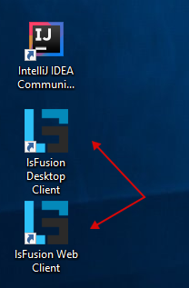

On this page you can download installers that install everything needed for development in a single click. In addition to lsFusion, these installers also install OpenJDK, PostgreSQL, Tomcat, and IntelliJ IDEA Community Edition with the built-in lsFusion plugin. If any of these programs are already on your computer, you can exclude them during the installation process.

## Download

### Windows

**lsFusion 5.0** (OpenJDK **11.0.16**, PostgreSQL **14.5**, Tomcat **9.0.67**, IntelliJ IDEA Community Edition **2022.2.3**)

- [x64](https://download.lsfusion.org/exe/lsfusion-dev-5.0-x64.exe)

<strong>Older versions</strong>

 

- lsFusion 4.0 ([x32](https://download.lsfusion.org/exe/lsfusion-dev-4.1.exe) / [x64](https://download.lsfusion.org/exe/lsfusion-dev-4.1-x64.exe))
- lsFusion 3.1 ([x32](https://download.lsfusion.org/exe/lsfusion-dev-3.1.exe) / [x64](https://download.lsfusion.org/exe/lsfusion-dev-3.1-x64.exe))
- lsFusion 2.4 ([x32](https://download.lsfusion.org/exe/lsfusion-dev-2.4.exe) / [x64](https://download.lsfusion.org/exe/lsfusion-dev-2.4-x64.exe))

   

## After installation

After the installation completes successfully, the corresponding shortcuts for launching IDE and the client will automatically be created on the desktop:

### Launching IDE

When using silent installation, a shortcut is created that launches IDEA.

A description of working with IDE after it opens is located [here](IDE.md).

### Launching the client

When using automatic installation, by default two shortcuts are created. The first shortcut opens a link in the browser to a locally installed web client. The second shortcut launches the desktop client. The administrator password (the "admin" user is the only user created by default) is the one specified during installation of the platform (empty by default).

