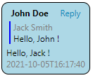
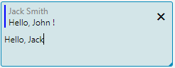

For each [property](Properties.md) type, by default, a predefined visual component is used to display and edit the data. 
However, it is possible to override components with your own, created with JavaScript. 
This functionality is only supported in the web client.

Consider the task of creating a chat room for communication between users to demonstrate this capability.

### Domain logic

First, let's create a domain logic in which the _Message_ entity is defined.
Each message contains plain text, as well as information about the author and sending time.

```lsf
CLASS Message 'Message';

dateTime 'Time' = DATA DATETIME (Message);
text 'Text' = DATA TEXT (Message);

author = DATA CustomUser (Message);
nameAuthor 'Author' (Message m) = name(author(m));

replyTo = DATA Message (Message);
nameAuthorReplyTo (Message m) = nameAuthor(replyTo(m));
textReplyTo (Message m) = text(replyTo(m)); 
```

### Message list display

The list of chat messages on the form will be displayed as rows in a table with one column.
For this column the value display component will be changed to one that will be written in JavaScript.
The easiest way to represent the value is in the form of JSON format string, which will store all the parameters of the message.
To build this string we will use built-in PostgreSQL function _json_build_object_ :

```lsf
json (Message m) = 
    [FORMULA STRING 'json_build_object(\'author\',$1,\'time\',$2,\'text\',$3,\'own\',$4,\'replyAuthor\',$5,\'replyText\',$6,\'replyMessage\',$7)'](
         (OVERRIDE nameAuthor(m), ''), 
         dateTime(m), 
         text(m), 
         IF author(m) = currentUser() THEN 1 ELSE 0, 
         (OVERRIDE nameAuthorReplyTo(m), ''), 
         (OVERRIDE textReplyTo(m), ''), 
         (OVERRIDE LONG(replyTo(m)), 0)
    );
```
Example value:
```json
{
    "author":"John Doe",
    "time":"2021-10-05T15:28:05",
    "text":"Hello, Jack!",
    "own":1,
    "replyAuthor":"Jack Smith",
    "replyText":"Hello, John",
    "replyMessage":31302
}
```

Note that all values must not contain NULL. Otherwise, the value of the expression obtained through [FORMULA](FORMULA_operator.md) operator, will also be NULL.

Next, use JavaScript and CSS to create a component that will display messages in the browser.
The component will be created in the chat.js file, which will be located in the _resources/web_ folder.
When the platform starts up, all js and css files inside the web folder of any element from the classpath will be loaded onto the browser page automatically.

Inside the chat.js file, create _chatMessageRender_ function. It will return an object consisting of two functions: _render_ and _update_.

The _render_ function takes as input an element within which the new elements necessary to display the data should be created:
```js
render: function (element) { 
    element.style.removeProperty("max-height");
    element.parentElement.style.removeProperty("height");

    var message = document.createElement("div")
    message.classList.add("chat-message");

    var header = document.createElement("div");
    header.classList.add("chat-header");

    var author = document.createElement("div");
    author.classList.add("chat-author");

    element.author = author;
    header.appendChild(author);

    var replyAction = document.createElement("a");
    replyAction.classList.add("chat-reply-action");

    var replyCaption = document.createTextNode("Reply");
    replyAction.appendChild(replyCaption);

    element.replyAction = replyAction;
    header.appendChild(replyAction);

    message.appendChild(header);

    var replyContent = document.createElement("div");
    replyContent.classList.add("chat-reply-content");

    var replyAuthor = document.createElement("div");
    replyAuthor.classList.add("chat-reply-author");

    element.replyAuthor = replyAuthor;
    replyContent.appendChild(replyAuthor);

    var replyText = document.createElement("div");
    replyText.classList.add("chat-reply-text");

    element.replyText = replyText;
    replyContent.appendChild(replyText);

    element.replyContent = replyContent;
    message.appendChild(replyContent);

    var text = document.createElement("div");
    text.classList.add("chat-text");

    element.text = text;
    message.appendChild(text);

    var time = document.createElement("div");
    time.classList.add("chat-time");

    element.time = time;
    message.appendChild(time);

    element.message = message;
    element.appendChild(message);
}
```
This code inside _element_ creates and stores new _div_ for each message, which will then be used to draw parts of the message.
The result will be the following component structure:
```html
<div class="chat-message chat-message-own">
   <div class="chat-header">
      <div class="chat-author">John Doe</div>
      <a class="chat-reply-action">Reply</a>
   </div>
   <div class="chat-reply-content">
      <div class="chat-reply-author"></div>
      <div class="chat-reply-text"></div>
   </div>
   <div class="chat-text">Hello world !</div>
   <div class="chat-time">2021-10-05T15:28:05</div>
</div>
```
Each element has its own class, which is used to design with CSS:
```css
.chat-message {
    margin: 6px;
    border: 1px solid;
    border-radius: 10px;
    padding: 6px;

    display: flex;
    flex-direction: column;
}

.chat-header {
    display: flex;
    align-content: stretch;
    justify-content: space-around;
}

.chat-author {
    font-weight: bold
}

.chat-reply-action {
    cursor: pointer;
    margin-left: 4px;
}

.chat-reply {
    display: flex;
}

.chat-reply-content {
    border-left: 2px solid;
    padding-left: 4px;
    margin: 4px;
    border-color: blue;
    cursor: pointer;
    flex: 1;
}

.chat-reply-author {
    color: grey
}

.chat-reply-text {
    white-space: pre-wrap;
    max-height: 100px;
    overflow: clip;
}

.chat-text {
    white-space: pre-wrap;
}

.chat-message-own {
    background-color: lightblue;
    margin-left: 100px;
}

.chat-time {
    color: grey
}
```

To update the displayed values, the platform will call the _update_ function each time, in which the same _element_ will be passed, 
as in the _render_ function, as well as the value itself:
```js
update: function (element, controller, value) {
    var obj = JSON.parse(value);
    element.author.innerHTML = obj.author;

    element.replyAuthor.innerHTML = obj.replyAuthor;
    element.replyText.innerHTML = obj.replyText;

    element.time.innerHTML = obj.time;
    element.text.innerHTML = obj.text;

    if (obj.own) {
        element.message.classList.add('chat-message-own');
    } else
        element.message.classList.remove('chat-message-own');
}
```
This function converts the string value _value_, which was calculated from the previously described _json_ property, into a JavaScript object. 
The values of all fields are written to the elements that were previously constructed in the _render_ function.

To combine these two functions into one, a new function _chatMessageRender_ is created, which returns them within the same object:
```js
function chatMessageRender() {
    return {
        render: function (element) {
            ...
        },
        update: function (element, controller, value) {
            ...
        }
    }
}
```

The message displayed by the created component will look like this:



### Handling user actions

In this example, we will handle two user actions for any of the messages: clicking on the quoted message and clicking on the Reply button.
In the first case, the transition to the original message will be done, and in the second case - storing the message
in [local property](Data_properties_DATA.md#---local) and setting the focus in the input field of the new message.

The _controller_ parameter, passed to the _update_ function, is used to notify the server of an event made by the user:
```js
element.replyAction.onclick = function(event) {
    controller.changeValue(JSON.stringify({ action : 'reply' }));
    $(this).closest("div[lsfusion-container='chat']").find(".chat-textarea").focus();
}

element.replyContent.onmousedown = function(event) {
    controller.changeValue(JSON.stringify({ action : 'goToReply' }));
}
```
Clicking on the quoted message also searches for the message field using jQuery and sets the current focus to it.
The DOM element with the class chat-message-input-area will be created later.

Depending on the action made by the user, the _changeValue_ method is called on the controller, which sends information about the event as a JSON format string.
The platform will automatically pass the value to the defined [action](Actions.md) _changeMessage_ :
```lsf
replyTo = DATA LOCAL Message ();

changeMessage (Message m) {
    INPUT s = STRING DO { // get the string
        stringToFile(s); // transform it to resultFile()
        
        LOCAL action = STRING();
        IMPORT JSON FROM resultFile() TO() action; // import the file as a json in local properties
        
        IF action() = 'goToReply' THEN {
            seek(replyTo(m)); // go to the quoted message
        }

        IF action() = 'reply' THEN {
            replyTo() <- m; // store the current message in a local property
        }
    }
}
```
This action reads the string passed from JavaScript, parses JSON, and then performs the appropriate action.

Finally, create a chat form and add a table with a list of messages to it. The table will have exactly one column, the value of which will be JSON built earlier.
The keyword **CUSTOM** specifies that the value is to be displayed using the _chatMessageRender_ function created earlier.
The action specified after the keyword **ON CHANGE** is called when the _controller.changeValue_ method is executed for the selected message.

```lsf
FORM chat 'Chat'
    OBJECTS msg = Message LAST
    PROPERTIES(msg) json CUSTOM 'chatMessageRender' ON CHANGE changeMessage(msg)
;
```

Next, customize the form design by placing the table with the list of messages in a new container with the identifier _chat_, and remove unnecessary components created automatically:
```lsf
DESIGN chat {
    OBJECTS {
        NEW chat {
            fill = 1; 
            MOVE GRID(msg) {
                headerHeight = 0;
                PROPERTY(json(msg)) {
                    autoSize = TRUE;
                }
            }
            REMOVE BOX(msg);
        }
    }
    REMOVE TOOLBARBOX;       
}
```

Add a form to the navigator:
```lsf
NAVIGATOR {
    NEW chat;
}
```

### Send a new message

It remains to add to the form the ability for the user to create new messages. 

First, let's create a _send_ action that will create a new message in a separate [session](Change_sessions.md) 
based on the local _message_ property and the previously defined _replyTo_ property:
```lsf
message = DATA LOCAL TEXT ();

send 'Send' () { 
    NEWSESSION NESTED LOCAL {
        NEW m = Message {
            dateTime(m) <- currentDateTime();
            author(m) <- currentUser();
            replyTo(m) <- replyTo();
            text(m) <- message();
            seek(m);
            APPLY;
        }
    }
} 
```

Similar to the _json_ property described earlier, we create a new _jsonInputMessage_ property, which will be used by the component to enter a new message:
```lsf
jsonInputMessage () = [FORMULA STRING 'json_build_object(\'replyAuthor\',$1,\'replyText\',$2,\'text\',$3)']
                       ((OVERRIDE nameAuthor(replyTo()), ''), (OVERRIDE text(replyTo()), ''), (OVERRIDE message(), ''));
```

Next, create a function that will generate a component to display and input a new message.
For this we will use the _div_ element with the _contentEditable_ attribute:
```js
function chatMessageInputRender() {
    return {
        render: function (element) {
        var input = document.createElement("div");
        input.classList.add("chat-message-input");

        var reply = document.createElement("div");
        reply.classList.add("chat-reply");

        var replyContent = document.createElement("div");
        replyContent.classList.add("chat-reply-content");

        var replyAuthor = document.createElement("div");
        replyAuthor.classList.add("chat-reply-author");

        element.replyAuthor = replyAuthor;
        replyContent.appendChild(replyAuthor);

        var replyText = document.createElement("div");
        replyText.classList.add("chat-reply-text");

        element.replyText = replyText;
        replyContent.appendChild(replyText);

        element.replyContent = replyContent;
        reply.appendChild(replyContent);

        var replyRemove = document.createElement("div");
        replyRemove.classList.add("chat-reply-remove");

        element.replyRemove = replyRemove;
        reply.appendChild(replyRemove);

        input.appendChild(reply);

        var text = document.createElement("div");
        text.classList.add("chat-message-input-area");
        text.contentEditable = "true";

        element.text = text;
        input.appendChild(text);

        element.appendChild(input);
    },
    update: function (element, controller, value) {
        if (value !== null) {
            var obj = JSON.parse(value);

            element.replyAuthor.innerHTML = obj.replyAuthor;
            element.replyText.innerHTML = obj.replyText;

            element.replyRemove.innerHTML = (obj.replyAuthor === '') ? '' : '❌';

            element.text.innerHTML = obj.text;
        }
    }
}
```
The CSS for the created elements will look like this:
```css
.chat-message-input {
    display: flex;
    flex-direction: column;
    flex: 1;
    align-self: stretch;
    max-height: 300px;
    min-height: 90px;
}

.chat-reply-remove {
    justify-content: flex-end;
    align-items: center;
    display: flex;
    cursor: pointer;
    margin-right: 10px;
}

.chat-message-input-area {
    padding: 4px;
}
```

As a result, the component will look like this:



Then we add event handlers that will delete the quoted message, send the message when CTRL+ENTER is pressed,
and write the entered message to a local property when the component loses focus.

The browser side will have the following JavaScript code:
```js
element.replyRemove.onclick = function(event) {
    controller.changeValue(JSON.stringify({ action : 'replyRemove' }));
}

element.text.onkeydown = function(event) {
    if (event.keyCode == 10 || event.keyCode == 13)
        if (event.ctrlKey)
            controller.changeValue(JSON.stringify({ action : 'send', value : element.text.innerHTML }))
        else
            event.stopPropagation(); // stop further processing after pressing ENTER
}

element.text.onblur = function (event) {
    controller.changeValue(JSON.stringify({ action : 'change', value : element.text.innerHTML }));
}
```

The _changeInputMessage_ action will receive these events on the server:
```lsf
changeInputMessage () {
    INPUT s = TEXT DO {
        stringToFile(s);
        
        LOCAL action = STRING();
        LOCAL value = TEXT();
        IMPORT JSON FROM resultFile() TO() action, value;

        IF action() = 'replyRemove' THEN {
            replyTo() <- NULL;
        }

        IF action() = 'send' THEN {
            message() <- value();
            send();
        }
        
        IF action() = 'change' THEN {
            message() <- value();
        }
    }
}
```

Add an input field to the form based on the previously declared functions and actions, as well as a _Send_ button:
```lsf
EXTEND FORM chat
    PROPERTIES jsonInputMessage() CUSTOM 'chatMessageInputRender' ON CHANGE changeInputMessage(), 
               send()
;
```

Change the design of the form, so that the field for entering a message and the _Send_ button were under the list of messages:
```lsf
DESIGN chat {
    chat {
        NEW chatMessage {
            autoSize = TRUE;
            type = CONTAINERH;
            alignment = STRETCH;
            MOVE PROPERTY(jsonInputMessage()) {
                fill = 1;
                autoSize = TRUE;
                width = 0;
                caption = '';
            }
            MOVE PROPERTY(send()) { fontSize = 32; alignment = STRETCH; }
        }
    }  
}
```
By setting the _autoSize_ and _width_ attributes, the input component will stretch as the message size grows.

The final form will look like this:

