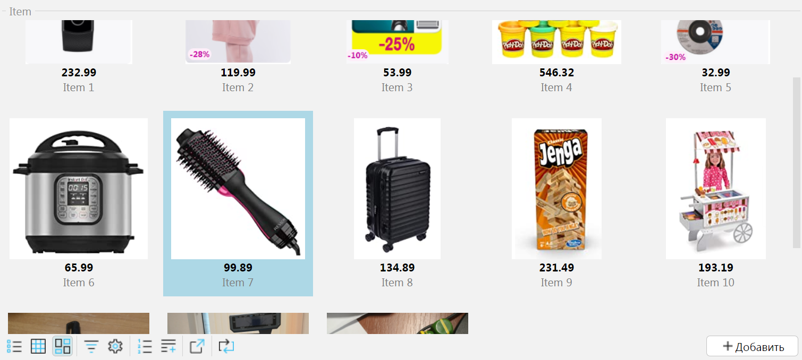

By default, each object on a form with GRID view is displayed on the form as a flat table with columns.
However, it is possible to create your own components in the platform to visualize the list of objects.

As an illustrative example, let's consider the task of displaying a list of products with images in the form of "tiles".

### Domain Logic

First let's create classes and properties of items, as well as edit form:

```lsf
CLASS Item 'Item';

name 'Name' = DATA STRING (Item) NONULL;
price 'Price' = DATA NUMERIC[12,2] (Item) NONULL;
image '' = DATA IMAGEFILE (Item);

FORM item 'Item'
    OBJECTS i = Item PANEL
    PROPERTIES(i) name, price, image
    
    EDIT Item OBJECT i
;

DESIGN item {
    OBJECTS {
        MOVE PROPERTY(image(i)) {
            fill = 1;
        }
    }
}
```
The name, price and image must be specified for each item.

### Interface

Let's create a form with a list of items. To do this let's add to the form an object _Item_, its properties, and actions to add, edit, and delete:
```lsf
FORM items 'Items'
    OBJECTS i = Item CUSTOM 'itemCards'
    PROPERTIES(i) READONLY image, price, name
    PROPERTIES(i) NEWSESSION new = NEW, edit = EDIT GRID, DELETE GRID
;

NAVIGATOR {
    NEW items;
}
```
The keyword **CUSTOM** specifies that not the standard tabular interface should be used to draw the list of items,
but the components created by the function _itemCards_. Let's declare this function in the file _itemcards.js_, which we'll place in the folder _resources/web_.
It will return an object consisting of two functions: _render_ and _update_.

The function _render_ takes as input the controller and the element inside which the new elements necessary to display the data are to be created:
```js
render: (element, controller) => {
    let cards = document.createElement("div")
    cards.classList.add("item-cards");

    element.cards = cards;
    element.appendChild(cards);
},
```
In this example we create a new _div_ _cards_, remember it, and append it to _element_.

To update the displayed values, the platform will call the _update_ function each time, and the same _element_ will be passed to it,
as in the _render_ function, and the _list_ of objects:
```js
update: (element, controller, list) => {
    while (element.cards.lastElementChild) {
        element.cards.removeChild(element.cards.lastElementChild);
    }

    for (let item of list) {
        let card = document.createElement("div")
        card.classList.add("item-card");

        if (controller.isCurrent(item))
            card.classList.add("item-card-current");

        let cardImage = document.createElement("img")
        cardImage.classList.add("item-card-image");
        cardImage.src = item.image;
        card.appendChild(cardImage);

        let cardPrice = document.createElement("div")
        cardPrice.classList.add("item-card-price");
        cardPrice.innerHTML = item.price;
        card.appendChild(cardPrice);

        let cardName = document.createElement("div")
        cardName.classList.add("item-card-name");
        cardName.innerHTML = item.name;
        card.appendChild(cardName);

        element.cards.appendChild(card);

        card.onclick = function(event) {
            if (!controller.isCurrent(item)) controller.changeObject(item);
        }
        card.ondblclick = function(event) {
            controller.changeProperty('edit', item);
        }
    }
}
```
Because the _update_ function is called whenever the data changes, the first thing that happens is that all previously created elements (namely, item cards) are deleted.

This example uses the simplest update scheme, but if necessary, it can be optimized by updating the DOM only for changed values.
To do that, the _controller_ has _getDiff_ method, where you pass a new _list_ of objects as a parameter.
This method will return as a result an object with arrays _add_, _update_, _remove_, which store added, changed and deleted objects respectively.
Example:
```js
let diff = controller.getDiff(list);
for (let object of diff.add) { ... }
for (let object of diff.update) { ... }
for (let option of diff.remove) { ... }
```

After removing the old elements, for each object in the _list_ array a _div_ _card_ is created, in which the desired display elements of each property are placed.
The names of the object fields correspond to the names of the properties on the form. The _isCurrent_ method determines which object from the list is current.

At the very end of the function, mouse click handlers are added to the item card. 

On a single click _changeObject_ method is called on the controller, which changes the current object.
The second parameter (_rendered_) is not specified (i.e. it is assumed to be _false_), which means that the server must eventually call the _update_ function with a new list of objects (probably the same one).
Since the value of the _isCurrent_ method will change, re-creating the item cards will change the currently selected object in the interface.

On double-click, the _changeProperty_ method is called, which changes the current value of the _edit_ property for the object passed in the second parameter.
Since _edit_ is an action, the third parameter, the value by which the current value of the property should be changed, is not passed, and the action will be called instead of the change.
In this case the item editing form will be opened.

To combine the _render_ and _update_ functions into one, _itemCards_ function is created, which returns them within the same object:
```js
function itemCards() {
    return {
        render: function (element, controller) => {
            ...
        },
        update: function (element, controller, list) {
            ...
        }
    }
}
```

To complete the design setup, create a file _itemcards.css_, which we will also place in the _resources/web_ folder:
```css
.item-cards {
    display: grid;
    grid-template-columns: repeat(auto-fit, minmax(150px, 1fr));
    grid-auto-rows: 200px;
    grid-gap: 10px;
}

.item-card {
    cursor: pointer;
    display: flex;
    flex-direction: column;
    overflow: hidden;
    align-items: center;
    padding: 8px;
}
.item-card-current {
    background-color: lightblue;
}

.item-card-image {
    flex: 1;
    min-height: 100px;
}

.item-card-price {
    font-weight: bold;
}

.item-card-name {
    color: gray;
}
```

In order to load created js and css files when the page opens in the browser, you must add their initialization to the action _onWebClientLoad_ using the operator [INTERNAL](INTERNAL_operator.md) :
```lsf
onWebClientLoad() + {
    INTERNAL CLIENT 'itemcards.js';
    INTERNAL CLIENT 'itemcards.css';
}
```

The resulting form will look like this:
