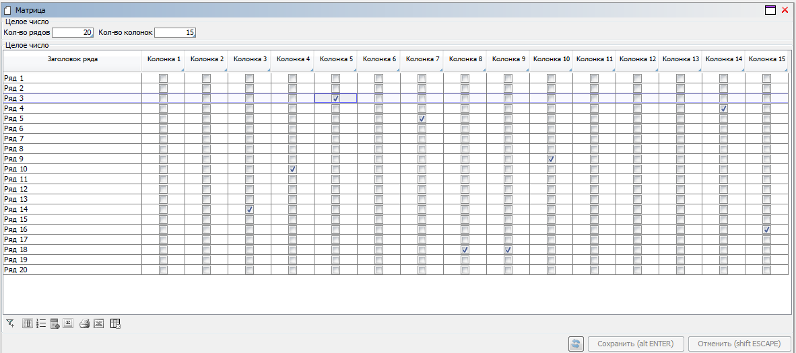

## Example 1

### Task

We have the concepts of books and buyers defined. A price is defined for each book and buyer.

```lsf
CLASS Book 'Book';
name 'Name' = DATA ISTRING[50] (Book) IN id;

CLASS Customer 'Customer';
name 'Name' = DATA ISTRING[50] (Customer) IN id;

price 'Price' = DATA NUMERIC[14,2] (Book, Customer);
```

We need to create a form with a single table where rows will contain books and columns will contain buyers. Each cell should have a price for its book and buyer.

### Solution

```lsf
FORM prices 'Prices'
    OBJECTS c = Customer

    OBJECTS b = Book
    PROPERTIES name(b) READONLY, price(b, c) COLUMNS (c) HEADER name(c)
;
```

Object `c` will not be displayed on the form, since no properties have been added for it.

The form will look like this:


## Example 2

### Task

Similar to [**Example 1**](#example-1), only there is a deferred payment period for each book and buyer.

```lsf
gracePeriod 'Delay, days' = DATA INTEGER (Book, Customer);
```

We need to create a form with a single table where rows will contain books and columns will contain buyers. For each buyer, there will be two columns next to them: price and deferred payment period. We need to highlight columns with deferred payment information in yellow. It should be possible to choose which buyers to display in the columns.

### Solution

```lsf
selected 'Mark' = DATA BOOLEAN (Customer);

headerName 'Price header' (Customer c) = name(c) + ': Price';
headerGrace 'Dealy header' (Customer c) = name(c) + ': Delay, days';

FORM pricesAndGracePeriods 'Prices and delays'
    OBJECTS s = Customer
    PROPERTIES selected(s), name(s) READONLY

    OBJECTS c = Customer
    FILTERS selected(c)

    OBJECTS b = Book
    PROPERTIES name(b) READONLY,
               price(b, c) COLUMNS 'priceAndGrace' (c) HEADER headerName(c),
               gracePeriod(b, c) COLUMNS 'priceAndGrace' (c) HEADER headerGrace(c)
;

DESIGN pricesAndGracePeriods {
    BOX(b) {
        fill = 3;
        PROPERTY(gracePeriod(b, c)) {
            background = #FFFFAA;
        }
    }
}
```

Only objects that meet the filter condition for object `c` will be shown in the columns. Besides, the columns will be shown in the same order as the objects.

All properties with the same ID after the word `COLUMNS` will go side by side for the same objects. In this case, the price and the deferred payment period for the first buyer, then the price and deferral for the second one, and so forth. If IDs were different or unspecified, prices for all buyers would have been shown first followed by deferred payment values.

The form will look like this:


## Example 3

### Task

We need to create a form containing a matrix with a specified number of rows and columns. The user should be able to check each cell.

### Solution

```lsf
in 'On' = DATA BOOLEAN (INTEGER, INTEGER);

row 'Row header' (INTEGER r) = 'Row ' + (r AS INTEGER);
column 'Column header' (INTEGER c) = 'Column ' + (c AS INTEGER);

FORM matrix 'Matrix'
    OBJECTS m = (rows = INTEGER, columns = INTEGER) PANEL
    PROPERTIES rs = VALUE(rows), cs = VALUE(columns)

    OBJECTS c = INTEGER
    FILTERS iterate(c, 1, columns)

    OBJECTS r = INTEGER
    PROPERTIES(r) row
    PROPERTIES in(r, c) COLUMNS (c) HEADER column(c)
    FILTERS iterate(r, 1, rows)
;

DESIGN matrix {
    PROPERTY(rs) { caption = 'Number of rows'; }
    PROPERTY(cs) { caption = 'Number of columns'; }
}
```

In real projects, we recommend limiting the number of rows and columns during data entry or filtering. Otherwise, if the user enters too many rows or columns, the system will generate a CTE query for the `iterate` property which, in turn, will produce a table containing entered (very big) number of records and that may cause the server database to crash.

Result:


