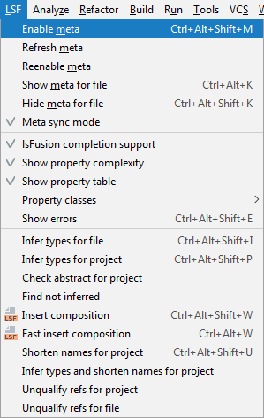
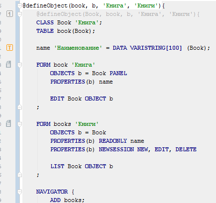

You may often need to write "similar" code for certain cases. The [`META` statement](META_statement.md) exists for this purpose, and makes it possible to create a code template or *metacode*. It can contain parameters that will be replaced by certain values when this metacode is used. Such an approach is called [metaprogramming](Metaprogramming.md).

Let's create a simple directory as described in the article. [How-to: CRUD](How-to_CRUD.md).

```lsf
CLASS Book 'Book';
name 'Name' = DATA ISTRING[30] (Book) IN id;
```

```lsf
FORM book 'Book' // form for displaying "card' // form for displaying the book card
    OBJECTS b = Book PANEL
    PROPERTIES(b) name

    EDIT Book OBJECT b
;

FORM books 'Books'
    OBJECTS b = Book
    PROPERTIES(b) READONLY name
    PROPERTIES(b) NEWSESSION NEW, EDIT, DELETE

    LIST Book OBJECT b
;

NAVIGATOR {
    NEW books;
}
```

We can use this code to write the following metacode:

```lsf
META defineObject(class, id, shortId, caption, multiCaption)
    CLASS class caption;
    TABLE id(class);

    name 'Name' = DATA ISTRING[100] (class);

    FORM id caption
        OBJECTS shortId = class PANEL
        PROPERTIES(shortId) name

        EDIT class OBJECT shortId
    ;

    FORM id##s multiCaption
        OBJECTS shortId = class
        PROPERTIES(shortId) READONLY name
        PROPERTIES(shortId) NEWSESSION NEW, EDIT, DELETE

        LIST class OBJECT shortId
    ;

    NAVIGATOR {
        NEW id##s;
    }
END

META defineObject(id, shortId, caption, multiCaption)
    @defineObject(###id, id, shortId, caption, multiCaption);
END
```

Note that one code segment can programmatically call another one.

This is how metacode is used:

```lsf
@defineObject(book, b, 'Book', 'Books');
@defineObject(magazine, m, 'Magazine', 'Magazines');
```

In the first case, when the system starts generating the result code, it will replace all `id` lexemes with `book`, `shortId` with `b`, `caption` with `'Book'`, and `multiCaption` with `'Books'`. When using `##` concatenation, these replacements will leave everything unchanged. If `###` concatenation is used, the first letter of the value will be capitalized. The generated code will look like this:

```lsf
CLASS Book 'Book';
TABLE book(Book);

name 'Name' = DATA ISTRING[100] (Book);

FORM book 'Book'
    OBJECTS b = Book PANEL
    PROPERTIES(b) name

    EDIT Book OBJECT b
;

FORM books 'Books'
    OBJECTS b = Book
    PROPERTIES(b) READONLY name
    PROPERTIES(b) NEWSESSION NEW, EDIT, DELETE

    LIST Book OBJECT b
;

NAVIGATOR {
    NEW books;
}

CLASS Magazine 'Magazine';
TABLE magazine(Magazine);

name 'Name' = DATA ISTRING[100] (Magazine);

FORM magazine 'Magazine'
    OBJECTS m = Magazine PANEL
    PROPERTIES(m) name

    EDIT Magazine OBJECT m
;

FORM magazines 'Magazines'
    OBJECTS m = Magazine
    PROPERTIES(m) READONLY name
    PROPERTIES(m) NEWSESSION NEW, EDIT, DELETE

    LIST Magazine OBJECT m
;

NAVIGATOR {
    NEW magazines;
}
```

In order for the IDE to "see" the code generated by metacodes, you need to enabled the corresponding mode in the menu.



When the metacode support mode is enabled, the generated code will be automatically substituted in the source code if metacode is used.



Any modifications of the code will be impossible, since they will be automatically overwritten by the IDE. However, it is recommended to disable this mode when committing code to your version control system to avoid creating redundant change history entries.

Objects created using metacode can subsequently be extended using standard [mechanisms](How-to_Extensions.md).

```lsf
genre 'Genre' = DATA ISTRING[20] (Book);
EXTEND FORM book PROPERTIES(b) genre;
EXTEND FORM books PROPERTIES(b) genre;
```
