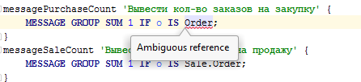

Occasionally, you will find yourself in situations where you will need to use the same [name](Naming.md) for different system elements. For this purpose, you can assign them to different namespaces that are defined for a module using the [`NAMESPACE` statement](Module_header.md). By default, the namespace matches the name of the module.

Let's create two modules, `UseCaseNamePurchase` and `UseCaseNameSale`, that declare the logic of purchase and sell orders:

```lsf
MODULE UseCaseNamePurchase;

NAMESPACE Purchase;

CLASS Order 'Order';
date 'Date' = DATA DATE (Order);
number 'Number' = DATA INTEGER (Order);

FORM orders 'Purchase orders'
    OBJECTS o = Order
    PROPERTIES(o) date, number
;

NAVIGATOR {
    NEW orders;
}
```

```lsf
MODULE UseCaseNameSale;

NAMESPACE Sale;

CLASS Order 'Order';
date 'Date' = DATA DATE (Order);
number 'Number' = DATA INTEGER (Order);

FORM orders 'Sales orders'
    OBJECTS o = Order
    PROPERTIES(o) date, number
;

NAVIGATOR {
    NEW orders;
}
```

Both of them have the `Order` class declared in them, but since the modules have different namespaces, the first one's will be `Purchase`, the second one's will be `Sale`.

Let's declare a test module with a `Test` namespace that will simultaneously depend on both modules:

```lsf
REQUIRE UseCaseNamePurchase, UseCaseNameSale;

NAMESPACE Test;

messagePurchaseCount 'Display the number of purchase orders' {
    MESSAGE GROUP SUM 1 IF o IS Purchase.Order;
}
messageSaleCount 'Display the number of sales orders' {
    MESSAGE GROUP SUM 1 IF o IS Sale.Order;
}

NAVIGATOR {
    NEW ACTION messagePurchaseCount;
    NEW ACTION messageSaleCount;
}
```

If you try to refer to the `Order` class without explicitly specifying the namespace, you will see an error message:



All such references require an explicit specification of the namespace.

In case the namespace of a module matches the space of the required system element (for example, `Purchase`)

```lsf
NAMESPACE Purchase;
```

or the namespace priority has not been specified using the [`PRIORITY` statement](Module_header.md),

```lsf
PRIORITY Purchase;
```

you can skip the specification of the namespace

```lsf
messagePurchaseCount 'Display the number of purchase orders' {
    MESSAGE GROUP SUM 1 IF o IS Order;
}
messageSaleCount 'Display the number of sales orders' {
    MESSAGE GROUP SUM 1 IF o IS Sale.Order;
}

NAVIGATOR {
    NEW ACTION messagePurchaseCount;
    NEW ACTION messageSaleCount;
}
```

If you don't specify the namespace, the class from `Purchase` will be used. You still can explicitly specify the namespace (for example, `Sale`).
