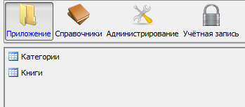

## Example 1

### Task

We have the forms with a list of books and categories.

```lsf
FORM categories 'Categories';
FORM books 'Books';
```

We need to add them to the [navigator](Navigator.md) to the new folder called `'Application'` under the main toolbar.

### Solution

```lsf
NAVIGATOR {
    NEW FOLDER application 'Application' WINDOW toolbar FIRST {
        NEW categories;
        NEW books;
    }
}
```

By specifying `WINDOW` for the `application` element, we indicated that all its child objects must be displayed in the system [window](Navigator_design.md) called `toolbar`. This will look like this:



## Example 2

### Task

Similar to [**Example 1**](#example-1).

We need to place the same forms in the subfolder called `'Directories'`.

### Solution

```lsf
NAVIGATOR {
    application {
        NEW FOLDER masterData 'Directories' {
            NEW categories;
            NEW books;
        }
    }
}
```

Result:


