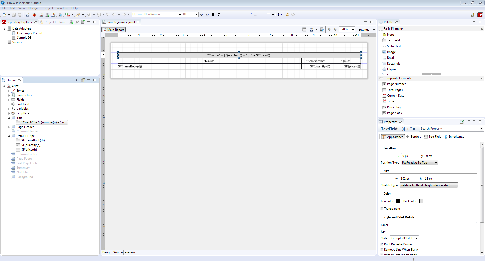
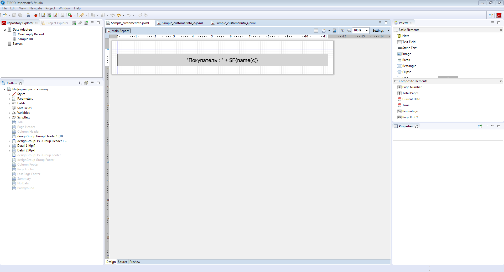

## Example 1

### Task

We have a logic for books split into categories.

```lsf
NAMESPACE Sample;

CLASS Category 'Category';
name 'Name' = DATA ISTRING[50] (Category) IN id;

CLASS Book 'Book';
name 'Name' = DATA ISTRING[100] (Book) IN id;

category 'Category' = DATA Category (Book) AUTOSET;
nameCategory 'Category' (Book b) = name(category(b)) IN id;

countBooks 'Number of books' (Category c) = GROUP SUM 1 BY category(Book b);

FORM books 'Books'
    OBJECTS b = Book
    PROPERTIES(b) READONLY name, nameCategory
    PROPERTIES(b) NEWSESSION NEW, EDIT, DELETE
;

NAVIGATOR {
    NEW books;
}
```

We need to create a [print form](Print_view.md) to display all the books by category. We also need to export this form to the XLSX format.

### Solution

First, we need to declare a [form](Forms.md) to define the print form structure.

```lsf
FORM booksByCategories 'Books by category'
    OBJECTS c = Category
    PROPERTIES(c) name, countBooks

    OBJECTS b = Book
    PROPERTIES(b) name, nameCategory
    FILTERS category(b) == c
;
```

Then, we add two actions that use the [`PRINT` operator](PRINT_operator.md) for creating a report and for previewing it and exporting to XLSX respectively.

```lsf
printBooksByCategories 'Books by category' ()  {
    PRINT booksByCategories;
}

xlsxBooksByCategories 'Books by category (XLSX)' ()  {
    PRINT booksByCategories XLSX;
}
```

Now let's display them on the `books` form in the toolbar of the table of books.

```lsf
EXTEND FORM books
    PROPERTIES() DRAW b TOOLBAR printBooksByCategories, xlsxBooksByCategories
;
```

Then, we start the server from the IDE, launch the desktop client, open the form with books and click the created "Print" button. The system will automatically create a print-ready form and open it in the [preview](In_a_print_view_PRINT.md#interactive) mode. Then, click the button below:


The system will save automatic templates for [Jasper Reports](https://community.jaspersoft.com/project/jasperreports-library) to the source code folder (src/main/lsfusion).


The system will then start the editor associated with the jrxml format where these files will be opened. You can use [JasperSoft Studio](https://community.jaspersoft.com/project/jaspersoft-studio) as an editor. In addition, a background process will be launched to constantly synchronize report files in the src / main / lsfusion and out / production folders (or target / classes if Maven is used to start the configuration instead of IDEA Build) to eliminate the need for rebuilding the project after the templates are modified in the editor.

Since categories and books are associated, a single flat report will be created with categories represented as groups of books. Report data will be transmitted in a flat, denormalized form, where a separate (**Field**) field will be created for each property. A group (**Group**) and a corresponding header block (**Group Header**) will be created for categories.

Let's make a few changes in the automatic template and save it:


**Template** `Sample_booksByCategories.jrxml`:
 
```xml
<?xml version="1.0" encoding="UTF-8"?>
<!-- Created with Jaspersoft Studio version 6.6.0.final using JasperReports Library version 6.6.0  -->
<jasperReport xmlns="http://jasperreports.sourceforge.net/jasperreports" xmlns:xsi="http://www.w3.org/2001/XMLSchema-instance" xsi:schemaLocation="http://jasperreports.sourceforge.net/jasperreports http://jasperreports.sourceforge.net/xsd/jasperreport.xsd" name="Книги по категориям" pageWidth="842" pageHeight="595" orientation="Landscape" columnWidth="555" leftMargin="20" rightMargin="20" topMargin="30" bottomMargin="30" uuid="31977562-8391-4ea1-a6bd-a5081bbc75bb">
    <style name="DefaultStyle" isDefault="true" vTextAlign="Middle" vImageAlign="Middle" fontName="lsf.TimesNewRoman" fontSize="10">
        <box>
            <pen lineWidth="0.5" lineStyle="Solid" lineColor="#000000"/>
        </box>
        <paragraph leftIndent="2" rightIndent="2"/>
    </style>
    <style name="GroupCellStyle2" vTextAlign="Middle" vImageAlign="Middle" fontName="lsf.TimesNewRoman" fontSize="10">
        <box>
            <pen lineWidth="0.5" lineStyle="Solid" lineColor="#000000"/>
        </box>
        <paragraph leftIndent="2" rightIndent="2"/>
    </style>
    <style name="GroupCellStyle1" mode="Opaque" backcolor="#DFDFDF" vTextAlign="Middle" vImageAlign="Middle" fontName="lsf.TimesNewRoman" fontSize="10">
        <box>
            <pen lineWidth="0.5" lineStyle="Solid" lineColor="#000000"/>
        </box>
        <paragraph leftIndent="2" rightIndent="2"/>
    </style>
    <style name="GroupCellStyle0" vTextAlign="Middle" vImageAlign="Middle" fontName="lsf.TimesNewRoman" fontSize="10">
        <box>
            <pen lineWidth="0.5" lineStyle="Solid" lineColor="#000000"/>
        </box>
        <paragraph leftIndent="2" rightIndent="2"/>
    </style>
    <field name="c.object" class="java.lang.Long"/>
    <field name="name(c)" class="java.lang.String"/>
    <field name="countBooks(c)" class="java.lang.Integer"/>
    <field name="b.object" class="java.lang.Long"/>
    <field name="name(b)" class="java.lang.String"/>
    <field name="nameCategory(b)" class="java.lang.String"/>
    <group name="designGroup522">
        <groupExpression><![CDATA[String.valueOf($F{c.object})]]></groupExpression>\n\t\t<groupHeader>\n\t\t\t<band height="18" splitType="Prevent">\n\t\t\t\t<textField isStretchWithOverflow="true" isBlankWhenNull="true">\n\t\t\t\t\t<reportElement style="GroupCellStyle1" stretchType="RelativeToBandHeight" x="0" y="0" width="96" height="18" uuid="5b282d01-48bf-4170-8cb5-358756cdd8fd"/>\n\t\t\t\t\t<textElement textAlignment="Center"/>\n\t\t\t\t\t<textFieldExpression><![CDATA["Name"]]></textFieldExpression>\n\t\t\t\t</textField>\n\t\t\t\t<textField isStretchWithOverflow="true" isBlankWhenNull="true">\n\t\t\t\t\t<reportElement style="GroupCellStyle1" positionType="Float" stretchType="RelativeToBandHeight" x="96" y="0" width="459" height="18" backcolor="#FF0000" uuid="b8110564-b312-4096-bb6b-a466364ea2b9"/>\n\t\t\t\t\t<textElement textAlignment="Left"/>\n\t\t\t\t\t<textFieldExpression><![CDATA[$F{name(c)}]]></textFieldExpression>\n\t\t\t\t</textField>\n\t\t\t\t<textField isStretchWithOverflow="true" isBlankWhenNull="true">\n\t\t\t\t\t<reportElement style="GroupCellStyle1" stretchType="RelativeToBandHeight" x="555" y="0" width="93" height="18" uuid="b2edb91d-7e15-4c69-8ed5-43f6ffa82208"/>\n\t\t\t\t\t<textElement textAlignment="Center"/>\n\t\t\t\t\t<textFieldExpression><![CDATA["Quantity of books"]]></textFieldExpression>\n\t\t\t\t</textField>\n\t\t\t\t<textField isStretchWithOverflow="true" isBlankWhenNull="true">\n\t\t\t\t\t<reportElement style="GroupCellStyle1" positionType="Float" stretchType="RelativeToBandHeight" x="648" y="0" width="154" height="18" uuid="6e18a055-237f-4845-8134-20ff20f182db"/>\n\t\t\t\t\t<textElement textAlignment="Right"/>\n\t\t\t\t\t<textFieldExpression><![CDATA[$F{countBooks(c)}]]></textFieldExpression>\n\t\t\t\t</textField>\n\t\t\t</band>\n\t\t</groupHeader>\n\t</group>\n\t<pageHeader>\n\t\t<band height="18">\n\t\t\t<textField isStretchWithOverflow="true" isBlankWhenNull="true">\n\t\t\t\t<reportElement style="GroupCellStyle0" stretchType="RelativeToBandHeight" x="0" y="0" width="555" height="18" uuid="f9243784-60ef-4031-8c73-4afeed320bab"/>\n\t\t\t\t<textElement textAlignment="Center"/>\n\t\t\t\t<textFieldExpression><![CDATA["Name"]]></textFieldExpression>\n\t\t\t</textField>\n\t\t\t<textField isStretchWithOverflow="true" isBlankWhenNull="true">\n\t\t\t\t<reportElement style="GroupCellStyle0" stretchType="RelativeToBandHeight" x="555" y="0" width="247" height="18" uuid="a1fd3130-9652-4f34-9d9b-d8508fe21663"/>\n\t\t\t\t<textElement textAlignment="Center"/>\n\t\t\t\t<textFieldExpression><![CDATA["Category"]]></textFieldExpression>\n\t\t\t</textField>\n\t\t</band>\n\t</pageHeader>\n\t<detail>\n\t\t<band height="18">\n\t\t\t<textField isStretchWithOverflow="true" isBlankWhenNull="true">\n\t\t\t\t<reportElement style="GroupCellStyle0" positionType="Float" stretchType="RelativeToBandHeight" x="0" y="0" width="555" height="18" uuid="ca0e19c6-4400-465b-8af7-5dc6074dc82f"/>\n\t\t\t\t<textElement textAlignment="Left"/>\n\t\t\t\t<textFieldExpression><![CDATA[$F{name(b)}]]></textFieldExpression>\n\t\t\t</textField>\n\t\t\t<textField isStretchWithOverflow="true" isBlankWhenNull="true">\n\t\t\t\t<reportElement style="GroupCellStyle0" positionType="Float" stretchType="RelativeToBandHeight" x="555" y="0" width="247" height="18" uuid="3c9eb36e-c2d6-4b37-86ae-2eca4d14903d"/>\n\t\t\t\t<textElement textAlignment="Left"/>\n\t\t\t\t<textFieldExpression><![CDATA[$F{nameCategory(b)}]]></textFieldExpression>\n\t\t\t</textField>\n\t\t</band>\n\t</detail>\n</jasperReport>
```

Once done, if you re-run the report generation procedure, it will use modified templates and the result will look as follows:


:::info
If the background process fails to synchronize development and execution folders for some reason, you just need to restart the server so that the project is re-built and changes are applied.
:::

## Example 2

### Task

The invoice logic has been defined.

```lsf
CLASS Invoice 'Invoice';
date 'Date' = DATA DATE (Invoice);
number 'Number' = DATA STRING[10] (Invoice);

CLASS InvoiceDetail 'Invoice line';
invoice 'Invoice' = DATA Invoice (InvoiceDetail) NONULL DELETE;

book 'Book' = DATA Book (InvoiceDetail) NONULL;
nameBook 'Book' (InvoiceDetail d) = name(book(d));

quantity 'Quantity' = DATA INTEGER (InvoiceDetail);
price 'Price' = DATA NUMERIC[14,2] (InvoiceDetail);

FORM invoice 'Invoice'
    OBJECTS i = Invoice PANEL
    PROPERTIES(i) date, number

    OBJECTS d = InvoiceDetail
    PROPERTIES(d) nameBook, quantity, price, NEW, DELETE
    FILTERS invoice(d) == i

    EDIT Invoice OBJECT i
;

FORM invoices 'Invoices'
    OBJECTS i = Invoice
    PROPERTIES(i) READONLY date, number
    PROPERTIES(i) NEWSESSION NEW, EDIT, DELETE
;

NAVIGATOR {
    NEW invoices;
}
```

We need to create a print form for invoices that will contain all of their parameters and lines. We also need to be able to export this form to the DOCX format.

### Solution

To create a print form, let's use the existing `invoice` form that works for us in terms of structure. However, we can create a new form, if necessary.

```lsf
print 'Print' (Invoice i)  {
    PRINT invoice OBJECTS i = i;
}
printWord 'Print (DOCX)' (Invoice i)  {
    PRINT invoice OBJECTS i = i DOCX;
}

EXTEND FORM invoices
    PROPERTIES(i) print TOOLBAR, printWord TOOLBAR
;
```

Since the `i` objects of the `invoice` form are displayed on the panel, the report will only contain data for the invoice that is passed to this object as a parameter in the `PRINT` operator.

Let's move the invoice data from the group header (**Group Header**) to the invoice header so that it gets displayed above the columns.



  

**Template** `Sample_invoice_i.jrxml`:
 
```xml
<?xml version="1.0" encoding="UTF-8"?>
<!-- Created with Jaspersoft Studio version 6.6.0.final using JasperReports Library version 6.6.0  -->
<jasperReport xmlns="http://jasperreports.sourceforge.net/jasperreports" xmlns:xsi="http://www.w3.org/2001/XMLSchema-instance" xsi:schemaLocation="http://jasperreports.sourceforge.net/jasperreports http://jasperreports.sourceforge.net/xsd/jasperreport.xsd" name="Счет" pageWidth="842" pageHeight="595" orientation="Landscape" columnWidth="555" leftMargin="20" rightMargin="20" topMargin="30" bottomMargin="30" uuid="f60eb956-09f7-45ef-a1e0-3345187967cb">
    <style name="DefaultStyle" isDefault="true" vTextAlign="Middle" vImageAlign="Middle" fontName="lsf.TimesNewRoman" fontSize="10">
        <box>
            <pen lineWidth="0.5" lineStyle="Solid" lineColor="#000000"/>
        </box>
        <paragraph leftIndent="2" rightIndent="2"/>
    </style>
    <style name="GroupCellStyle2" vTextAlign="Middle" vImageAlign="Middle" fontName="lsf.TimesNewRoman" fontSize="10">
        <box>
            <pen lineWidth="0.5" lineStyle="Solid" lineColor="#000000"/>
        </box>
        <paragraph leftIndent="2" rightIndent="2"/>
    </style>
    <style name="GroupCellStyle1" mode="Opaque" backcolor="#DFDFDF" vTextAlign="Middle" vImageAlign="Middle" fontName="lsf.TimesNewRoman" fontSize="10">
        <box>
            <pen lineWidth="0.5" lineStyle="Solid" lineColor="#000000"/>
        </box>
        <paragraph leftIndent="2" rightIndent="2"/>
    </style>
    <style name="GroupCellStyle0" vTextAlign="Middle" vImageAlign="Middle" fontName="lsf.TimesNewRoman" fontSize="10">
        <box>
            <pen lineWidth="0.5" lineStyle="Solid" lineColor="#000000"/>
        </box>
        <paragraph leftIndent="2" rightIndent="2"/>
    </style>
    <field name="i.object" class="java.lang.Long"/>
    <field name="date(i)" class="java.util.Date"/>
    <field name="number(i)" class="java.lang.String"/>
    <field name="nameCustomer(i)" class="java.lang.String"/>
    <field name="d.object" class="java.lang.Long"/>
    <field name="nameBook(d)" class="java.lang.String"/>
    <field name="quantity(d)" class="java.lang.Integer"/>
    <field name="price(d)" class="java.math.BigDecimal"/>
    <title>
        <band height="18">
            <textField isStretchWithOverflow="true" isBlankWhenNull="true">
                <reportElement style="GroupCellStyle1" stretchType="RelativeToBandHeight" x="0" y="0" width="802" height="18" uuid="798a30fc-f932-4434-a299-d289e5acf420"/>
                <textElement textAlignment="Center"/>
                <textFieldExpression><![CDATA["Invoice No." + $F{number(i)} + " dated " + $F{date(i)}]]></textFieldExpression>\n\t\t\t</textField>\n\t\t</band>\n\t</title>\n\t<pageHeader>\n\t\t<band height="18">\n\t\t\t<textField isStretchWithOverflow="true" isBlankWhenNull="true">\n\t\t\t\t<reportElement style="GroupCellStyle0" stretchType="RelativeToBandHeight" x="0" y="0" width="606" height="18" uuid="c151590a-a89b-464a-89ff-8bf91a7e652f"/>\n\t\t\t\t<textElement textAlignment="Center"/>\n\t\t\t\t<textFieldExpression><![CDATA["Book"]]></textFieldExpression>\n\t\t\t</textField>\n\t\t\t<textField isStretchWithOverflow="true" isBlankWhenNull="true">\n\t\t\t\t<reportElement style="GroupCellStyle0" stretchType="RelativeToBandHeight" x="606" y="0" width="97" height="18" uuid="186213e1-9aa8-46e8-aa27-60e9e59dd03f"/>\n\t\t\t\t<textElement textAlignment="Center"/>\n\t\t\t\t<textFieldExpression><![CDATA["Quantity"]]></textFieldExpression>\n\t\t\t</textField>\n\t\t\t<textField isStretchWithOverflow="true" isBlankWhenNull="true">\n\t\t\t\t<reportElement style="GroupCellStyle0" stretchType="RelativeToBandHeight" x="703" y="0" width="99" height="18" uuid="5d3c0f3a-fc6e-4182-b7ae-f3ad933029f8"/>\n\t\t\t\t<textElement textAlignment="Center"/>\n\t\t\t\t<textFieldExpression><![CDATA["Price"]]></textFieldExpression>\n\t\t\t</textField>\n\t\t</band>\n\t</pageHeader>\n\t<detail>\n\t\t<band height="18">\n\t\t\t<textField isStretchWithOverflow="true" isBlankWhenNull="true">\n\t\t\t\t<reportElement style="GroupCellStyle0" positionType="Float" stretchType="RelativeToBandHeight" x="0" y="0" width="606" height="18" uuid="3b31443c-0422-40d4-b32c-82ac15259dd9"/>\n\t\t\t\t<textElement textAlignment="Left"/>\n\t\t\t\t<textFieldExpression><![CDATA[$F{nameBook(d)}]]></textFieldExpression>\n\t\t\t</textField>\n\t\t\t<textField isStretchWithOverflow="true" isBlankWhenNull="true">\n\t\t\t\t<reportElement style="GroupCellStyle0" positionType="Float" stretchType="RelativeToBandHeight" x="606" y="0" width="97" height="18" uuid="204da3de-446c-4c2c-ba1b-33262b64ef4b"/>\n\t\t\t\t<textElement textAlignment="Right"/>\n\t\t\t\t<textFieldExpression><![CDATA[$F{quantity(d)}]]></textFieldExpression>\n\t\t\t</textField>\n\t\t\t<textField isStretchWithOverflow="true" isBlankWhenNull="true">\n\t\t\t\t<reportElement style="GroupCellStyle0" positionType="Float" stretchType="RelativeToBandHeight" x="703" y="0" width="99" height="18" uuid="6fb33419-b7aa-46fb-9021-d13a8c906dc9"/>\n\t\t\t\t<textElement textAlignment="Right"/>\n\t\t\t\t<textFieldExpression><![CDATA[$F{price(d)}]]></textFieldExpression>\n\t\t\t</textField>\n\t\t</band>\n\t</detail>\n</jasperReport>\n
```

The resulting report will look like this:


## Example 3

### Task

Similar to [**Example 2**](#example-2), plus the buyer and order logic.

```lsf
CLASS Customer 'Customer';
name 'Name' = DATA ISTRING[50] (Customer) IN id;

FORM customers 'Customers'
    OBJECTS c = Customer
    PROPERTIES(c) READONLY name
    PROPERTIES(c) NEWSESSION NEW, EDIT, DELETE
;

NAVIGATOR {
    NEW customers;
}

customer 'Customer' = DATA Customer (Invoice);
nameCustomer 'Customer' (Invoice i) = name(customer(i));

EXTEND FORM invoice PROPERTIES(i) nameCustomer;

CLASS Order 'Order';
date 'Date' = DATA DATE (Order);
number 'Number' = DATA STRING[10] (Order);

customer 'Customer' = DATA Customer (Order);
nameCustomer 'Customer' (Order o) = name(customer(o));

CLASS OrderDetail 'Order line';
order 'Order' = DATA Order (OrderDetail) NONULL DELETE;

book 'Book' = DATA Book (OrderDetail) NONULL;
nameBook 'Book' (OrderDetail d) = name(book(d));

quantity 'Quantity' = DATA INTEGER (OrderDetail);
price 'Price' = DATA NUMERIC[14,2] (OrderDetail);

FORM order 'Order'
    OBJECTS o = Order PANEL
    PROPERTIES(o) date, number, nameCustomer

    OBJECTS d = OrderDetail
    PROPERTIES(d) nameBook, quantity, price, NEW, DELETE
    FILTERS order(d) == o

    EDIT Order OBJECT o
;

FORM orders 'Orders'
    OBJECTS i = Order
    PROPERTIES(i) READONLY date, number, nameCustomer
    PROPERTIES(i) NEWSESSION NEW, EDIT, DELETE
;

NAVIGATOR {
    NEW orders;
}
```

We need to create a print form with customer information that will include all orders and invoices.

### Solution

First, let's create a form whose structure will correspond to the logic of the required print form. We will display the buyer object in the panel, as we only need to show data for a single buyer. The rest of the objects remain tables.

```lsf
FORM customerInfo 'Customer information'
    OBJECTS c = Customer PANEL
    PROPERTIES(c) name

    OBJECTS o = Order
    PROPERTIES(o) date, number
    FILTERS customer(o) == c

    OBJECTS od = OrderDetail
    PROPERTIES(od) nameBook, quantity, price
    FILTERS order(od) == o

    OBJECTS i = Invoice
    PROPERTIES(i) date, number
    FILTERS customer(i) == c

    OBJECTS id = InvoiceDetail
    PROPERTIES(id) nameBook, quantity, price
    FILTERS invoice(id) == i
;

printInfo 'Print information' (Customer c)  {
    PRINT customerInfo OBJECTS c = c;
}

EXTEND FORM customers
    PROPERTIES(c) printInfo TOOLBAR
;
```

The principle of this report is that objects with invoices and orders are independent of each other. Thus, they will be generated as different subreports (**Subreport**).

Since the dependency between objects forms a tree with two leaf nodes, a total of three templates will be formed:

1.  `Sample_customerInfo` is a top report that will show buyer data (in this case, for a single buyer). It will contain links to subreports `Sample_customerInfo_i` and `Sample_customerInfo_o`.  
    

    **Template** `Sample_customerInfo.jrxml`:

    ```xml
    <?xml version="1.0" encoding="UTF-8"?>
    <!-- Created with Jaspersoft Studio version 6.6.0.final using JasperReports Library version 6.6.0  -->
    <jasperReport xmlns="http://jasperreports.sourceforge.net/jasperreports" xmlns:xsi="http://www.w3.org/2001/XMLSchema-instance" xsi:schemaLocation="http://jasperreports.sourceforge.net/jasperreports http://jasperreports.sourceforge.net/xsd/jasperreport.xsd" name="Информация по клиенту" pageWidth="842" pageHeight="595" orientation="Landscape" columnWidth="555" leftMargin="20" rightMargin="20" topMargin="30" bottomMargin="30" uuid="06ed2f8a-ff5b-497a-925f-5a8722df2e57">
        <style name="DefaultStyle" isDefault="true" vTextAlign="Middle" vImageAlign="Middle" fontName="lsf.TimesNewRoman" fontSize="10">
            <box>
                <pen lineWidth="0.5" lineStyle="Solid" lineColor="#000000"/>
            </box>
            <paragraph leftIndent="2" rightIndent="2"/>
        </style>
        <style name="GroupCellStyle3" vTextAlign="Middle" vImageAlign="Middle" fontName="lsf.TimesNewRoman" fontSize="10">
            <box>
                <pen lineWidth="0.5" lineStyle="Solid" lineColor="#000000"/>
            </box>
            <paragraph leftIndent="2" rightIndent="2"/>
        </style>
        <style name="GroupCellStyle2" mode="Opaque" backcolor="#D5D5D5" vTextAlign="Middle" vImageAlign="Middle" fontName="lsf.TimesNewRoman" fontSize="10">
            <box>
                <pen lineWidth="0.5" lineStyle="Solid" lineColor="#000000"/>
            </box>
            <paragraph leftIndent="2" rightIndent="2"/>
        </style>
        <parameter name="o_report" class="net.sf.jasperreports.engine.JasperReport"/>
        <parameter name="o_source" class="net.sf.jasperreports.engine.JRDataSource"/>
        <parameter name="o_params" class="java.util.Map"/>
        <parameter name="i_report" class="net.sf.jasperreports.engine.JasperReport"/>
        <parameter name="i_source" class="net.sf.jasperreports.engine.JRDataSource"/>
        <parameter name="i_params" class="java.util.Map"/>
        <field name="c.object" class="java.lang.Long"/>
        <field name="name(c)" class="java.lang.String"/>
        <group name="designGroup">
            <groupExpression><![CDATA[]]></groupExpression>\n\t\t<groupHeader>\n\t\t\t<band height="18" splitType="Prevent"/>\n\t\t</groupHeader>\n\t</group>\n\t<group name="designGroup1153">\n\t\t<groupExpression><![CDATA[String.valueOf($F{c.object})]]></groupExpression>\n\t\t<groupHeader>\n\t\t\t<band height="46" splitType="Prevent">\n\t\t\t\t<textField isStretchWithOverflow="true" isBlankWhenNull="true">\n\t\t\t\t\t<reportElement style="GroupCellStyle2" positionType="Float" stretchType="RelativeToBandHeight" x="0" y="0" width="802" height="46" uuid="dacafbf4-9be5-4748-b8e7-c01b1e4d98ab"/>\n\t\t\t\t\t<textElement textAlignment="Center">\n\t\t\t\t\t\t<font size="20"/>\n\t\t\t\t\t</textElement>\n\t\t\t\t\t<textFieldExpression><![CDATA["Customer : " + $F{name(c)}]]></textFieldExpression>\n\t\t\t\t</textField>\n\t\t\t</band>\n\t\t</groupHeader>\n\t</group>\n\t<detail>\n\t\t<band>\n\t\t\t<subreport>\n\t\t\t\t<reportElement stretchType="RelativeToBandHeight" x="0" y="0" width="0" height="0" uuid="9a51a576-f72c-4ccc-bb2c-95966743b540"/>\n\t\t\t\t<parametersMapExpression><![CDATA[$P{o_params}]]></parametersMapExpression>\n\t\t\t\t<dataSourceExpression><![CDATA[$P{o_source}]]></dataSourceExpression>\n\t\t\t\t<subreportExpression><![CDATA[$P{o_report}]]></subreportExpression>\n\t\t\t</subreport>\n\t\t</band>\n\t\t<band>\n\t\t\t<subreport>\n\t\t\t\t<reportElement stretchType="RelativeToBandHeight" x="0" y="0" width="0" height="0" uuid="4d75be9a-a015-4b45-9ac8-bf383332dd2a"/>\n\t\t\t\t<parametersMapExpression><![CDATA[$P{i_params}]]></parametersMapExpression>\n\t\t\t\t<dataSourceExpression><![CDATA[$P{i_source}]]></dataSourceExpression>\n\t\t\t\t<subreportExpression><![CDATA[$P{i_report}]]></subreportExpression>\n\t\t\t</subreport>\n\t\t</band>\n\t</detail>\n</jasperReport>\n
    
    ```
2.  `Sample_customerInfo_o` is a report that will contain all the orders along with their lines.

    **Template** `Sample_customerInfo_o.jrxml`:

    ```xml
    <?xml version="1.0" encoding="UTF-8"?>
    <!-- Created with Jaspersoft Studio version 6.6.0.final using JasperReports Library version 6.6.0  -->
    <jasperReport xmlns="http://jasperreports.sourceforge.net/jasperreports" xmlns:xsi="http://www.w3.org/2001/XMLSchema-instance" xsi:schemaLocation="http://jasperreports.sourceforge.net/jasperreports http://jasperreports.sourceforge.net/xsd/jasperreport.xsd" name="o" pageWidth="842" pageHeight="595" orientation="Landscape" columnWidth="555" leftMargin="0" rightMargin="0" topMargin="0" bottomMargin="0" uuid="b5fa21a2-3583-4e69-9766-70ddacc9af1f">
        <style name="DefaultStyle" isDefault="true" vTextAlign="Middle" vImageAlign="Middle" fontName="lsf.TimesNewRoman" fontSize="10">
            <box>
                <pen lineWidth="0.5" lineStyle="Solid" lineColor="#000000"/>
            </box>
            <paragraph leftIndent="2" rightIndent="2"/>
        </style>
        <style name="GroupCellStyle0" mode="Opaque" backcolor="#F0F0F0" vTextAlign="Middle" vImageAlign="Middle" fontName="lsf.TimesNewRoman" fontSize="10">
            <box>
                <pen lineWidth="0.5" lineStyle="Solid" lineColor="#000000"/>
            </box>
            <paragraph leftIndent="2" rightIndent="2"/>
        </style>
        <style name="GroupCellStyle1" mode="Opaque" backcolor="#FFFFFF" vTextAlign="Middle" vImageAlign="Middle" fontName="lsf.TimesNewRoman" fontSize="10">
            <box>
                <pen lineWidth="0.5" lineStyle="Solid" lineColor="#000000"/>
            </box>
            <paragraph leftIndent="2" rightIndent="2"/>
        </style>
        <field name="o.object" class="java.lang.Long"/>
        <field name="date(o)" class="java.util.Date"/>
        <field name="number(o)" class="java.lang.String"/>
        <field name="od.object" class="java.lang.Long"/>
        <field name="nameBook(od)" class="java.lang.String"/>
        <field name="quantity(od)" class="java.lang.Integer"/>
        <field name="price(od)" class="java.math.BigDecimal"/>
        <group name="designGroup1560">
            <groupExpression><![CDATA[String.valueOf($F{o.object})]]></groupExpression>\n\t\t<groupHeader>\n\t\t\t<band height="18" splitType="Prevent">\n\t\t\t\t<textField isStretchWithOverflow="true">\n\t\t\t\t\t<reportElement style="GroupCellStyle0" stretchType="RelativeToBandHeight" x="0" y="0" width="32" height="18" uuid="7a140661-f62c-48e3-a050-2667b8215684"/>\n\t\t\t\t\t<textElement textAlignment="Center"/>\n\t\t\t\t\t<textFieldExpression><![CDATA["Date"]]></textFieldExpression>\n\t\t\t\t</textField>\n\t\t\t\t<textField isStretchWithOverflow="true" isBlankWhenNull="true">\n\t\t\t\t\t<reportElement style="GroupCellStyle0" positionType="Float" stretchType="RelativeToBandHeight" x="32" y="0" width="96" height="18" uuid="0764778b-b7e8-47af-9bb1-f8e8c0b3a50a"/>\n\t\t\t\t\t<textElement textAlignment="Right"/>\n\t\t\t\t\t<textFieldExpression><![CDATA[$F{date(o)}]]></textFieldExpression>\n\t\t\t\t</textField>\n\t\t\t\t<textField isStretchWithOverflow="true">\n\t\t\t\t\t<reportElement style="GroupCellStyle0" stretchType="RelativeToBandHeight" x="128" y="0" width="40" height="18" uuid="9d4386c3-8b68-4d22-9a57-72a1b9f4edb0"/>\n\t\t\t\t\t<textElement textAlignment="Center"/>\n\t\t\t\t\t<textFieldExpression><![CDATA["ID"]]></textFieldExpression>\n\t\t\t\t</textField>\n\t\t\t\t<textField isStretchWithOverflow="true" isBlankWhenNull="true">\n\t\t\t\t\t<reportElement style="GroupCellStyle0" positionType="Float" stretchType="RelativeToBandHeight" x="168" y="0" width="634" height="18" uuid="bcc4aee3-1e1a-4373-bc23-2c71a5193277"/>\n\t\t\t\t\t<textElement textAlignment="Left"/>\n\t\t\t\t\t<textFieldExpression><![CDATA[$F{number(o)}]]></textFieldExpression>\n\t\t\t\t</textField>\n\t\t\t</band>\n\t\t</groupHeader>\n\t</group>\n\t<title>\n\t\t<band height="45">\n\t\t\t<staticText>\n\t\t\t\t<reportElement x="0" y="0" width="802" height="45" uuid="bedb580c-7ea1-4962-b012-273c455d18db"/>\n\t\t\t\t<textElement textAlignment="Center">\n\t\t\t\t\t<font size="20"/>\n\t\t\t\t</textElement>\n\t\t\t\t<text><![CDATA[Orders]]></text>\n\t\t\t</staticText>\n\t\t</band>\n\t</title>\n\t<pageHeader>\n\t\t<band height="18">\n\t\t\t<textField isStretchWithOverflow="true">\n\t\t\t\t<reportElement style="GroupCellStyle1" stretchType="RelativeToBandHeight" x="0" y="0" width="606" height="18" uuid="2ed4a155-b17f-4c87-93bb-ccb3c17f99d6"/>\n\t\t\t\t<textElement textAlignment="Center"/>\n\t\t\t\t<textFieldExpression><![CDATA["Book"]]></textFieldExpression>\n\t\t\t</textField>\n\t\t\t<textField isStretchWithOverflow="true">\n\t\t\t\t<reportElement style="GroupCellStyle1" stretchType="RelativeToBandHeight" x="606" y="0" width="97" height="18" uuid="55aeb106-a5f3-42ac-a43f-571457fc26c8"/>\n\t\t\t\t<textElement textAlignment="Center"/>\n\t\t\t\t<textFieldExpression><![CDATA["Quantity"]]></textFieldExpression>\n\t\t\t</textField>\n\t\t\t<textField isStretchWithOverflow="true">\n\t\t\t\t<reportElement style="GroupCellStyle1" stretchType="RelativeToBandHeight" x="703" y="0" width="99" height="18" uuid="186d6da9-1a7a-49e8-b7a4-6df9dcec61e6"/>\n\t\t\t\t<textElement textAlignment="Center"/>\n\t\t\t\t<textFieldExpression><![CDATA["Price"]]></textFieldExpression>\n\t\t\t</textField>\n\t\t</band>\n\t</pageHeader>\n\t<detail>\n\t\t<band height="18">\n\t\t\t<textField isStretchWithOverflow="true" isBlankWhenNull="true">\n\t\t\t\t<reportElement style="GroupCellStyle1" positionType="Float" stretchType="RelativeToBandHeight" x="0" y="0" width="606" height="18" uuid="4161551d-97d3-48d5-a26a-11b0a145f131"/>\n\t\t\t\t<textElement textAlignment="Left"/>\n\t\t\t\t<textFieldExpression><![CDATA[$F{nameBook(od)}]]></textFieldExpression>\n\t\t\t</textField>\n\t\t\t<textField isStretchWithOverflow="true" isBlankWhenNull="true">\n\t\t\t\t<reportElement style="GroupCellStyle1" positionType="Float" stretchType="RelativeToBandHeight" x="606" y="0" width="97" height="18" uuid="8739e7c6-7536-4ff4-93a0-4dfe576a376e"/>\n\t\t\t\t<textElement textAlignment="Right"/>\n\t\t\t\t<textFieldExpression><![CDATA[$F{quantity(od)}]]></textFieldExpression>\n\t\t\t</textField>\n\t\t\t<textField isStretchWithOverflow="true" isBlankWhenNull="true">\n\t\t\t\t<reportElement style="GroupCellStyle1" positionType="Float" stretchType="RelativeToBandHeight" x="703" y="0" width="99" height="18" uuid="345899e3-a8b5-4532-b8e5-ddadf1ca95b5"/>\n\t\t\t\t<textElement textAlignment="Right"/>\n\t\t\t\t<textFieldExpression><![CDATA[$F{price(od)}]]></textFieldExpression>\n\t\t\t</textField>\n\t\t</band>\n\t</detail>\n</jasperReport>\n
    
    ```
    
3.  `Sample_customerInfo_i` is a report that will contain all the invoices with their lines.

    **Template** `Sample_customerInfo_i.jrxml`:

    ```xml
    <?xml version="1.0" encoding="UTF-8"?>
    <!-- Created with Jaspersoft Studio version 6.6.0.final using JasperReports Library version 6.6.0  -->
    <jasperReport xmlns="http://jasperreports.sourceforge.net/jasperreports" xmlns:xsi="http://www.w3.org/2001/XMLSchema-instance" xsi:schemaLocation="http://jasperreports.sourceforge.net/jasperreports http://jasperreports.sourceforge.net/xsd/jasperreport.xsd" name="i" pageWidth="842" pageHeight="595" orientation="Landscape" columnWidth="555" leftMargin="0" rightMargin="0" topMargin="5" bottomMargin="0" uuid="82cf7f76-d161-47d0-a5eb-7c4c08a08c5f">
        <style name="DefaultStyle" isDefault="true" vTextAlign="Middle" vImageAlign="Middle" fontName="lsf.TimesNewRoman" fontSize="10">
            <box>
                <pen lineWidth="0.5" lineStyle="Solid" lineColor="#000000"/>
            </box>
            <paragraph leftIndent="2" rightIndent="2"/>
        </style>
        <style name="GroupCellStyle0" mode="Opaque" backcolor="#F0F0F0" vTextAlign="Middle" vImageAlign="Middle" fontName="lsf.TimesNewRoman" fontSize="10">
            <box>
                <pen lineWidth="0.5" lineStyle="Solid" lineColor="#000000"/>
            </box>
            <paragraph leftIndent="2" rightIndent="2"/>
        </style>
        <style name="GroupCellStyle1" mode="Opaque" backcolor="#FFFFFF" vTextAlign="Middle" vImageAlign="Middle" fontName="lsf.TimesNewRoman" fontSize="10">
            <box>
                <pen lineWidth="0.5" lineStyle="Solid" lineColor="#000000"/>
            </box>
            <paragraph leftIndent="2" rightIndent="2"/>
        </style>
        <field name="i.object" class="java.lang.Long"/>
        <field name="date(i)" class="java.util.Date"/>
        <field name="number(i)" class="java.lang.String"/>
        <field name="id.object" class="java.lang.Long"/>
        <field name="nameBook(id)" class="java.lang.String"/>
        <field name="quantity(id)" class="java.lang.Integer"/>
        <field name="price(id)" class="java.math.BigDecimal"/>
        <group name="designGroup1591">
            <groupExpression><![CDATA[String.valueOf($F{i.object})]]></groupExpression>\n\t\t<groupHeader>\n\t\t\t<band height="18" splitType="Prevent">\n\t\t\t\t<textField isStretchWithOverflow="true">\n\t\t\t\t\t<reportElement style="GroupCellStyle0" stretchType="RelativeToBandHeight" x="0" y="0" width="32" height="18" uuid="f4d356be-24a9-4ca9-851f-167c95ffc33c"/>\n\t\t\t\t\t<textElement textAlignment="Center"/>\n\t\t\t\t\t<textFieldExpression><![CDATA["Date"]]></textFieldExpression>\n\t\t\t\t</textField>\n\t\t\t\t<textField isStretchWithOverflow="true" isBlankWhenNull="true">\n\t\t\t\t\t<reportElement style="GroupCellStyle0" positionType="Float" stretchType="RelativeToBandHeight" x="32" y="0" width="88" height="18" uuid="97cebc8a-8bdd-4c8f-b90e-0dd3bcb6c4b1"/>\n\t\t\t\t\t<textElement textAlignment="Right"/>\n\t\t\t\t\t<textFieldExpression><![CDATA[$F{date(i)}]]></textFieldExpression>\n\t\t\t\t</textField>\n\t\t\t\t<textField isStretchWithOverflow="true">\n\t\t\t\t\t<reportElement style="GroupCellStyle0" stretchType="RelativeToBandHeight" x="120" y="0" width="40" height="18" uuid="3098f851-ca96-45b9-9cf2-04e6e243528a"/>\n\t\t\t\t\t<textElement textAlignment="Center"/>\n\t\t\t\t\t<textFieldExpression><![CDATA["ID"]]></textFieldExpression>\n\t\t\t\t</textField>\n\t\t\t\t<textField isStretchWithOverflow="true" isBlankWhenNull="true">\n\t\t\t\t\t<reportElement style="GroupCellStyle0" positionType="Float" stretchType="RelativeToBandHeight" x="160" y="0" width="642" height="18" uuid="71a8d3eb-c29f-4363-a1e6-857af2784d5a"/>\n\t\t\t\t\t<textElement textAlignment="Left"/>\n\t\t\t\t\t<textFieldExpression><![CDATA[$F{number(i)}]]></textFieldExpression>\n\t\t\t\t</textField>\n\t\t\t</band>\n\t\t</groupHeader>\n\t</group>\n\t<title>\n\t\t<band height="45">\n\t\t\t<staticText>\n\t\t\t\t<reportElement x="0" y="0" width="802" height="45" uuid="ec3d75be-ea13-4ee3-a0f0-22e7612fe552"/>\n\t\t\t\t<textElement textAlignment="Center">\n\t\t\t\t\t<font size="20"/>\n\t\t\t\t</textElement>\n\t\t\t\t<text><![CDATA[Invoices]]></text>\n\t\t\t</staticText>\n\t\t</band>\n\t</title>\n\t<pageHeader>\n\t\t<band height="18">\n\t\t\t<textField isStretchWithOverflow="true">\n\t\t\t\t<reportElement style="GroupCellStyle1" stretchType="RelativeToBandHeight" x="0" y="0" width="606" height="18" uuid="768f5aa5-7a86-49aa-9c18-855e4e4d3d02"/>\n\t\t\t\t<textElement textAlignment="Center"/>\n\t\t\t\t<textFieldExpression><![CDATA["Book"]]></textFieldExpression>\n\t\t\t</textField>\n\t\t\t<textField isStretchWithOverflow="true">\n\t\t\t\t<reportElement style="GroupCellStyle1" stretchType="RelativeToBandHeight" x="606" y="0" width="97" height="18" uuid="032b4dad-5895-46e1-ba97-7e2af9ebecde"/>\n\t\t\t\t<textElement textAlignment="Center"/>\n\t\t\t\t<textFieldExpression><![CDATA["Quantity"]]></textFieldExpression>\n\t\t\t</textField>\n\t\t\t<textField isStretchWithOverflow="true">\n\t\t\t\t<reportElement style="GroupCellStyle1" stretchType="RelativeToBandHeight" x="703" y="0" width="99" height="18" uuid="092947c2-bbd0-464f-8048-4d800c05a6c6"/>\n\t\t\t\t<textElement textAlignment="Center"/>\n\t\t\t\t<textFieldExpression><![CDATA["Price"]]></textFieldExpression>\n\t\t\t</textField>\n\t\t</band>\n\t</pageHeader>\n\t<detail>\n\t\t<band height="18">\n\t\t\t<textField isStretchWithOverflow="true" isBlankWhenNull="true">\n\t\t\t\t<reportElement style="GroupCellStyle1" positionType="Float" stretchType="RelativeToBandHeight" x="0" y="0" width="606" height="18" uuid="86fa4116-b7e3-4aaf-a284-45a596a52f2b"/>\n\t\t\t\t<textElement textAlignment="Left"/>\n\t\t\t\t<textFieldExpression><![CDATA[$F{nameBook(id)}]]></textFieldExpression>\n\t\t\t</textField>\n\t\t\t<textField isStretchWithOverflow="true" isBlankWhenNull="true">\n\t\t\t\t<reportElement style="GroupCellStyle1" positionType="Float" stretchType="RelativeToBandHeight" x="606" y="0" width="97" height="18" uuid="0c6acbce-c5ad-450f-a0be-23aa4b7e2ad0"/>\n\t\t\t\t<textElement textAlignment="Right"/>\n\t\t\t\t<textFieldExpression><![CDATA[$F{quantity(id)}]]></textFieldExpression>\n\t\t\t</textField>\n\t\t\t<textField isStretchWithOverflow="true" isBlankWhenNull="true">\n\t\t\t\t<reportElement style="GroupCellStyle1" positionType="Float" stretchType="RelativeToBandHeight" x="703" y="0" width="99" height="18" uuid="7b44de1a-3656-43b5-904a-fee48f5fc245"/>\n\t\t\t\t<textElement textAlignment="Right"/>\n\t\t\t\t<textFieldExpression><![CDATA[$F{price(id)}]]></textFieldExpression>\n\t\t\t</textField>\n\t\t</band>\n\t</detail>\n</jasperReport>
    
    ```

The result of this slightly modified report will look like this:


