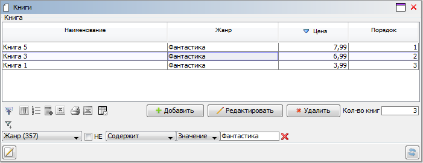

## Example 1

### Task

We have the concept of books, for which title, genre and price are defined.

```lsf
CLASS Book 'Book';
name 'Name' = DATA ISTRING[50] (Book) IN id;
genre 'Genre' = DATA ISTRING[30] (Book) IN id;

price 'Price' = DATA NUMERIC[12,2] (Book) IN id;

FORM books 'Books'
    OBJECTS b = Book
    PROPERTIES(b) READONLY name, genre, price
    PROPERTIES(b) NEWSESSION NEW, EDIT, DELETE
;

NAVIGATOR {
    NEW books;
}
```

We need to display the number of books on the form, taking into account filters made by the user.

### Solution

```lsf
filtered 'Book filtered' (Book b) = FILTER books.b;
filteredCount 'Number of books' = GROUP SUM 1 IF filtered(Book b);

EXTEND FORM books
    PROPERTIES() READONLY filteredCount DRAW b TOOLBAR
;
```

The solution uses the [`FILTER` operator](Filter_FILTER.md), which returns `TRUE` if the object is included in the current filter on the form.

## Example 2

### Task

Similar to [**Example 1**](#example-1).

We need to display the serial number of the book in the table with books taking into account the current filter and order made by the user.

### Solution

```lsf
index 'Order' (Book b) = PARTITION SUM 1 IF filtered(b) ORDER [ ORDER books.b](b);

EXTEND FORM books
    PROPERTIES(b) index
;
```

The property with the current order, defined using the [`ORDER` operator](Order_ORDER.md), is not declared as a separate named property but is used directly in the expression.

The form obtained in both examples, with user-defined filter and order, will look like this:


