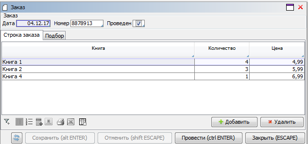

## Posting documents

### Task

There is some logic for working with orders.

```lsf
CLASS Book 'Book';
name 'Name' = DATA ISTRING[100] (Book) IN id;

CLASS Order 'Order';
date 'Date' = DATA DATE (Order);
number 'Number' = DATA STRING[10] (Order);

CLASS OrderDetail 'Order line';
order 'Order' = DATA Order (OrderDetail) NONULL DELETE;

book 'Book' = DATA Book (OrderDetail) NONULL;
nameBook 'Book' (OrderDetail d) = name(book(d));

quantity 'Quantity' = DATA INTEGER (OrderDetail);
price 'Price' = DATA NUMERIC[14,2] (OrderDetail);
```

An order edit form has been created for orders.

```lsf
FORM order 'Order'
    OBJECTS o = Order PANEL
    PROPERTIES(o) date, number

    OBJECTS d = OrderDetail
    PROPERTIES(d) nameBook, quantity, price, NEW, DELETE
    FILTERS order(d) == o

    EDIT Order OBJECT o
;


FORM orders 'Orders'
    OBJECTS o = Order
    PROPERTIES(o) READONLY date, number
    PROPERTIES(o) NEWSESSION NEW, EDIT, DELETE
;

NAVIGATOR {
    NEW orders;
}
```

Besides, a `posted` property has been added for orders. In the future, only orders with this property will take part in subsequent calculations (for example, calculation of the reserved quantity).

```lsf
posted 'Completed' = DATA BOOLEAN (Order);
reserved 'Reserved' (Book b) = GROUP SUM quantity(OrderDetail d) IF posted(order(d)) BY book(d);

EXTEND FORM order
    PROPERTIES(o) posted
;
```

We need to do so that instead of the `ОК` button on the order form, there is a `Post` button that simultaneously sets the `posted` property for the order, saves changes, and closes the form.

### Solution

```lsf
post 'Complete' (Order o)  { posted(o) <- TRUE; }

EXTEND FORM order
    EVENTS ON OK post(o)
;
DESIGN order {
    PROPERTY(formOk()) {
        caption = 'Complete';
    }
}
```

Each time the renamed `OK` button is pressed, the `post` action will be executed in a single transaction. With this scheme, if the user wants to "post" a document, they just need to go to the edit form, uncheck the `Posted` box in the document header, then click `Save` and `Close`.

## Line selection

### Task

We have an order with an edit form similar to the [**Posting documents**](#posting-documents) example.

We need to add a possibility to enter order lines by specifying the quantify in the table containing the list of products. Any changes in order lines and this table should be automatically synchronized with each other.

### Solution

```lsf
quantity 'Qty' (Order o, Book b) = GROUP SUM quantity(OrderDetail d) BY order(d), book(d);
lastOrderDetail 'Last line' (Order o, Book b) = GROUP LAST OrderDetail d ORDER d BY order(d), book(d);

changeQuantity 'Change quantity' (Order o, Book b)  {
    INPUT q = INTEGER DO { // requesting a number
        IF lastOrderDetail(o, b) THEN { // checking if there is at least one row
            IF q THEN // inputting a number
                quantity(OrderDetail d) <- q IF d == lastOrderDetail(o, b) WHERE order(d) == o AND book(d) == b; // writing the quantity in the last row with such a book
            ELSE // the number is dropped - deleting the row
                DELETE OrderDetail d WHERE order(d) == o AND book(d) == b;
        } ELSE
            IF q THEN
                NEW d = OrderDetail { // creating a new row
                    order(d) <- o;
                    book(d) <- b;
                    quantity(d) <- q;
                }
    }
}

EXTEND FORM order
    OBJECTS b = Book
    PROPERTIES name(b) READONLY, quantity(o, b) ON CHANGE changeQuantity(o, b)
;

DESIGN order {
    OBJECTS {
        NEW pane { // creating a container after the order header
            fill = 1;
            type = TABBED;
            MOVE BOX(d);
            MOVE BOX(b) {
                caption = 'Selection';
            }
        }
    }
}
```

The form will look like this:



If the quantity changes on the `Selection` tab, the system will automatically change order lines. If the order lines are changed, the quantity on the `Selection` tab will change as well.

If an order has two or more lines with one book, the system will reset the quantity in the first lines and set the total in the last line. If you want the change to affect the last line only, you need to use the following action during saving:

```lsf
quantity(OrderDetail d) <- q WHERE d == lastOrderDetail(o, b);
```

However, users may not understand this behavior, since after they enter a particular quantity on the `Selection` tab, the total quantity for all lines will be shown in the same column and it will be different from the entered value.

## Aggregated documents

### Task

We have the order logic.

We need to add some invoicing logic so that an order could automatically create a corresponding invoice.

### Solution

In order to implement this logic, you need to create an abstract `Invoice` [class](Classes.md) with the necessary set of [abstract properties](Property_extension.md).

```lsf
CLASS ABSTRACT Invoice 'Invoice';
date 'Date' = ABSTRACT DATE (Invoice);
number 'Number' = ABSTRACT STRING[10] (Invoice);

CLASS ABSTRACT InvoiceDetail 'Invoice line';
invoice 'Invoice' = ABSTRACT Invoice (InvoiceDetail);
book 'Book' = ABSTRACT Book (InvoiceDetail);

quantity 'Quantity' = ABSTRACT INTEGER (InvoiceDetail);
price 'Price' = ABSTRACT NUMERIC[14,2] (InvoiceDetail);
```

A form containing the list of objects of this abstract class is also created. It will contain the objects of all classes inherited from the `Invoice` class.

```lsf
FORM invoices 'Invoices'
    OBJECTS i = Invoice
    PROPERTIES(i) READONLY date, number
    PROPERTIES(i) NEWSESSION edit, DELETE
;

NAVIGATOR {
    NEW invoices;
}
```

The `edit` property will call the current object's edit form defined for its class. If it's not defined for the current object's class, no action will be taken. The `DELETE` property will delete the current object if it doesn't violate any constrains.

An object of an abstract class cannot exist in the system. In order for the user to manually create an invoice, a separate class `UserInvoice` is created . Also, it requires the creation of properties symmetrical to the abstract ones that are later added as their implementation.

```lsf
CLASS UserInvoice 'Custom invoice' : Invoice;
date 'Date' = DATA DATE (UserInvoice);
number 'Number' = DATA STRING[10] (UserInvoice);

CLASS UserInvoiceDetail 'Custom invoice line' : InvoiceDetail;
userInvoice 'Custom invoice' = DATA UserInvoice (UserInvoiceDetail);
book 'Book' = DATA Book (UserInvoiceDetail);
nameBook 'Book' (UserInvoiceDetail d) = name(book(d));

quantity 'Quantity' = DATA INTEGER (UserInvoiceDetail);
price 'Price' = DATA NUMERIC[14,2] (UserInvoiceDetail);

// implementing invoice properties
date(UserInvoice i) += date(i);
number(UserInvoice i) += number(i);

// implementing the properties of the invoice lines
invoice (UserInvoiceDetail d) += userInvoice(d);
book (UserInvoiceDetail d) += book(d);

quantity (UserInvoiceDetail d) += quantity(d);
price (UserInvoiceDetail d) += price(d);
```

Let's create a form for editing a user-generated invoice. Let's add a button for adding a user-generated invoice to the form with a list of abstract invoices.

```lsf
FORM userInvoice 'Invoice (custom)'
    OBJECTS i = UserInvoice PANEL
    PROPERTIES(i) date, number

    OBJECTS d = UserInvoiceDetail
    PROPERTIES(d) nameBook, quantity, price, NEW, DELETE
    FILTERS userInvoice(d) == i

    EDIT UserInvoice OBJECT i
;

EXTEND FORM invoices
    PROPERTIES(i) NEWSESSION NEW[UserInvoice]
;
```

For orders, let's create a `createInvoice` option that will be used for generating an invoice. We will now need to create a `OrderInvoice` class that will be inherited from `Invoice`. An object of this class will be automatically created and deleted by the system for every order with the `createInvoice` option. Therefore, this invoice is an [aggregated object](Aggregations.md) for the corresponding order. Aggregation for the invoice line relative to the order line is created identically.

```lsf
createInvoice 'Create invoice' = DATA BOOLEAN (Order);
EXTEND FORM order PROPERTIES(o) createInvoice;

// aggregated invoice
CLASS OrderInvoice 'Invoice based on order' : Invoice;
orderInvoice = AGGR OrderInvoice WHERE createInvoice(Order order) MATERIALIZED INDEXED;
date(OrderInvoice i) += date(order(i));
number(OrderInvoice i) += number(order(i));

// aggregated invoice lines
createInvoiceDetail 'Create invoice line' (OrderDetail d) = createInvoice(order(d));

CLASS OrderInvoiceDetail 'Invoice line based on order' : InvoiceDetail;
orderInvoiceDetail = AGGR OrderInvoiceDetail WHERE createInvoiceDetail(OrderDetail orderDetail) MATERIALIZED INDEXED;

invoice (OrderInvoiceDetail d) += orderInvoice(order(orderDetail(d)));
book (OrderInvoiceDetail d) += book(orderDetail(d));

quantity (OrderInvoiceDetail d) += quantity(orderDetail(d));
price (OrderInvoiceDetail d) += price(orderDetail(d));
```

We specify that an attempt to edit such an aggregated invoice will have to open the edit form for the associated order.

```lsf
edit(OrderInvoice i) + {  edit(order(i)); }
```

When you try to delete an invoice created for an order, you will see an error message.

The fundamental difference between this aggregation approach and one based on generating an invoice against an order is that the system automatically ensures synchronization between orders and invoices. When creating order-based invoices, the user has to manually modify them if corresponding orders are changed. Otherwise, it will require a separate event handling mechanism that will be responsible for it.
