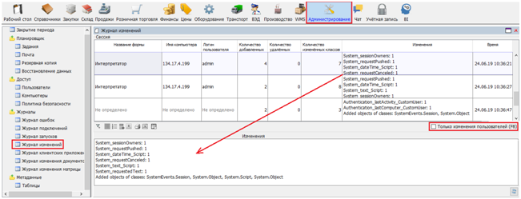
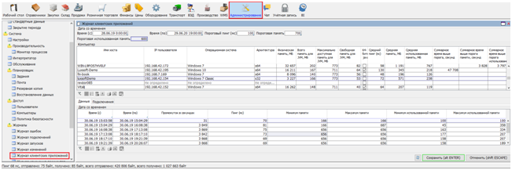
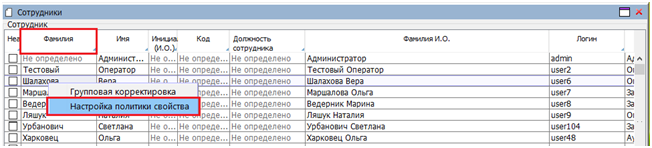
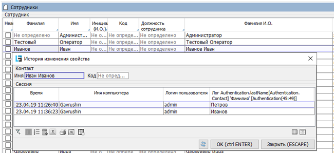

### Logs

-   Error log (fig. 1).

This log contains all errors that occurred during the operation. Errors are divided into the following classes (the `Object class` column):

-   errors that occurred on the server –– errors are displayed on a white background and are included in class `Exception on server`;
-   errors that occurred on the server and were received by the client application –– errors are displayed on a pink background and are included in class `Exception on server (from client)`;
-   errors that occurred in the client application – errors are displayed on a yellow background and fall into two classes: `Exception on client` and `Exception on web client`;
-   connection errors – errors are displayed on a blue background and are divided into two classes:
    -   `Temporary connection loss` - connection with the server was interrupted, but was then restored;
    -   `Permanent connection loss` - connection with the server was interrupted and could not be restored;

 Fig. 1 Error log.

The `Exception trace` section displays the java stack for the error; the `Exception LSF trace` displays the lsfusion stack. 

-   Connection Log (fig. 2).

Fig. 2 Connection Log.

The log stores information about users who connected to the system, from which computer, the characteristics of that computer, as well as information about the date and time of connection / disconnection. On the form, you can display the users currently working with the database: `Active connections`.

The `Form` section shows which forms the user entered and how many times. The `Session` section lets you trace when changes were applied, for some forms.

-   The startup log stores information about the dates and times when the application server was started (restarted). You can also see the name of the computer on which the server is installed and the version of the application (if filled in during the build).

-   The change log contains more detailed information about the changes which were reflected in the `Session` section of the connection log (fig. 3.).

Fig. 3 Change log.

The `Change` column displays a list of Properties (columns) where the values changed, as well as the number of changes (rows). Only changes in the current form are logged: dependent Properties that change simultaneously on other tables do not feature on this list.

The form lets you filter the changes made by users (excluding system changes) by checking `Only user changes`.

-   The client application log contains information about the quality of the connection while working with the application server for a given period of time (fig. 4.).

Fig. 4 Client application log.

As well as system memory indicators, you can analyze the average response time (ping) in milliseconds and the memory available to and used by the java application on client computers in the upper part of the form. The period to be analyzed is set by entering `Date from` and `Date to` in the `Date and time` section. In addition to dates, you can also set a threshold value here for the same indicators (ping and memory)–this allows you to get the total time (in seconds) when the client PC has exceeded the threshold values.

The `Data` tab at the bottom provides a chronology of changes in response time and in memory available and used. This information is displayed for the Desktop client only.

How much information should be stored in these logs is indicated in the `Admin form > Settings > Logging tab` (fig. 5.).

Fig. 5 Setting the number of days for logging.

If you need to track changes to the individual values of any  Properties (columns), a mechanism for user logging has been developed to allow you to do it. For example, let's say you need to record changes to an employee's last name in the Employees directory. To do this:

-  go to any entry in the `Surname` column and right-click to bring up the `Configure property policy` menu (fig. 6.);

Fig. 6 Select a property to log changes.

-   in the `Security policy` form, check `Logged by user` and click `OK` (fig. 7.);

Fig. 7 Setting user logging.

-   once you restart the application server, right-clicking on the `Surname` property will bring up an additional `Show Change History` menu item. If the surname for the current record has been changed by someone, then this will be reflected in the property change history (fig. 8).

### 

Fig. 8. Property change history.

The retention time for these logs is set to the same retention time as for the Change Log.

### Logs {#logs}

The following set of logs is supported for each platform component in the platform:

|Component|Folder|Logs|
|---|---|---|
|Application server (Server)|`$FUSION_DIR$/logs`, where `$FUSION_DIR$` is the application server startup folder|<ul><li>`stdout` - standard output log (output to the standard output stream, i.e. to the OS console, IDE, etc.). Includes `start` and `explain` logs.</li><li>`stderr` - general error log</li><li>`start` - a log of the stop and start process</li><li>`remote`, `invocation` - logs of processes related to accessing the application server</li><li>`sql`, `sqlhand`, `sqlconnection`, `sqlconflict`, `sqladjust` - logs of processes related to accessing the database server</li><li>`explain`, `explaincompile` - logs where query plans are displayed (database server and application server, respectively)</li><li>`lru` - log of memory management processes (mainly LRU caches)</li><li>`allocatedbytes` - log of memory allocation processes</li><li>`assert` - a log of various checks on meeting specified conditions (or rather, non-meeting)</li><li>`mail` - mail log</li><li>`jasperReports` - JasperReports log</li><li>`jdbc` - jdbc driver log</li><li>`exinfo` - a log of additional information (not included in the above)</li></ul>|
|Web server (Client)|`$CATALINA_BASE$/logs`, where `$CATALINA_BASE$` is the folder where Tomcat is installed|<ul><li>`catalina.out` - general output log</li><li>`gwtlog`, `gwtlog-err` - GWT logs</li><li>`invocation` - logs of processes related to accessing the web server</li></ul>|
|Desktop client|`$USER_DIR$/.fusion/logs`, where `$USER_DIR$` is the user folder|<ul><li>`stdout` - standard output log (output to the standard output stream, i.e. to the OS console, IDE, etc.).</li><li>`stderr` - general error log</li><li>`remote`, `invocation` - logs of processes related to accessing the application server</li><li>`jasperReports` - JasperReports log</li></ul>|

  

:::info
With [automatic installation](Execution_auto.md) under Linux, symlinks for these folders (as well as for the [lsFusion launch parameters](Launch_parameters.md#applsfusion)) are automatically created to [other folders](Execution_auto.md#logs) whose location is better aligned with Linux ideology.
:::
