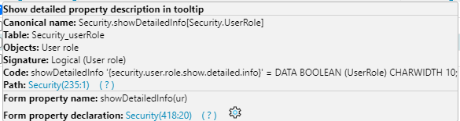
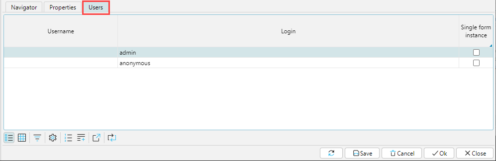

### Customizing user roles

The system uses the concept of User. A user is an object that contains information about one person working in the system. 

The functionality available to a User is determined by their Role or list of Roles. The Role determines which forms, fields, and buttons are available.

The User’s card (`Administration > Security > Users`) indicates which roles are assigned to the user (Fig. 1.).

Fig. 1. Assigning Employee Roles

### Setting access to system elements

The security policy for each Role is configured in the `Administration > Security > Security Policy`. This is where the composition of Roles is determined, using the `Add`, `Delete`, and `Copy` buttons. When a Role is copied, all rights are copied too. 

Fig. 2. Configuring security policy by role

For each Role you need to specify a name (`Name`) and a code (`Code`), and you can also set the following parameters:
- `Show detailed property description` – if you hover over a property, button, field, etc., a description will be displayed in a popup window.

Fig. 3. Detailed property description
- `Single form instance` - when selecting a form already open on the desktop in the navigator, the user will go to it, no additional window will be opened.  If there is a need to open several windows with this form, it is necessary to hold the `Ctrl` key when calling the form. This restriction can also be set for a specific user on the `Users` tab.
- `Forms on client’s startup` - for a role it is possible to define the forms that will be opened immediately after the user logs into the program. For this purpose, on the `Navigator` tab, in the `Number on client’s startup` field for the required forms the number in order is specified (see Fig. 2).
- ` Maximize on client's startup` - on logging in, the program will be opened in the full screen mode ( the navigation menu will be hidden)
- `Disable role` - access rights configured for the role will not be applicable. 

#### Navigator Tab

The `Navigator` tab displays all Forms that exist in the system. They are displayed either as a tree or as a table. In the tree view, the list of forms reflects the structure of existing modules and is most convenient to control access to them.

You can set one of three statuses for each form in the `Access` column:

`Permit` – a user can access the form

`Forbid` – a user cannot access the form

`Default` - the form will be available by default to the user with the given role. If a user has multiple roles, the form will be available if there is `Permit` or no `Forbid` among these roles.

Fig. 4. Example of configuring access to forms

The status set for a tree branch automatically applies to child branches. If necessary, a child branch can be set to a different access status, in which case the status of the parent element will be highlighted with a gray background, so that the user can visually determine that there are elements with a different access status in the structure of this branch. According to the settings shown in Fig. 4 only `Templates` forms are available to the user in the `Master data` menu.  

Fig. 5. Result of setting access to forms

#### Properties Tab

The `Properties` tab displays all the form elements available in the system: fields, buttons, checkboxes, etc. Like the Forms themselves, Properties are presented in tree and table form.

A role can have one of three access statuses for actions on properties:

`View` – defines whether the property is visible to a user

`Change` - defines whether a user can change the value of the property

`Follow` – if the property value is an object, defines whether a user can access the object to change it

The access status for Properties is set in the same way as for Forms. However, given the large number of different properties in the application, on the `Properties` tab it is convenient to define the access level to the property group corresponding to the upper branches of the tree, or to view the status of role permissions in terms of properties. 

Fig. 6. Managing access rights to properties

To set up access rights to a particular property on a form, it is convenient to use the context menu. To do this, right-click on the button or field you want to configure and select `Setup property policy` in the context menu. The `Security policy` window will open, where you can set the access level to the property for each role or for several roles, then click `OK`. All changes made and saved via the context menu are also displayed on the `Properties` tab of the `Security Policy` form.

Fig. 7. Option for configuring access to an individual property

#### Users Tab

This tab displays all the users to whom the highlited role is assigned as a primary or secondary role.

Fig. 8 . Users tab

All changes made on the `Security policy` form are activated after the next user login.

By default, there are 4 roles pre-installed in the platform:

-	Administrator (admin)
-	Readonly (readonly)
-	Default (default)
-	Self register (selfregistar)

:::info
Note that when set for a form or property, `Default` access applies permission or restriction, depending on the additional roles set. The set `Default` access does not apply the value specified in the Default role settings. To have the accesses configured in the Default role applied to a user, the user must be assigned that role.
::: 
