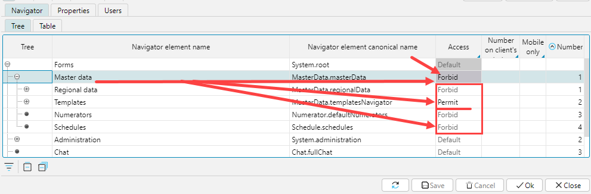
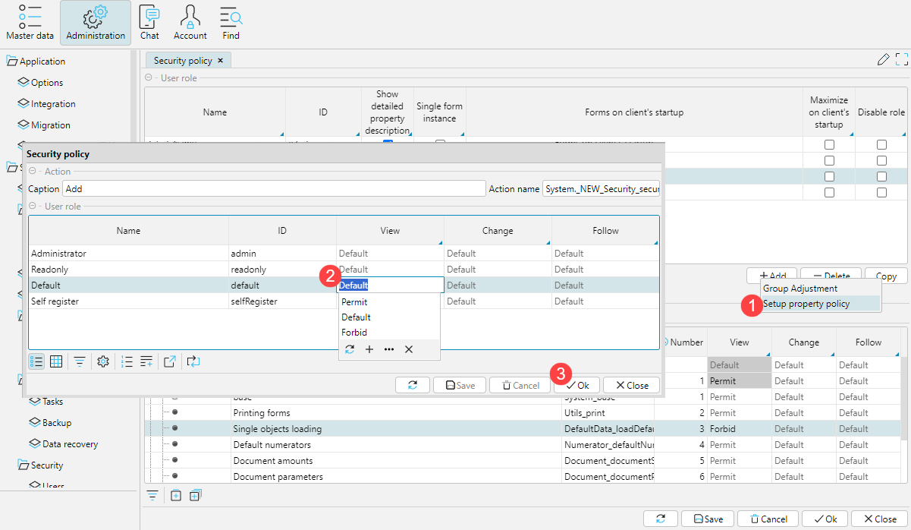

### Customizing user roles

The system uses the concept of User. A user is an object that contains information about one person working in the system. The system can store information about both its own employees and employees of other organizations.

The functionality available to a User is determined by their Role or list of  Roles. The Role determines which forms, fields, and buttons are available.

The User’s card (`Admin > Access > Users`) indicates the Main role; if necessary, Additional roles are assigned (Fig. 1.).

Fig. 1. Assigning Employee Roles

### Setting access to system elements

The security policy for each Role is configured in the `Admin > Access > Security Policy > Roles tab`. This is where the makeup of the Roles is determined, using the `Add`, `Delete`, and `Copy` buttons. When a Role is copied, all rights are copied too. If `default main role` is specified, then when a new employee is saved without a primary role they will be assigned a role from this field.

Fig. 2. Configuring security policy by role

For each Role, you can define some initial rights:

-   `Enable / disable all elements of the navigator` – serves for initial installation of access rights to all forms. For Roles with limited access to functionality, it is recommended that you set `Disable all navigation elements`. This facilitates further customization of access to specific forms: you only need to list the forms to which the user has access.
-   `Enable / disable viewing of all properties` – serves for initial setting of rights to view all form elements: buttons, fields, checkboxes, etc.
-   `Enable / disable changing all properties` – serves for initial installation of rights to use all form elements.
-   `Prevent viewing / editing security policies` – restricts access to security policy settings, i.e. an employee with this role will not be able to independently change access to form elements.
-   `Disable password changes` – employees with this role are not allowed to change their passwords. This restriction can be set for a specific user in the `Users` tab.
-   `Disable profile editing` – employees with this role are not allowed to change their Login, First Name, Last Name, Email, or font size. This restriction can be set for a specific user in the «Users» tab.
-   `Open form once` – if the user repeatedly opens an already open form (usually by accident), an additional window for the form is not created. If you do need to open the same form again, then hold down the `Ctrl` key when calling the form. This restriction can be set for a specific user in the `Users` tab.
-   `Forms when opened` – for each role, you can define the Forms that will be opened immediately when the employee enters the program. To do this, use the `Display forms by default` field; the number is then indicated for the forms in the `Default number` field in the `Navigator` tab. Usually used for a cashier's workstation.

Tabs on the `Security policy > Roles tab`:

-   The `Navigator` tab displays all Forms that exist in the system. They are displayed either as a tree or as a table. In the tree view, the list of forms reflects the structure of existing modules and is most convenient for controlling access to them. In addition, a deeper the tree branch, the higher the priority set to `Allow` / `Deny`. For example, on the `Desktop`, set the `Deny` flag for the entire Sales section but the `Allow` flag for the `Invoice` form. (fig. 3.)

Fig. 3. Example of configuring access to forms

As a result, when a user logs in with this role, they will be able to access the `Invoice` form but they will not see the `Processing internal orders` form. (fig. 4.)

Fig. 4. Result of setting access to forms

-   The `Properties` tab displays all the form elements available in the system: fields, buttons, checkboxes, etc. Like the Forms themselves, Properties are presented in tree and table form. The functional content of the forms used can be set for a role by setting permissions / prohibitions on viewing and changing properties. As practice shows, using this tab is justified for setting access to the upper branches of the property tree, i.e. for whole property groups. To configure access by specific properties (on a specific form), it is better to use the context menu (right-click) on the form element of interest. For example, on the `Invoice (purchase)` form we need to set constraints on closing documents for some roles. To do this, hover the mouse over the `Close` button and right-click on `Security policy settings` (fig. 5).

Fig. 5. How to configure access to an individual property

In the window that opens, check `Disable view`. in the `Access` section. This means that for all roles, by default, this button in this form will not be visible. And further, by checking permit against certain roles, we enable employees of only these roles to use this button (Fig.7.7.).

Fig. 6. Option for configuring access to an individual property

In the same way, you can organize access to fields and columns on any form. All changes made when configuring access to an individual element of the Form are transmitted to the `Properties` tab on the `Security policy` form.

-   On the tab `Additional Security Policy`, you can set the highest priority rights (bypassing those previously described) for some features in the program. This is done by entering the number 1 in the `Order` field (Fig. 7.).

Fig. 7. Setting an additional security policy

For Forms and Properties for which access rights have not been set (the enable / disable flags are not specified) at the role level, the rights specified in the `Default` are applied (Fig. 8.).

Fig. 8. Setting a default security policy

All changes made on the `Security policy` form are activated after the next user login.
