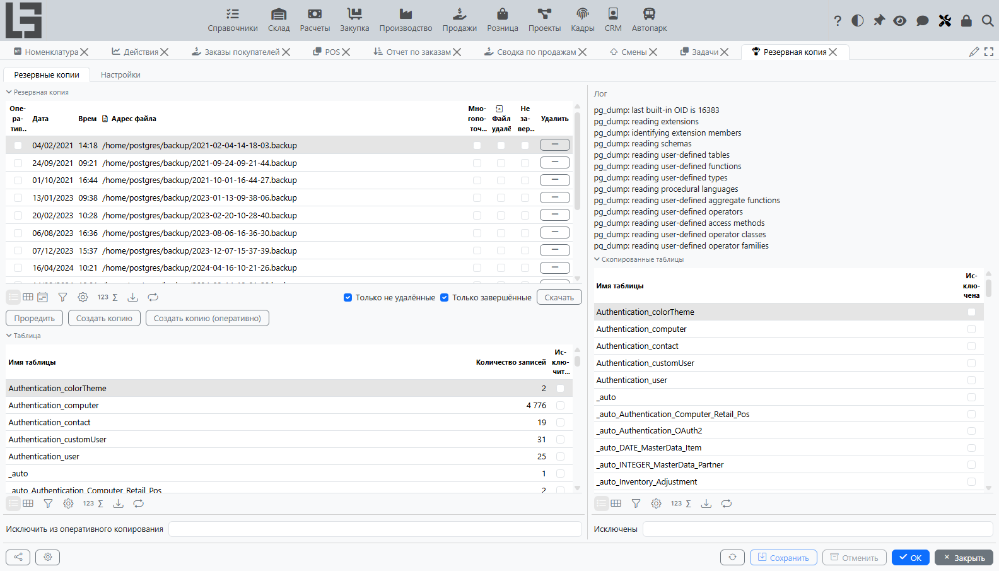
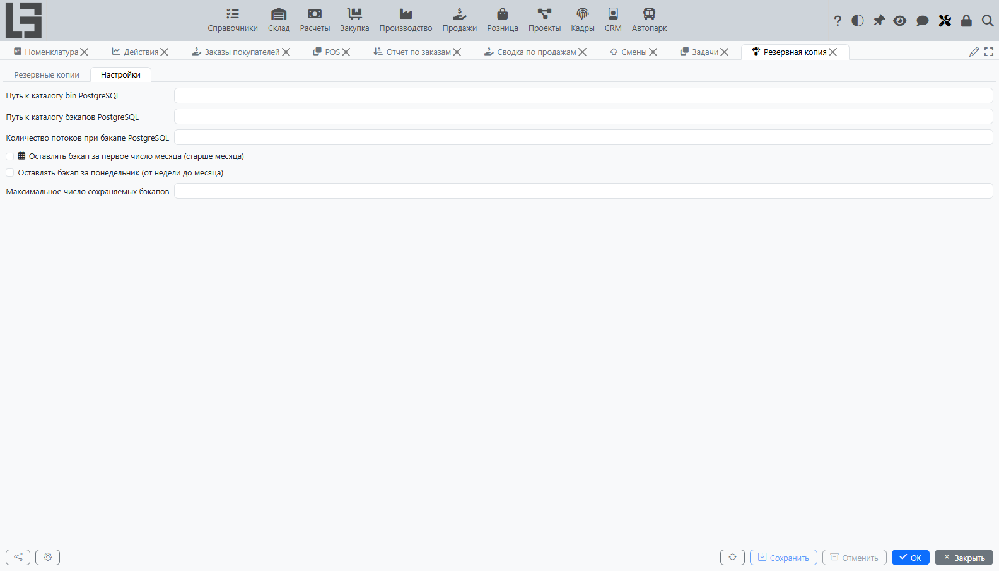
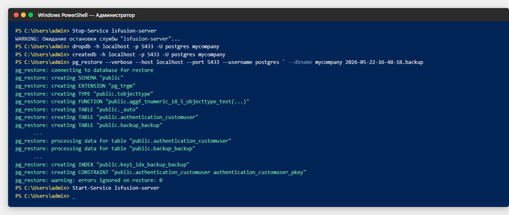
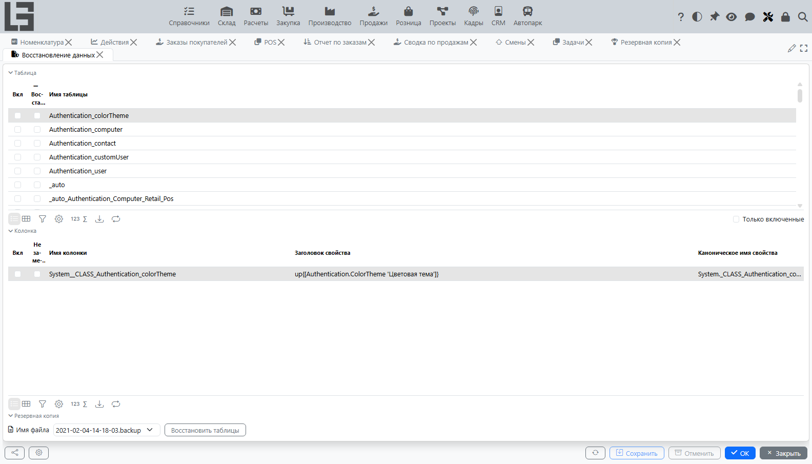

Платформа создаёт резервные копии базы данных, вызывая стандартную утилиту PostgreSQL `pg_dump`, и восстанавливает выбранные таблицы резервной копии, вызывая `pg_restore` во временную базу данных. Управление резервными копиями выполняется в меню `Администрирование > Система > Планировщик > Резервная копия` (рис. 1.). Выборочное восстановление выполняется в меню `Администрирование > Система > Планировщик > Восстановление данных`.

Рис. 1. Список созданных резервных копий

### Настройки

Параметры резервного копирования задаются на вкладке `Настройки` формы `Резервная копия` (рис. 2.).

Рис. 2. Настройки резервного копирования

- `Путь к каталогу bin PostgreSQL` – путь к каталогу `bin` PostgreSQL, содержащему `pg_dump`, `pg_restore`, `createdb` и `dropdb`. Если поле пустое, платформа вызывает эти утилиты по имени из системного `PATH`.
- `Путь к каталогу бэкапов PostgreSQL` – каталог, в который записываются файлы резервных копий. Если каталог не существует, платформа пытается его создать; если ни то, ни другое невозможно, резервное копирование отменяется с сообщением об ошибке.
- `Количество потоков при бэкапе PostgreSQL` – число параллельных заданий `pg_dump`. При значении больше 1 резервная копия создаётся в формате PostgreSQL `directory` (каталог из нескольких файлов); иначе она создаётся как один файл в формате `custom`. Значение по умолчанию – 1.
- `Оставлять бэкап за понедельник (от недели до месяца)` – при установке резервная копия, сделанная в понедельник, сохраняется, пока не станет старше месяца, даже если иначе она была бы удалена правилами хранения.
- `Оставлять бэкап за первое число месяца (старше месяца)` – при установке резервная копия, сделанная первого числа месяца, сохраняется независимо от её возраста.
- `Максимальное число сохраняемых бэкапов` – верхний предел числа резервных копий, остающихся после прореживания. Если это поле и оба предыдущих флага пусты, в качестве предела используется значение по умолчанию 30.

### Создание резервной копии

Резервную копию можно создать вручную с панели инструментов вкладки `Резервные копии` или автоматически с помощью планировщика.

На панели инструментов есть три кнопки:

- `Создать копию` – создаёт полную резервную копию всех таблиц платформы.
- `Создать копию (оперативно)` – создаёт резервную копию, исключающую таблицы, отмеченные для исключения (см. ниже).
- `Проредить` – немедленно применяет правила хранения (см. [Хранение](#хранение)).

После установки платформа создаёт задание планировщика `Резервное копирование`, которое запускается ежедневно в 01:00 и выполняет `Backup.makeBackup[]`, а затем `Backup.decimateBackups[]`. Расписание и список действий можно редактировать так же, как у любого другого задания – см. [Планировщик](Scheduler.md).

Каждая созданная резервная копия хранится в виде строки на вкладке `Резервные копии` со следующими колонками:

- `Оперативная копия` – установлен, если копия была создана через `Создать копию (оперативно)`.
- `Дата`, `Время` – момент начала резервного копирования; имя файла в `Путь к каталогу бэкапов PostgreSQL` имеет вид `yyyy-MM-dd-HH-mm-ss.backup`.
- `Адрес файла` – полный путь к файлу резервной копии (или к каталогу, для многопоточных копий).
- `Многопоточный` – установлен, если копия создана несколькими потоками, то есть в формате `directory`.
- `Файл удалён` – установлен после того, как файл резервной копии был удалён действием `Удалить` или прореживанием.
- `Не завершён` – установлен, если `pg_dump` завершился с непустым логом и без записи об успешном завершении.
- `Лог` – полный текст лога `pg_dump`, записанного в файл с суффиксом `.log` рядом с файлом резервной копии.

По умолчанию список фильтруется по `Только не удалённые` и `Только завершённые`; оба фильтра можно отключить, чтобы увидеть все строки.

Кнопка `Скачать` на строке резервной копии скачивает файл резервной копии на клиент. Резервная копия в формате `directory` упаковывается в один ZIP-архив перед скачиванием. Кнопка `Удалить` удаляет файл (или каталог) резервной копии и соответствующий файл лога из `Путь к каталогу бэкапов PostgreSQL` и помечает строку как `Файл удалён`; сама строка остаётся в списке для справки.

#### Оперативные копии

Оперативная копия пропускает данные выбранных таблиц; структура таблиц и данные всех остальных таблиц сохраняются как обычно. Таблицы исключаются двумя способами (рис. 3.):

- установкой флага `Исключить из оперативного копирования` на строке списка таблиц, показанного на той же вкладке. Эта настройка постоянна и применяется при каждом нажатии `Создать копию (оперативно)`;
- перечислением имён таблиц через запятую в поле `Исключены` под списком таблиц. Это удобно для таблиц, ещё отсутствующих в списке таблиц на момент настройки.

Рис. 3. Настройка таблиц, исключаемых из оперативной копии

Для копии, уже находящейся в списке, фактический набор исключённых таблиц виден в правой панели: блок `Скопированные таблицы` показывает каждую таблицу с флагом `Исключена` для этой конкретной копии, а поле `Исключены` под ним показывает поименный список для копии. Соответствующий вызов `pg_dump` выполняется с `--exclude-table-data=<table>` для каждой исключённой таблицы.

### Хранение

Действие `Проредить` (также вызываемое ежедневно стандартным заданием планировщика) удаляет файлы резервных копий, которые больше не нужны, и помечает соответствующие строки как `Файл удалён`. Копии, уже помеченные как удалённые, игнорируются. Правила вычисляются по дате каждой копии, от новых к старым:

- копия, сделанная в последние 7 дней, сохраняется;
- копия в возрасте от 8 до 30 дней сохраняется, только если она сделана в понедельник и установлено `Оставлять бэкап за понедельник`, либо первого числа месяца и установлено `Оставлять бэкап за первое число месяца`;
- копия старше 30 дней сохраняется, только если она сделана первого числа месяца и установлено `Оставлять бэкап за первое число месяца`;
- как только число сохранённых копий достигает `Максимальное число сохраняемых бэкапов`, все более старые удаляются независимо от остальных правил.

Если `Максимальное число сохраняемых бэкапов`, `Оставлять бэкап за понедельник` и `Оставлять бэкап за первое число месяца` все пусты, платформа использует значение `Максимальное число сохраняемых бэкапов` по умолчанию, равное 30.

### Восстановление данных

Платформа поддерживает два вида восстановления:

- полное восстановление поверх рабочей базы данных, выполняемое вручную утилитами PostgreSQL вне пользовательского интерфейса;
- выборочное восстановление выбранных таблиц и колонок из резервной копии в работающую базу, выполняемое из формы `Восстановление данных`.

#### Полное восстановление

Полное восстановление заменяет всю рабочую базу данных содержимым файла резервной копии. Платформа не выполняет эту операцию из пользовательского интерфейса, потому что она требует остановки сервера – нет безопасного способа удалить и пересоздать рабочую схему, пока пользовательские сессии выполняются и изменяют её. Полное восстановление выполняется администратором вручную (рис. 5.):

1. Остановите сервер платформы.
2. Удалите рабочую базу данных командой `dropdb <dbname>`.
3. Создайте пустую базу данных с тем же именем командой `createdb <dbname>`.
4. Выполните `pg_restore --dbname=<dbname> <backup_file>` для пустой базы данных. Утилиты `pg_restore`, `dropdb` и `createdb` берутся из `Путь к каталогу bin PostgreSQL` (см. [Настройки](#настройки)) или из системного `PATH`.
5. Запустите сервер платформы. При старте платформа синхронизирует структуру базы данных с текущим набором модулей `.lsf`, мигрируя таблицы, которые отсутствуют или изменились со времени создания резервной копии.

Рис. 5. Последовательность команд полного восстановления

Резервная копия, созданная в формате `directory` (с `Количество потоков при бэкапе PostgreSQL` больше 1), должна восстанавливаться с `pg_restore --format=d <backup_dir>`; для одиночного файла в формате `custom` `pg_restore` автоматически определяет формат по заголовку файла.

#### Выборочное восстановление

Форма выборочного восстановления открывается из `Администрирование > Система > Планировщик > Восстановление данных` (рис. 4.).

Рис. 4. Выбор таблиц и колонок для восстановления

Форма содержит три части:

- список таблиц слева, с флагом `Вкл` для каждой включаемой в восстановление таблицы и флагом `Восстанавливать удалённые объекты` (см. ниже);
- список колонок выбранной таблицы справа, с флагом `Вкл` для каждой импортируемой колонки и флагом `Не замещать` (см. ниже);
- селектор резервной копии и кнопка `Восстановить таблицы` внизу.

Восстановление выполняется следующим образом. Платформа вызывает `createdb` для создания временной базы данных с именем, начинающимся с `db-temp`, и затем вызывает `pg_restore --table <name>` для каждой включённой таблицы в эту базу. Данные включённых колонок читаются из временной базы и записываются в рабочую базу в обычной пользовательской сессии, так что все ограничения, события и агрегации, определённые для затронутых свойств, применяются как обычно. Временная база удаляется после завершения восстановления независимо от того, успешно ли оно прошло.

Два построчных флага управляют тем, как записываются данные:

- `Восстанавливать удалённые объекты` – при установке строки, идентификатор объекта которых больше не присутствует в рабочей базе, восстанавливаются созданием объекта с исходным идентификатором. Без установки такие строки пропускаются.
- `Не замещать` – при установке на колонке значение из резервной копии записывается только для тех объектов, у которых эта колонка сейчас пуста; существующие значения остаются как есть.

Если файла резервной копии не существует или ни одна таблица не отмечена `Вкл`, восстановление отменяется с сообщением об ошибке.

:::info
Выборочное восстановление читает таблицы из резервной копии по их физическим именам. Таблицы, которые были переименованы, удалены или разбиты после создания резервной копии, могут оказаться нечитаемыми; в этом случае соответствующая строка в логе `pg_restore` укажет на отсутствующую таблицу, и данные для неё импортированы не будут.
:::
