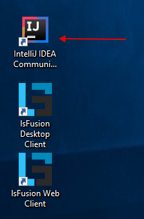

На этой странице можно скачать программы установки, которые установят все необходимое для разработки в один клик. Помимо lsFusion эти программы также устанавливают OpenJDK, PostgreSQL, Tomcat и IntelliJ IDEA Community Edition со встроенным lsFusion плагином. Если какие-то из этих программ уже есть на вашем компьютере, то их можно будет исключить в процессе установки.

## Скачать

### Windows

**lsFusion 5.1** (OpenJDK **11.0.16**, PostgreSQL **15.1**, Tomcat **9.0.67**, IntelliJ IDEA Community Edition **2022.3.1**)

- [x64](https://download.lsfusion.org/exe/lsfusion-dev-5.1-x64.exe)

<strong>Предыдущие версии</strong>

 

- lsFusion 5.0 ([x64](https://download.lsfusion.org/exe/lsfusion-dev-5.0-x64.exe))
- lsFusion 4.1 ([x32](https://download.lsfusion.org/exe/lsfusion-dev-4.1.exe) / [x64](https://download.lsfusion.org/exe/lsfusion-dev-4.1-x64.exe))
- lsFusion 3.1 ([x32](https://download.lsfusion.org/exe/lsfusion-dev-3.1.exe) / [x64](https://download.lsfusion.org/exe/lsfusion-dev-3.1-x64.exe))
- lsFusion 2.4 ([x32](https://download.lsfusion.org/exe/lsfusion-dev-2.4.exe) / [x64](https://download.lsfusion.org/exe/lsfusion-dev-2.4-x64.exe))

## После установки

После того как установка успешно завершится, на рабочем столе будут автоматически созданы соответствующие ярлыки для запуска IDE и клиента:

### Запуск IDE

При использовании автоматической установки, создается ярлык, запускающий IDEA.

Описание работы с IDE после ее запуска находится [здесь](IDE.md).

### Запуск клиента

При использовании автоматической установки, по умолчанию, создаются два ярлыка. Первый ярлык открывает в браузере ссылку на локально установленный веб-клиент. Второй ярлык запускает десктоп-клиент. Пароль администратора (пользователь admin - единственный по умолчанию создаваемый пользователь) соответствует тому, который был указан при установке платформы (по умолчанию пустой).

  
