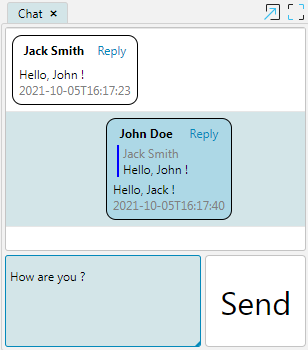

Для каждого типа [свойства](Properties.md) по умолчанию используется свой предопределенный визуальный компонент для отображения и 
редактирования данных. Однако, существует возможность переопределять компоненты на свои собственные, создаваемые при 
помощи JavaScript. Эта функциональность поддерживается только в веб-клиенте.

Рассмотрим задачу по созданию чата для общения между пользователями с целью демонстрации этой возможности.

### Доменная логика

Для начала создадим доменную логику, в которой определена сущность _Сообщение_. 
Каждое сообщение содержит плоский текст, а также информацию об авторе и времени отправки.

```lsf
CLASS Message 'Message';

dateTime 'Time' = DATA DATETIME (Message);
text 'Text' = DATA TEXT (Message);

author = DATA CustomUser (Message);
nameAuthor 'Author' (Message m) = name(author(m));

replyTo = DATA Message (Message);
nameAuthorReplyTo (Message m) = nameAuthor(replyTo(m));
textReplyTo (Message m) = text(replyTo(m)); 
```

### Отображение списка сообщений

Список сообщений в чате на форме будем отображать как записи в таблице с одной колонкой. 
Для этой колонки будет изменен компонент отображения значения на тот, который будет написан на JavaScript.
Проще всего значение представить в виде строки формата JSON, в которой будут храниться все параметры сообщения.
Для формирования этой строки воспользуемся встроенной в PostgreSQL функцией _json_build_object_ :

```lsf
json (Message m) = 
    [FORMULA STRING 'json_build_object(\'author\',$1,\'time\',$2,\'text\',$3,\'own\',$4,\'replyAuthor\',$5,\'replyText\',$6,\'replyMessage\',$7)'](
         (OVERRIDE nameAuthor(m), ''), 
         dateTime(m), 
         text(m), 
         IF author(m) = currentUser() THEN 1 ELSE 0, 
         (OVERRIDE nameAuthorReplyTo(m), ''), 
         (OVERRIDE textReplyTo(m), ''), 
         (OVERRIDE LONG(replyTo(m)), 0)
    );
```
Пример значения:
```json
{
    "author":"John Doe",
    "time":"2021-10-05T15:28:05",
    "text":"Hello, Jack!",
    "own":1,
    "replyAuthor":"Jack Smith",
    "replyText":"Hello, John",
    "replyMessage":31302
}
```

Отметим, что все значения не должны содержать NULL. Иначе значение выражения, полученного через оператор [FORMULA](FORMULA_operator.md), 
будет также равно NULL.

Далее создадим при помощи JavaScript и CSS компонент, который будет отображать сообщения в браузере.
Компонент создадим в файле chat.js, который расположим в папке _resources/web_. 
Во время запуска платформы все js и css файлы, находящиеся внутри папки web любого элемента из classpath будут загружены на страницу браузера автоматически.

Внутри файла chat.js создадим функцию _chatMessageRender_. Она будет возвращать объект, состоящий из двух функций: _render_ и _update_.

Функция _render_ принимает на вход элемент, внутри которого должны создаваться новые элементы, необходимые для отображения данных:
```js
render: function (element) { 
    element.style.removeProperty("max-height");
    element.parentElement.style.removeProperty("height");

    var message = document.createElement("div")
    message.classList.add("chat-message");

    var header = document.createElement("div");
    header.classList.add("chat-header");

    var author = document.createElement("div");
    author.classList.add("chat-author");

    element.author = author;
    header.appendChild(author);

    var replyAction = document.createElement("a");
    replyAction.classList.add("chat-reply-action");

    var replyCaption = document.createTextNode("Reply");
    replyAction.appendChild(replyCaption);

    element.replyAction = replyAction;
    header.appendChild(replyAction);

    message.appendChild(header);

    var replyContent = document.createElement("div");
    replyContent.classList.add("chat-reply-content");

    var replyAuthor = document.createElement("div");
    replyAuthor.classList.add("chat-reply-author");

    element.replyAuthor = replyAuthor;
    replyContent.appendChild(replyAuthor);

    var replyText = document.createElement("div");
    replyText.classList.add("chat-reply-text");

    element.replyText = replyText;
    replyContent.appendChild(replyText);

    element.replyContent = replyContent;
    message.appendChild(replyContent);

    var text = document.createElement("div");
    text.classList.add("chat-text");

    element.text = text;
    message.appendChild(text);

    var time = document.createElement("div");
    time.classList.add("chat-time");

    element.time = time;
    message.appendChild(time);

    element.message = message;
    element.appendChild(message);
}
```
В этом коде внутри _element_ создаются и сохраняются новые div для каждого сообщения, которые затем будут использованы для отрисовки частей сообщения.
В результате будет создана следующая структура компонентов:
```html
<div class="chat-message chat-message-own">
   <div class="chat-header">
      <div class="chat-author">John Doe</div>
      <a class="chat-reply-action">Reply</a>
   </div>
   <div class="chat-reply-content">
      <div class="chat-reply-author"></div>
      <div class="chat-reply-text"></div>
   </div>
   <div class="chat-text">Hello world !</div>
   <div class="chat-time">2021-10-05T15:28:05</div>
</div>
```
Для каждого элемента задается свой класс, который используется для дизайна при помощи CSS :
```css
.chat-message {
    margin: 6px;
    border: 1px solid;
    border-radius: 10px;
    padding: 6px;

    display: flex;
    flex-direction: column;
}

.chat-header {
    display: flex;
    align-content: stretch;
    justify-content: space-around;
}

.chat-author {
    font-weight: bold
}

.chat-reply-action {
    cursor: pointer;
    margin-left: 4px;
}

.chat-reply {
    display: flex;
}

.chat-reply-content {
    border-left: 2px solid;
    padding-left: 4px;
    margin: 4px;
    border-color: blue;
    cursor: pointer;
    flex: 1;
}

.chat-reply-author {
    color: grey
}

.chat-reply-text {
    white-space: pre-wrap;
    max-height: 100px;
    overflow: clip;
}

.chat-text {
    white-space: pre-wrap;
}

.chat-message-own {
    background-color: lightblue;
    margin-left: 100px;
}

.chat-time {
    color: grey
}
```

Для обновления отображаемых значений платформа будет каждый раз вызывать функцию _update_, в которую будет передан тот же element, 
что и в функции _render_, а также само значение:
```js
update: function (element, controller, value) {
    var obj = JSON.parse(value);
    element.author.innerHTML = obj.author;

    element.replyAuthor.innerHTML = obj.replyAuthor;
    element.replyText.innerHTML = obj.replyText;

    element.time.innerHTML = obj.time;
    element.text.innerHTML = obj.text;

    if (obj.own) {
        element.message.classList.add('chat-message-own');
    } else
        element.message.classList.remove('chat-message-own');
}
```
В этой функции идет преобразование в JavaScript-объект строки значения _value_, которое рассчитано из ранее описанного свойства _json_.
Значения всех полей записываются в элементы, которые были ранее построены в функции _render_.  

Чтобы объединить эти две функции в одну, создается новая функция _chatMessageRender_, которая возвращает их внутри одного объекта:
```js
function chatMessageRender() {
    return {
        render: function (element) {
            ...
        },
        update: function (element, controller, value) {
            ...
        }
    }
}
```

Сообщение, отображаемое при помощи созданного компонента, будет выглядеть следующим образом:


### Обработка действий пользователя

В этом примере будем обрабатывать два действия пользователей для любого из сообщений: нажатие на цитируемое сообщение и нажатие на кнопку Reply.
В первом случае будет осуществлен переход к исходному сообщению, а во втором - запоминание этого сообщения в [локальное свойство](Data_properties_DATA.md#---local) 
и установка фокуса в поле ввода нового сообщения.

Для уведомления сервера о событии, сделанном пользователе, используется параметр _controller_, передаваемый в функцию _update_:
```js
element.replyAction.onclick = function(event) {
    controller.changeValue(JSON.stringify({ action : 'reply' }));
    $(this).closest("div[lsfusion-container='chat']").find(".chat-message-input-area").focus();
}

element.replyContent.onmousedown = function(event) {
    controller.changeValue(JSON.stringify({ action : 'goToReply' }));
}
```
По нажатию на цитируемое сообщение также происходит поиск поля для ввода сообщения при помощи jQuery и установка в него текущего фокуса.
Элемент DOM с классом chat-message-input-area будет создан позднее.

В зависимости от сделанного пользователем действия у контроллера вызывается метод _changeValue_, в который передается информация о событии в виде строки формата JSON.
Платформа автоматически передаст значение в объявленное [действие](Actions.md) _changeMessage_ :
```lsf
replyTo = DATA LOCAL Message ();

changeMessage (Message m) {
    INPUT s = STRING DO { // получаем строку
        stringToFile(s); // преобразовываем в файл resultFile()
        
        LOCAL action = STRING();
        IMPORT JSON FROM resultFile() TO() action; // импортируем файл как json в локальные свойства
        
        IF action() = 'goToReply' THEN {
            seek(replyTo(m)); // переходим к цитируемому сообщению
        }

        IF action() = 'reply' THEN {
            replyTo() <- m; // запоминаем текущее сообщение в локальное свойство
        }
    }
}
```
В этом действии происходит считывание строки, передаваемой из JavaScript, разбор JSON, а затем выполнение соответствующих действий.

Наконец создаем форму чата и добавляем туда таблицу со списком сообщений. В таблице будет ровно одна колонка, значением в которой будет построенный ранее JSON.
При помощи ключевого слова **CUSTOM** указывается, что значение должно отображаться при помощи созданной ранее функции _chatMessageRender_.
Действие, указанное после ключевого слова **ON CHANGE**, вызывается при выполнении метода _controller.changeValue_ для соответствующего сообщения.

```lsf
FORM chat 'Chat'
    OBJECTS msg = Message LAST
    PROPERTIES(msg) json CUSTOM 'chatMessageRender' ON CHANGE changeMessage(msg)
;
```

Далее настраиваем дизайн формы, помещая таблицу со списком сообщений в новый контейнер с идентификатором _chat_, а также удаляем ненужные компоненты, созданные автоматически:
```lsf
DESIGN chat {
    OBJECTS {
        NEW chat {
            fill = 1; 
            MOVE GRID(msg) {
                headerHeight = 0;
                PROPERTY(json(msg)) {
                    autoSize = TRUE;
                }
            }
            REMOVE BOX(msg);
        }
    }
    REMOVE TOOLBARBOX;       
}
```

Добавляем форму в навигатор:
```lsf
NAVIGATOR {
    NEW chat;
}
```

### Отправка нового сообщения

Осталось добавить на форму возможность пользователю создавать новые сообщения. 

Для начала создадим действие _send_, которое будет создавать новое сообщение в отдельной [сессии](Change_sessions.md) 
на основе локального свойства _message_ и определенного ранее свойства _replyTo_:
```lsf
message = DATA LOCAL TEXT ();

send 'Send' () { 
    NEWSESSION NESTED LOCAL {
        NEW m = Message {
            dateTime(m) <- currentDateTime();
            author(m) <- currentUser();
            replyTo(m) <- replyTo();
            text(m) <- message();
            seek(m);
            APPLY;
        }
    }
} 
```

По аналогии со свойством _json_, описанным ранее, создаем новое свойство _jsonInputMessage_, которое будет использоваться компонентом для ввода нового сообщения:
```lsf
jsonInputMessage () = [FORMULA STRING 'json_build_object(\'replyAuthor\',$1,\'replyText\',$2,\'text\',$3)']
                       ((OVERRIDE nameAuthor(replyTo()), ''), (OVERRIDE text(replyTo()), ''), (OVERRIDE message(), ''));
```

Далее создаем функцию, которая будет генерировать компонент, для отображения и ввода нового сообщения. 
Для этого будем использовать элемент _div_ с атрибутом _contentEditable_:
```js
function chatMessageInputRender() {
    return {
        render: function (element) {
        var input = document.createElement("div");
        input.classList.add("chat-message-input");

        var reply = document.createElement("div");
        reply.classList.add("chat-reply");

        var replyContent = document.createElement("div");
        replyContent.classList.add("chat-reply-content");

        var replyAuthor = document.createElement("div");
        replyAuthor.classList.add("chat-reply-author");

        element.replyAuthor = replyAuthor;
        replyContent.appendChild(replyAuthor);

        var replyText = document.createElement("div");
        replyText.classList.add("chat-reply-text");

        element.replyText = replyText;
        replyContent.appendChild(replyText);

        element.replyContent = replyContent;
        reply.appendChild(replyContent);

        var replyRemove = document.createElement("div");
        replyRemove.classList.add("chat-reply-remove");

        element.replyRemove = replyRemove;
        reply.appendChild(replyRemove);

        input.appendChild(reply);

        var text = document.createElement("div");
        text.classList.add("chat-message-input-area");
        text.contentEditable = "true";

        element.text = text;
        input.appendChild(text);

        element.appendChild(input);
    },
    update: function (element, controller, value) {
        if (value !== null) {
            var obj = JSON.parse(value);

            element.replyAuthor.innerHTML = obj.replyAuthor;
            element.replyText.innerHTML = obj.replyText;

            element.replyRemove.innerHTML = (obj.replyAuthor === '') ? '' : '❌';

            element.text.innerHTML = obj.text;
        }
    }
}
```
CSS для создаваемых элементов будет выглядеть следующим образом:
```css
.chat-message-input {
    display: flex;
    flex-direction: column;
    flex: 1;
    align-self: stretch;
    max-height: 300px;
    min-height: 90px;
}

.chat-reply-remove {
    justify-content: flex-end;
    align-items: center;
    display: flex;
    cursor: pointer;
    margin-right: 10px;
}

.chat-message-input-area {
    padding: 4px;
}
```

В результате компонент будет выглядеть следующим образом:


Далее добавляем обработчики событий, которые будут удалять цитируемое сообщение, отсылать сообщение по нажатию CTRL+ENTER,
а также записывать введенное сообщение в локальное свойство при потере компонентом фокуса.

На стороне браузера будет следующий JavaScript код:
```js
element.replyRemove.onclick = function(event) {
    controller.changeValue(JSON.stringify({ action : 'replyRemove' }));
}

element.text.onkeydown = function(event) {
    if (event.keyCode == 10 || event.keyCode == 13)
        if (event.ctrlKey)
            controller.changeValue(JSON.stringify({ action : 'send', value : element.text.innerHTML }))
        else
            event.stopPropagation(); // останавливаем дальнейшую обработку нажатия клавиши ENTER
}

element.text.onblur = function (event) {
    controller.changeValue(JSON.stringify({ action : 'change', value : element.text.innerHTML }));
}
```

Принимать на сервере эти события будет действие _changeInputMessage_:
```lsf
changeInputMessage () {
    INPUT s = TEXT DO {
        stringToFile(s);
        
        LOCAL action = STRING();
        LOCAL value = TEXT();
        IMPORT JSON FROM resultFile() TO() action, value;

        IF action() = 'replyRemove' THEN {
            replyTo() <- NULL;
        }

        IF action() = 'send' THEN {
            message() <- value();
            send();
        }
        
        IF action() = 'change' THEN {
            message() <- value();
        }
    }
}
```

Добавляем поле для ввода на форму на основе объявленных ранее функций и действий, а также кнопку _Send_:
```lsf
EXTEND FORM chat
    PROPERTIES jsonInputMessage() CUSTOM 'chatMessageInputRender' ON CHANGE changeInputMessage(), 
               send()
;
```

Изменяем дизайн формы, чтобы поле для ввода сообщения и кнопка _Send_ располагались под списком сообщений:
```lsf
DESIGN chat {
    chat {
        NEW chatMessage {
            autoSize = TRUE;
            type = CONTAINERH;
            alignment = STRETCH;
            MOVE PROPERTY(jsonInputMessage()) {
                fill = 1;
                autoSize = TRUE;
                width = 0;
                caption = '';
            }
            MOVE PROPERTY(send()) { fontSize = 32; alignment = STRETCH; }
        }
    }  
}
```
Благодаря установке атрибутов _autoSize_ и _width_ компонент ввода будет растягиваться по мере увеличения размера сообщения.

Итоговая форма будет выглядеть следующим образом:

