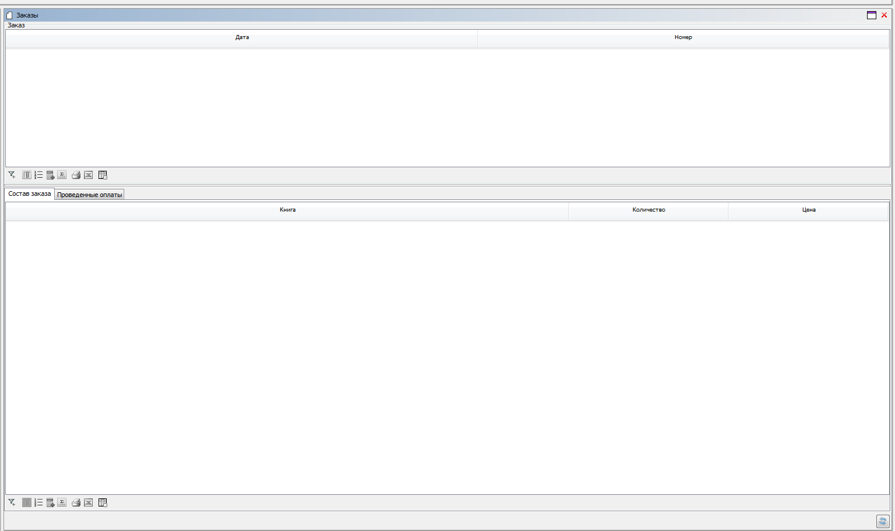
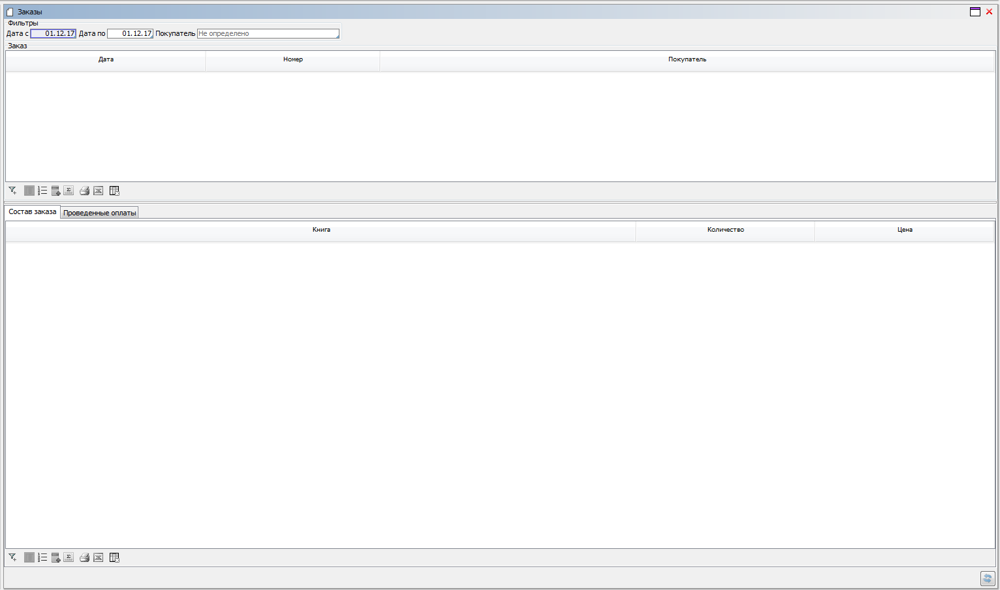

## Пример 1

### Условие

Есть форма со списком заказов, для каждого из которых задан список книг и проведенные по нему оплаты.

```lsf
CLASS Book 'Книга';
name 'Наименование' = DATA ISTRING[100] (Book);

CLASS Order 'Заказ';
date 'Дата' = DATA DATE (Order);
number 'Номер' = DATA INTEGER (Order);

CLASS OrderDetail 'Строка заказа';
order 'Заказ' = DATA Order (OrderDetail) NONULL DELETE;

book 'Книга' = DATA Book (OrderDetail) NONULL;
nameBook 'Книга' (OrderDetail d) = name(book(d));

quantity 'Количество' = DATA INTEGER (OrderDetail);
price 'Цена' = DATA NUMERIC[14,2] (OrderDetail);

CLASS Payment 'Оплата';
order 'Заказ' = DATA Order (Payment) NONULL DELETE;

date 'Дата' = DATA DATE (Payment);
sum 'Сумма' = DATA NUMERIC[14,2] (Payment);

FORM orders 'Заказы'
    OBJECTS o = Order
    PROPERTIES(o) READONLY date, number

    OBJECTS d = OrderDetail
    PROPERTIES(d) READONLY nameBook, quantity, price
    FILTERS order(d) == o

    OBJECTS p = Payment
    PROPERTIES(p) READONLY date, sum
    FILTERS order(p) == o
;

NAVIGATOR {
    NEW orders;
}
```

Необходимо настроить дизайн формы таким образом, чтобы строки и оплаты шли отдельными вкладками и отделялись от списка заказов при помощи вертикального сплиттера.

### Решение

```lsf
DESIGN orders {
    // добавляем новый контейнер в самое начало формы
    NEW orderList FIRST {
        fill = 1; // помечаем, что этот контейнер должен "растягиваться" в верхнем контейнере
        type = SPLITV; // вертикальный сплиттер - то есть может быть только 2 потомка
        MOVE BOX(o); // первым контейнером будет список заказов
        NEW orderDetails {
            // Указываем, что спецификация будет занимать в 2 раза больше места, 
            // чем контейнер o.box (для всех таких контейнеров fill, по умолчанию, равен 1)
            fill = 2; 
            type = TABBED; // контейнер будет панелью с вкладками
            MOVE BOX(d) { // первой вкладкой будет список строк с книгами
                caption = 'Состав заказа';
            }
            MOVE BOX(p) { // второй вкладкой будет список оплат
                caption = 'Проведенные оплаты';
            }
        }
    }
}
```

Форма будет выглядеть следующим образом :

 

## Пример 2

### Условие

Аналогично [**Примеру 1**](#пример-1), только на форму добавлены фильтры по дате и покупателю.

```lsf
CLASS Customer 'Покупатель';
name 'Наименование' = DATA ISTRING[100] (Customer);

customer 'Покупатель' = DATA Customer (Order);
nameCustomer 'Покупатель' (Order o) = name(customer(o));

filterCustomer = DATA LOCAL Customer ();
nameFilterCustomer 'Покупатель' = name(filterCustomer());

EXTEND FORM orders
    PROPERTIES() nameFilterCustomer

    OBJECTS dates = (dateFrom = DATE, dateTo = DATE) BEFORE o PANEL
    PROPERTIES df = VALUE(dateFrom), dt = VALUE(dateTo)

    PROPERTIES(o) READONLY nameCustomer
    FILTERS date(o) >= dateFrom, date(o) <= dateTo,
            customer(o) == filterCustomer() OR NOT filterCustomer()
;
```

Нужно добавить элементы фильтрации в дизайн ранее созданной формы.

### Решение

```lsf
DESIGN orders {
    orderList {
        // создаем новый контейнер и добавляем в вертикальный сплиттер первым компонентом
        NEW orderHeader FIRST { 
            // нужно сделать, чтобы он "растягивался" внутри orderList, так как в нем будет список заказов
            fill = 1; 
            // по умолчанию, тип нового контейнера CONTAINERV, то есть все компоненты в нем располагаются сверху вниз
            // создаем контейнер, в который поместим все компоненты, которые отвечают за фильтрацию
            NEW filters { 
                caption = 'Фильтры';
                // делаем его горизонтальным, чтобы все компоненты шли слева направо
                type = CONTAINERH; 
                MOVE PROPERTY(df) {
                    caption = 'Дата с';
                }
                MOVE PROPERTY(dt) {
                    caption = 'Дата по';
                }
                MOVE PROPERTY(nameFilterCustomer());
            }
            // переносим контейнер со списком заказом в него, так как в сплиттере должно быть ровно два компонента
            MOVE BOX(o); 
        }
    }
}
```

Результат:


