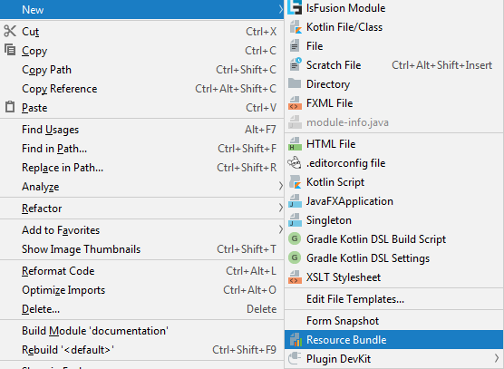
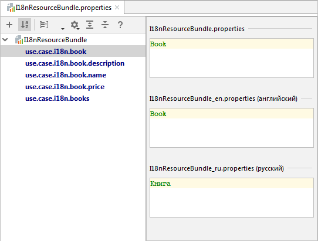
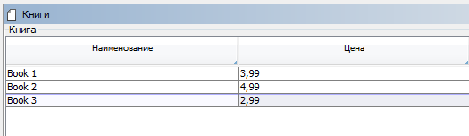

Система поддерживает [интернационализацию](Internationalization.md) путем передачи на клиента значений, локализованных в зависимости от того, какой язык выбран у пользователя. Локализуются все значения, которые заключены в фигурные скобки. Предположим, необходимо реализовать простую форму со списком книг и их ценой, с возможностью добавления/удаления.

Объявим логику обычным способом, только вместо задания названий в явную, вместо них будем использовать идентификаторы.

```lsf
CLASS Book '{use.case.i18n.book}';

name '{use.case.i18n.book.name}' = DATA STRING[40] (Book);
price '{use.case.i18n.book.price}' = DATA STRING[40] (Book);

FORM books '{use.case.i18n.books}'
    OBJECTS b = Book
    PROPERTIES(b) name, price, NEW, DELETE
;

NAVIGATOR {
    NEW books;
}
```

Затем создаем новый Resource Bundle, куда пропишем значения идентификаторов на разных языках:



Называем его, например, `I18nResourceBundle` (система будет считывать только файлы, которые заканчиваются на `'ResourceBundle'`) и выбираем языки, которые будут использоваться :


Далее, для каждого идентификатора прописываем значения на каждом из выбранных языков:



После запуска, по умолчанию, все названия будут показываться на языке сервера (который, в свою очередь, по умолчанию, определяется по языку операционной системы) :



Для конкретного пользователя можно изменить язык и страну в его профиле:


В таком случае, когда пользователь зайдет заново в систему, то все названия будут показываться ему на выбранном языке:


Идентификаторы можно также использовать и в выражениях:

```lsf
description '{use.case.i18n.book.description}' (Book b) = STRING[60] (name(b) + ', {use.case.i18n.book.price} : ' + price(b));
EXTEND FORM books
    PROPERTIES(b) READONLY description
;
```

При этом надо помнить, что такие выражения не следует использовать в [материализациях](Materializations.md). 

Система не умеет автоматически локализовывать пользовательские данные. Ответственность за это несет непосредственно разработчик.
