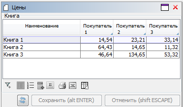
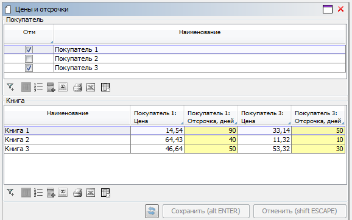

## Пример 1

### Условие

Заданы понятия книг и покупателей. Для каждой книги и покупателя задается своя цена.

```lsf
CLASS Book 'Книга';
name 'Наименование' = DATA ISTRING[50] (Book) IN id;

CLASS Customer 'Покупатель';
name 'Наименование' = DATA ISTRING[50] (Customer) IN id;

price 'Цена' = DATA NUMERIC[14,2] (Book, Customer);
```

Нужно построить форму с единственной таблицей, в которой в строках будут книги, а в колонках - покупатели. В каждой ячейке должна быть цена для данной книги и покупателя.

### Решение

```lsf
FORM prices 'Цены'
    OBJECTS c = Customer

    OBJECTS b = Book
    PROPERTIES name(b) READONLY, price(b, c) COLUMNS (c) HEADER name(c)
;
```

Объект `c` не будет отображаться на форме, так как для него не добавлено ни одного свойства.

Форма будет выглядеть следующим образом :



## Пример 2

### Условие

Аналогично [**Примеру 1**](#пример-1), только для книги и покупателя также задается отсрочка платежа в днях.

```lsf
gracePeriod 'Отсрочка, дней' = DATA INTEGER (Book, Customer);
```

Нужно построить форму с единственной таблицей, в которой в строках будут книги, а в колонках - покупатели. При этом для каждого покупателя должно быть две колонки рядом : цена и отсрочка. Колонки с отсрочкой нужно выделить желтым цветом. Должна быть возможность выбирать каких покупателей отображать в колонки.

### Решение

```lsf
selected 'Отм' = DATA BOOLEAN (Customer);

headerName 'Заголовок цены' (Customer c) = name(c) + ': Цена';
headerGrace 'Заголовок отсрочки' (Customer c) = name(c) + ': Отсрочка, дней';

FORM pricesAndGracePeriods 'Цены и отсрочки'
    OBJECTS s = Customer
    PROPERTIES selected(s), name(s) READONLY

    OBJECTS c = Customer
    FILTERS selected(c)

    OBJECTS b = Book
    PROPERTIES name(b) READONLY,
               price(b, c) COLUMNS 'priceAndGrace' (c) HEADER headerName(c),
               gracePeriod(b, c) COLUMNS 'priceAndGrace' (c) HEADER headerGrace(c)
;

DESIGN pricesAndGracePeriods {
    BOX(b) {
        fill = 3;
        PROPERTY(gracePeriod(b, c)) {
            background = #FFFFAA;
        }
    }
}
```

В колонки будут показываться только те объекты, которые попадают в фильтр для объекта `c`. Кроме того, колонки будут идти в том же порядке, что и объекты.

Все свойства с одинаковым идентификатором после слова `COLUMNS` будут идти рядом для одних и тех же объектов. В данном случае, цена и отсрочка для первого покупателя, затем цена и отсрочка для второго и так далее. Если идентификаторы были бы разными или не указаны во все, то сначала бы шли цены для всех покупателей, а потом уже отсрочки.

Форма будет выглядеть следующим образом :



## Пример 3

### Условие

Нужно построить форму, в которой будет матрица с задаваемым количеством рядов и колонок. Пользователь должен иметь возможность проставлять в каждой ячейке отметку.

### Решение

```lsf
in 'Вкл' = DATA BOOLEAN (INTEGER, INTEGER);

row 'Заголовок ряда' (INTEGER r) = 'Ряд ' + (r AS INTEGER);
column 'Заголовок колонки' (INTEGER c) = 'Колонка ' + (c AS INTEGER);

FORM matrix 'Матрица'
    OBJECTS m = (rows = INTEGER, columns = INTEGER) PANEL
    PROPERTIES rs = VALUE(rows), cs = VALUE(columns)

    OBJECTS c = INTEGER
    FILTERS iterate(c, 1, columns)

    OBJECTS r = INTEGER
    PROPERTIES(r) row
    PROPERTIES in(r, c) COLUMNS (c) HEADER column(c)
    FILTERS iterate(r, 1, rows)
;

DESIGN matrix {
    PROPERTY(rs) { caption = 'Кол-во рядов'; }
    PROPERTY(cs) { caption = 'Кол-во колонок'; }
}
```

В рабочих проектах лучше ограничивать количество рядов и колонок при вводе или фильтрации. Иначе, если пользователь введет очень большое количество строк или столбцов для свойства `iterate` будет сформирован CTE запрос с таблицей на это количество записей, что может привести к падению сервера базы данных.

Результат :


