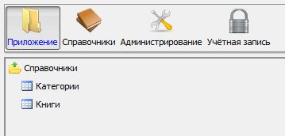

## Пример 1

### Условие

Есть формы со списком книг и категорий.

```lsf
FORM categories 'Категории';
FORM books 'Книги';
```

Нужно добавить их в [навигатор](Navigator.md) в новую папку `'Приложение'` снизу от основного тулбара.

### Решение

```lsf
NAVIGATOR {
    NEW FOLDER application 'Приложение' WINDOW toolbar FIRST {
        NEW categories;
        NEW books;
    }
}
```

Указав `WINDOW` для элемента `application`, мы указали, что все его потомки должны отображаться в системном [окне](Navigator_design.md) `toolbar`. Это будет выглядеть следующим образом :


## Пример 2

### Условие

Аналогичен [**Примеру 1**](#пример-1)

Нужно сделать, чтобы эти же формы были в подпапке `'Справочники'`.

### Решение

```lsf
NAVIGATOR {
    application {
        NEW FOLDER masterData 'Справочники' {
            NEW categories;
            NEW books;
        }
    }
}
```

Результат :


