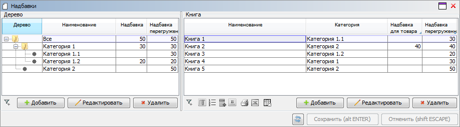

Часто возникают задачи, когда необходимо предоставить пользователю возможность вводить значение некоторого атрибута, уточняя затем его для более детального объекта.

Рассмотрим случай, когда для книги нужно определить торговую надбавку. При этом определена логика категорий, которые образуют дерево путем задания для каждой категории своего родителя. Пользователь должен иметь возможность задать надбавку как для товара, так и для категории на любом уровне.

Определим логику категорий и [первичное свойство](Data_properties_DATA.md) надбавки для категории.

```lsf
CLASS Category 'Категория';
name 'Наименование' = DATA ISTRING[50] (Category) IN id;

parent 'Родитель' = DATA Category (Category) AUTOSET;
nameParent 'Родитель' (Category c) = name(parent(c)) IN id;

markup 'Надбавка' = DATA NUMERIC[8,2] (Category);
```

Используя [оператор `RECURSION`](RECURSION_operator.md) для любых двух категорий посчитаем свойство `'Уровень'`, которое будет равно двойке возведенной в степень расстояния между ними.

```lsf
level 'Уровень' (Category child, Category parent) = RECURSION 1l IF child IS Category AND parent == child
                                                                 STEP 2l IF parent == parent($parent) MATERIALIZED;
```

Построим свойство, которое будет по категории и уровню определять соответствующего родителя.

```lsf
parent (Category child, LONG level) = GROUP MAX Category parent
                                                       BY level(child, parent);
```

Находим минимальный уровень категории, для которой задана надбавка. Он же будет уровнем "ближайшей вверх" категории с заданной надбавкой.

```lsf
nearestGroupLevel 'Ближайший уровень, для которого задана надбавка' (Category child) =
    GROUP MIN level(child, Category parent) IF markup(parent);
```

По этому уровню определяем саму категорию и надбавку для нее.

```lsf
nearestGroup 'Ближайшая группа, для которой задана надбавка' (Category category) = parent(category, nearestGroupLevel(category));

overMarkup 'Надбавка перегруженная' (Category category) = markup(nearestGroup(category));
```

Таким образом, в свойстве `overMarkup` будет искомое значение надбавки для категории с учетом их иерархии.

Теперь определим логику книг. Каждая из них привязана к некоторой категории, которая может быть на любом уровне иерархии.

```lsf
CLASS Book 'Книга';
name 'Наименование' = DATA ISTRING[100] (Book) IN id;

category 'Категория' = DATA Category (Book) AUTOSET;
nameCategory 'Категория' (Book b) = name(category(b)) IN id;
```

Зададим первичное свойство надбавки для товара. После этого построим переопределенное свойство, которое будет возвращать надбавку для товара, если оно не равно `NULL`, и построенное ранее свойство с надбавкой для категории.

```lsf
markup 'Надбавка для товара' = DATA NUMERIC[8,2] (Book);

overMarkup 'Надбавка перегруженная' (Book b) = OVERRIDE markup(b), overMarkup(category(b));
```

Наконец нарисуем форму, в которой пользователь сможет вводить надбавку для категорий и товаров одновременно. И для категории, и для товара выведем как первичную надбавку, так и переопределенную. При этом изменения в переопределенных свойствах на форме будут отображаться сразу, но сохраняться только в момент нажатия соответствующей кнопки.

```lsf
markup 'Надбавка для товара' = DATA NUMERIC[8,2] (Book);

overMarkup 'Надбавка перегруженная' (Book b) = OVERRIDE markup(b), overMarkup(category(b));
```

В итоге форма с заполненным данными будет выглядеть следующим образом:


