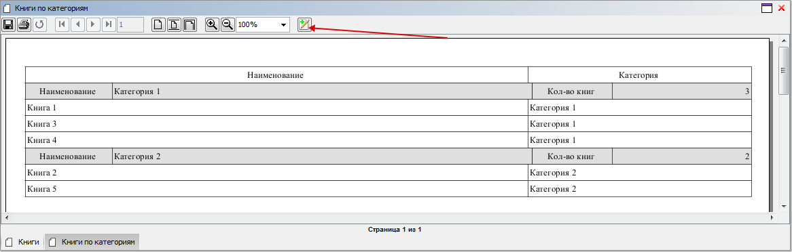
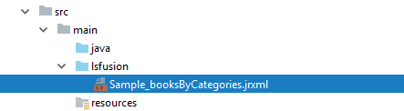
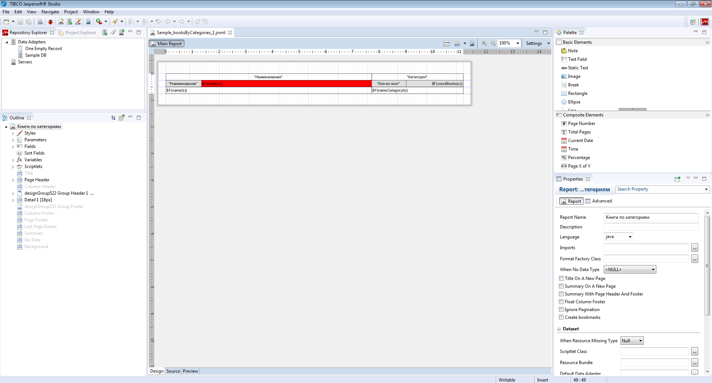
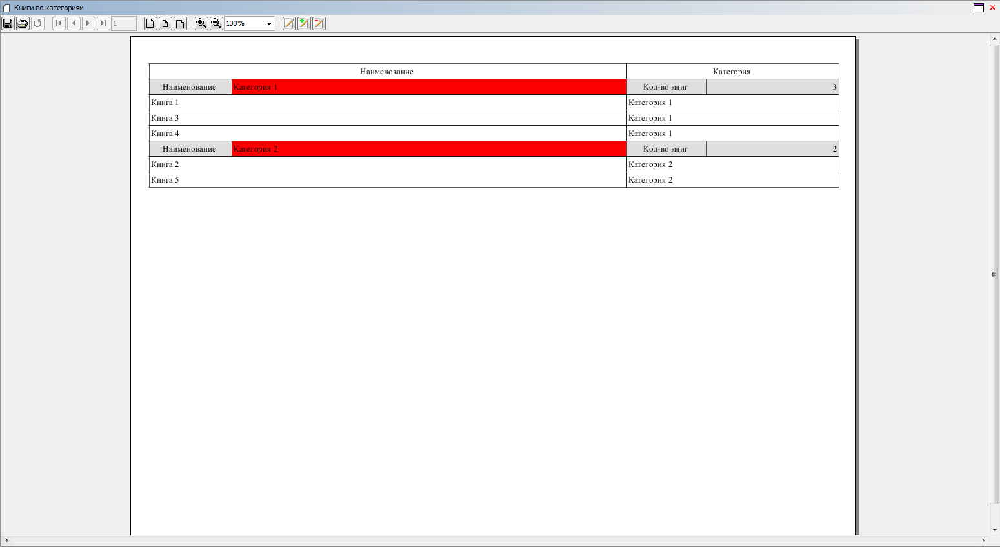
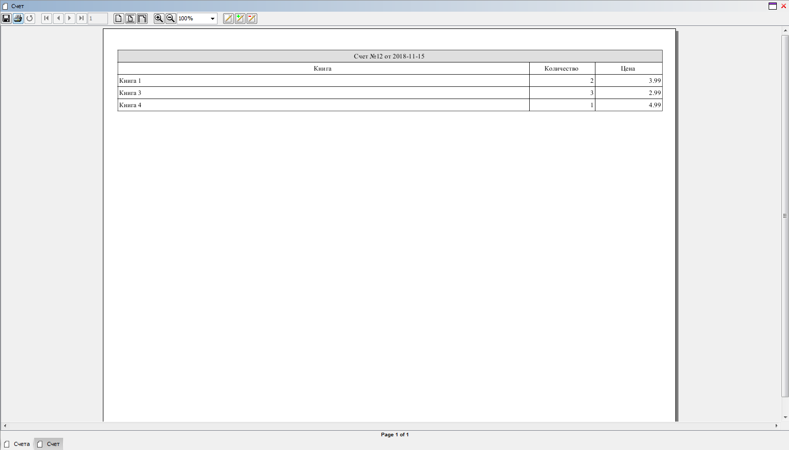

## Пример 1

### Условие

Задана логика книг, разбитых по категориям.

```lsf
NAMESPACE Sample;

CLASS Category 'Категория';
name 'Наименование' = DATA ISTRING[50] (Category) IN id;

CLASS Book 'Книга';
name 'Наименование' = DATA ISTRING[100] (Book) IN id;

category 'Категория' = DATA Category (Book) AUTOSET;
nameCategory 'Категория' (Book b) = name(category(b)) IN id;

countBooks 'Кол-во книг' (Category c) = GROUP SUM 1 BY category(Book b);

FORM books 'Книги'
    OBJECTS b = Book
    PROPERTIES(b) READONLY name, nameCategory
    PROPERTIES(b) NEWSESSION NEW, EDIT, DELETE
;

NAVIGATOR {
    NEW books;
}
```

Нужно сделать [печатную форму](Print_view.md), в которой будут отображаться все книги с разбивкой по категориям. Также нужно сделать экспорт этой формы в формат XLSX.

### Решение

Сначала объявим [форму](Forms.md), которая описывает структуру печатной формы.

```lsf
FORM booksByCategories 'Книги по категориям'
    OBJECTS c = Category
    PROPERTIES(c) name, countBooks

    OBJECTS b = Book
    PROPERTIES(b) name, nameCategory
    FILTERS category(b) == c
;
```

Затем добавим два действия, которые при помощи [оператора `PRINT`](PRINT_operator.md) формируют отчет и выводят его на предпросмотр и в XLSX соответственно.

```lsf
printBooksByCategories 'Книги по категориям' ()  {
    PRINT booksByCategories;
}

xlsxBooksByCategories 'Книги по категориям (XLSX)' ()  {
    PRINT booksByCategories XLSX;
}
```

Выведем их на форму `books` в тулбар таблицы с книгами.

```lsf
EXTEND FORM books
    PROPERTIES() DRAW b TOOLBAR printBooksByCategories, xlsxBooksByCategories
;
```

Затем запускаем сервер из IDE, запускаем десктоп-клиент, открываем форму с книгами и жмем созданную кнопку печати. Система создаст автоматическую печатную форму и откроет ее в режиме [предпросмотра](In_a_print_view_PRINT.md#interactive). Далее нужно нажать указанную ниже кнопку :



Система сохранит автоматические шаблоны для [Jasper Reports](https://community.jaspersoft.com/project/jasperreports-library) в папку исходников (src/main/lsfusion).



Затем откроется редактор, ассоциированный с форматом jrxml, в котором будут открыты эти файлы. В качестве редактора можно использовать [JasperSoft Studio](https://community.jaspersoft.com/project/jaspersoft-studio). Кроме того, будет запущен фоновый процесс, который будет в постоянном режиме синхронизировать файлы отчетов в каталогах src/main/lsfusion и out/production (или target/classes, если для запуска конфигурации используется Maven, а не IDEA Build), чтобы избавить от необходимости перестраивать проект после изменений шаблонов в редакторе.

Так как категории и книги зависят друг от друга, то будет создан один плоский отчет, где категории будут идти как группировка книг. Данные для отчета будут передаваться в плоском денормализованном виде, где для каждого свойства будет создано свое поле (**Field**). Для категорий будет создана группа (**Group**) и соответствующий блок заголовка (**Group Header**).

Внесем некоторые изменения в автоматическом шаблоне и сохраним :



**Шаблон** `Sample_booksByCategories.jrxml`:
 
```xml
<?xml version="1.0" encoding="UTF-8"?>
<!-- Created with Jaspersoft Studio version 6.6.0.final using JasperReports Library version 6.6.0  -->
<jasperReport xmlns="http://jasperreports.sourceforge.net/jasperreports" xmlns:xsi="http://www.w3.org/2001/XMLSchema-instance" xsi:schemaLocation="http://jasperreports.sourceforge.net/jasperreports http://jasperreports.sourceforge.net/xsd/jasperreport.xsd" name="Книги по категориям" pageWidth="842" pageHeight="595" orientation="Landscape" columnWidth="555" leftMargin="20" rightMargin="20" topMargin="30" bottomMargin="30" uuid="31977562-8391-4ea1-a6bd-a5081bbc75bb">
    <style name="DefaultStyle" isDefault="true" vTextAlign="Middle" vImageAlign="Middle" fontName="lsf.TimesNewRoman" fontSize="10">
        <box>
            <pen lineWidth="0.5" lineStyle="Solid" lineColor="#000000"/>
        </box>
        <paragraph leftIndent="2" rightIndent="2"/>
    </style>
    <style name="GroupCellStyle2" vTextAlign="Middle" vImageAlign="Middle" fontName="lsf.TimesNewRoman" fontSize="10">
        <box>
            <pen lineWidth="0.5" lineStyle="Solid" lineColor="#000000"/>
        </box>
        <paragraph leftIndent="2" rightIndent="2"/>
    </style>
    <style name="GroupCellStyle1" mode="Opaque" backcolor="#DFDFDF" vTextAlign="Middle" vImageAlign="Middle" fontName="lsf.TimesNewRoman" fontSize="10">
        <box>
            <pen lineWidth="0.5" lineStyle="Solid" lineColor="#000000"/>
        </box>
        <paragraph leftIndent="2" rightIndent="2"/>
    </style>
    <style name="GroupCellStyle0" vTextAlign="Middle" vImageAlign="Middle" fontName="lsf.TimesNewRoman" fontSize="10">
        <box>
            <pen lineWidth="0.5" lineStyle="Solid" lineColor="#000000"/>
        </box>
        <paragraph leftIndent="2" rightIndent="2"/>
    </style>
    <field name="c.object" class="java.lang.Long"/>
    <field name="name(c)" class="java.lang.String"/>
    <field name="countBooks(c)" class="java.lang.Integer"/>
    <field name="b.object" class="java.lang.Long"/>
    <field name="name(b)" class="java.lang.String"/>
    <field name="nameCategory(b)" class="java.lang.String"/>
    <group name="designGroup522">
        <groupExpression><![CDATA[String.valueOf($F{c.object})]]></groupExpression>
        <groupHeader>
            <band height="18" splitType="Prevent">
                <textField isStretchWithOverflow="true" isBlankWhenNull="true">
                    <reportElement style="GroupCellStyle1" stretchType="RelativeToBandHeight" x="0" y="0" width="96" height="18" uuid="5b282d01-48bf-4170-8cb5-358756cdd8fd"/>
                    <textElement textAlignment="Center"/>
                    <textFieldExpression><![CDATA["Наименование"]]></textFieldExpression>
                </textField>
                <textField isStretchWithOverflow="true" isBlankWhenNull="true">
                    <reportElement style="GroupCellStyle1" positionType="Float" stretchType="RelativeToBandHeight" x="96" y="0" width="459" height="18" backcolor="#FF0000" uuid="b8110564-b312-4096-bb6b-a466364ea2b9"/>
                    <textElement textAlignment="Left"/>
                    <textFieldExpression><![CDATA[$F{name(c)}]]></textFieldExpression>
                </textField>
                <textField isStretchWithOverflow="true" isBlankWhenNull="true">
                    <reportElement style="GroupCellStyle1" stretchType="RelativeToBandHeight" x="555" y="0" width="93" height="18" uuid="b2edb91d-7e15-4c69-8ed5-43f6ffa82208"/>
                    <textElement textAlignment="Center"/>
                    <textFieldExpression><![CDATA["Кол-во книг"]]></textFieldExpression>
                </textField>
                <textField isStretchWithOverflow="true" isBlankWhenNull="true">
                    <reportElement style="GroupCellStyle1" positionType="Float" stretchType="RelativeToBandHeight" x="648" y="0" width="154" height="18" uuid="6e18a055-237f-4845-8134-20ff20f182db"/>
                    <textElement textAlignment="Right"/>
                    <textFieldExpression><![CDATA[$F{countBooks(c)}]]></textFieldExpression>
                </textField>
            </band>
        </groupHeader>
    </group>
    <pageHeader>
        <band height="18">
            <textField isStretchWithOverflow="true" isBlankWhenNull="true">
                <reportElement style="GroupCellStyle0" stretchType="RelativeToBandHeight" x="0" y="0" width="555" height="18" uuid="f9243784-60ef-4031-8c73-4afeed320bab"/>
                <textElement textAlignment="Center"/>
                <textFieldExpression><![CDATA["Наименование"]]></textFieldExpression>
            </textField>
            <textField isStretchWithOverflow="true" isBlankWhenNull="true">
                <reportElement style="GroupCellStyle0" stretchType="RelativeToBandHeight" x="555" y="0" width="247" height="18" uuid="a1fd3130-9652-4f34-9d9b-d8508fe21663"/>
                <textElement textAlignment="Center"/>
                <textFieldExpression><![CDATA["Категория"]]></textFieldExpression>
            </textField>
        </band>
    </pageHeader>
    <detail>
        <band height="18">
            <textField isStretchWithOverflow="true" isBlankWhenNull="true">
                <reportElement style="GroupCellStyle0" positionType="Float" stretchType="RelativeToBandHeight" x="0" y="0" width="555" height="18" uuid="ca0e19c6-4400-465b-8af7-5dc6074dc82f"/>
                <textElement textAlignment="Left"/>
                <textFieldExpression><![CDATA[$F{name(b)}]]></textFieldExpression>
            </textField>
            <textField isStretchWithOverflow="true" isBlankWhenNull="true">
                <reportElement style="GroupCellStyle0" positionType="Float" stretchType="RelativeToBandHeight" x="555" y="0" width="247" height="18" uuid="3c9eb36e-c2d6-4b37-86ae-2eca4d14903d"/>
                <textElement textAlignment="Left"/>
                <textFieldExpression><![CDATA[$F{nameCategory(b)}]]></textFieldExpression>
            </textField>
        </band>
    </detail>
</jasperReport>
```

После этого, если повторно запустить формирование отчета, то будут использованы уже измененные шаблоны и результат будет выглядеть следующим образом :




:::info
Если по каким-то причинам фоновый процесс не может синхронизировать папки между директориями разработки и выполнения, то нужно просто перезапустить сервер, чтобы изменения применились вместе с перестроением проекта.
:::

## Пример 2

### Условие

Задана логика счетов.

```lsf
CLASS Invoice 'Счет';
date 'Дата' = DATA DATE (Invoice);
number 'Номер' = DATA STRING[10] (Invoice);

CLASS InvoiceDetail 'Строка счета';
invoice 'Счет' = DATA Invoice (InvoiceDetail) NONULL DELETE;

book 'Книга' = DATA Book (InvoiceDetail) NONULL;
nameBook 'Книга' (InvoiceDetail d) = name(book(d));

quantity 'Количество' = DATA INTEGER (InvoiceDetail);
price 'Цена' = DATA NUMERIC[14,2] (InvoiceDetail);

FORM invoice 'Счет'
    OBJECTS i = Invoice PANEL
    PROPERTIES(i) date, number

    OBJECTS d = InvoiceDetail
    PROPERTIES(d) nameBook, quantity, price, NEW, DELETE
    FILTERS invoice(d) == i

    EDIT Invoice OBJECT i
;

FORM invoices 'Счета'
    OBJECTS i = Invoice
    PROPERTIES(i) READONLY date, number
    PROPERTIES(i) NEWSESSION NEW, EDIT, DELETE
;

NAVIGATOR {
    NEW invoices;
}
```

Нужно сделать печатную форму счета, в которой будут отображаться его параметры и все строки. Также нужно сделать экспорт этой формы в формат DOCX.

### Решение

Для создания печатной формы воспользуемся уже существующей формой `invoice`, которая подходит нам по структуре. Однако, при необходимости можно было бы создать новую форму.

```lsf
print 'Печать' (Invoice i)  {
    PRINT invoice OBJECTS i = i;
}
printWord 'Печать (DOCX)' (Invoice i)  {
    PRINT invoice OBJECTS i = i DOCX;
}

EXTEND FORM invoices
    PROPERTIES(i) print TOOLBAR, printWord TOOLBAR
;
```

Поскольку объекты `i` формы `invoice` отображается в панель, то в отчете будут данные только касательного того счета, который передается параметром в этот объект в операторе `PRINT`.

Перенесем данные о счете из заголовка группы (**Group Header**) в шапку всего отчета, чтобы он отрисовывался над названиями колонок.


  

**Шаблон** `Sample_invoice_i.jrxml`:
 
```xml
<?xml version="1.0" encoding="UTF-8"?>
<!-- Created with Jaspersoft Studio version 6.6.0.final using JasperReports Library version 6.6.0  -->
<jasperReport xmlns="http://jasperreports.sourceforge.net/jasperreports" xmlns:xsi="http://www.w3.org/2001/XMLSchema-instance" xsi:schemaLocation="http://jasperreports.sourceforge.net/jasperreports http://jasperreports.sourceforge.net/xsd/jasperreport.xsd" name="Счет" pageWidth="842" pageHeight="595" orientation="Landscape" columnWidth="555" leftMargin="20" rightMargin="20" topMargin="30" bottomMargin="30" uuid="f60eb956-09f7-45ef-a1e0-3345187967cb">
    <style name="DefaultStyle" isDefault="true" vTextAlign="Middle" vImageAlign="Middle" fontName="lsf.TimesNewRoman" fontSize="10">
        <box>
            <pen lineWidth="0.5" lineStyle="Solid" lineColor="#000000"/>
        </box>
        <paragraph leftIndent="2" rightIndent="2"/>
    </style>
    <style name="GroupCellStyle2" vTextAlign="Middle" vImageAlign="Middle" fontName="lsf.TimesNewRoman" fontSize="10">
        <box>
            <pen lineWidth="0.5" lineStyle="Solid" lineColor="#000000"/>
        </box>
        <paragraph leftIndent="2" rightIndent="2"/>
    </style>
    <style name="GroupCellStyle1" mode="Opaque" backcolor="#DFDFDF" vTextAlign="Middle" vImageAlign="Middle" fontName="lsf.TimesNewRoman" fontSize="10">
        <box>
            <pen lineWidth="0.5" lineStyle="Solid" lineColor="#000000"/>
        </box>
        <paragraph leftIndent="2" rightIndent="2"/>
    </style>
    <style name="GroupCellStyle0" vTextAlign="Middle" vImageAlign="Middle" fontName="lsf.TimesNewRoman" fontSize="10">
        <box>
            <pen lineWidth="0.5" lineStyle="Solid" lineColor="#000000"/>
        </box>
        <paragraph leftIndent="2" rightIndent="2"/>
    </style>
    <field name="i.object" class="java.lang.Long"/>
    <field name="date(i)" class="java.util.Date"/>
    <field name="number(i)" class="java.lang.String"/>
    <field name="nameCustomer(i)" class="java.lang.String"/>
    <field name="d.object" class="java.lang.Long"/>
    <field name="nameBook(d)" class="java.lang.String"/>
    <field name="quantity(d)" class="java.lang.Integer"/>
    <field name="price(d)" class="java.math.BigDecimal"/>
    <title>
        <band height="18">
            <textField isStretchWithOverflow="true" isBlankWhenNull="true">
                <reportElement style="GroupCellStyle1" stretchType="RelativeToBandHeight" x="0" y="0" width="802" height="18" uuid="798a30fc-f932-4434-a299-d289e5acf420"/>
                <textElement textAlignment="Center"/>
                <textFieldExpression><![CDATA["Счет №" + $F{number(i)} + " от " + $F{date(i)}]]></textFieldExpression>
            </textField>
        </band>
    </title>
    <pageHeader>
        <band height="18">
            <textField isStretchWithOverflow="true" isBlankWhenNull="true">
                <reportElement style="GroupCellStyle0" stretchType="RelativeToBandHeight" x="0" y="0" width="606" height="18" uuid="c151590a-a89b-464a-89ff-8bf91a7e652f"/>
                <textElement textAlignment="Center"/>
                <textFieldExpression><![CDATA["Книга"]]></textFieldExpression>
            </textField>
            <textField isStretchWithOverflow="true" isBlankWhenNull="true">
                <reportElement style="GroupCellStyle0" stretchType="RelativeToBandHeight" x="606" y="0" width="97" height="18" uuid="186213e1-9aa8-46e8-aa27-60e9e59dd03f"/>
                <textElement textAlignment="Center"/>
                <textFieldExpression><![CDATA["Количество"]]></textFieldExpression>
            </textField>
            <textField isStretchWithOverflow="true" isBlankWhenNull="true">
                <reportElement style="GroupCellStyle0" stretchType="RelativeToBandHeight" x="703" y="0" width="99" height="18" uuid="5d3c0f3a-fc6e-4182-b7ae-f3ad933029f8"/>
                <textElement textAlignment="Center"/>
                <textFieldExpression><![CDATA["Цена"]]></textFieldExpression>
            </textField>
        </band>
    </pageHeader>
    <detail>
        <band height="18">
            <textField isStretchWithOverflow="true" isBlankWhenNull="true">
                <reportElement style="GroupCellStyle0" positionType="Float" stretchType="RelativeToBandHeight" x="0" y="0" width="606" height="18" uuid="3b31443c-0422-40d4-b32c-82ac15259dd9"/>
                <textElement textAlignment="Left"/>
                <textFieldExpression><![CDATA[$F{nameBook(d)}]]></textFieldExpression>
            </textField>
            <textField isStretchWithOverflow="true" isBlankWhenNull="true">
                <reportElement style="GroupCellStyle0" positionType="Float" stretchType="RelativeToBandHeight" x="606" y="0" width="97" height="18" uuid="204da3de-446c-4c2c-ba1b-33262b64ef4b"/>
                <textElement textAlignment="Right"/>
                <textFieldExpression><![CDATA[$F{quantity(d)}]]></textFieldExpression>
            </textField>
            <textField isStretchWithOverflow="true" isBlankWhenNull="true">
                <reportElement style="GroupCellStyle0" positionType="Float" stretchType="RelativeToBandHeight" x="703" y="0" width="99" height="18" uuid="6fb33419-b7aa-46fb-9021-d13a8c906dc9"/>
                <textElement textAlignment="Right"/>
                <textFieldExpression><![CDATA[$F{price(d)}]]></textFieldExpression>
            </textField>
        </band>
    </detail>
</jasperReport>
```

Результирующий отчет будет выглядеть следующим образом :



## Пример 3

### Условие

Аналогично [**Примеру 2**](#пример-2), только добавлена логика покупателей и заказов.

```lsf
CLASS Customer 'Покупатель';
name 'Наименование' = DATA ISTRING[50] (Customer) IN id;

FORM customers 'Покупатели'
    OBJECTS c = Customer
    PROPERTIES(c) READONLY name
    PROPERTIES(c) NEWSESSION NEW, EDIT, DELETE
;

NAVIGATOR {
    NEW customers;
}

customer 'Покупатель' = DATA Customer (Invoice);
nameCustomer 'Покупатель' (Invoice i) = name(customer(i));

EXTEND FORM invoice PROPERTIES(i) nameCustomer;

CLASS Order 'Заказ';
date 'Дата' = DATA DATE (Order);
number 'Номер' = DATA STRING[10] (Order);

customer 'Покупатель' = DATA Customer (Order);
nameCustomer 'Покупатель' (Order o) = name(customer(o));

CLASS OrderDetail 'Строка заказа';
order 'Заказ' = DATA Order (OrderDetail) NONULL DELETE;

book 'Книга' = DATA Book (OrderDetail) NONULL;
nameBook 'Книга' (OrderDetail d) = name(book(d));

quantity 'Количество' = DATA INTEGER (OrderDetail);
price 'Цена' = DATA NUMERIC[14,2] (OrderDetail);

FORM order 'Заказ'
    OBJECTS o = Order PANEL
    PROPERTIES(o) date, number, nameCustomer

    OBJECTS d = OrderDetail
    PROPERTIES(d) nameBook, quantity, price, NEW, DELETE
    FILTERS order(d) == o

    EDIT Order OBJECT o
;

FORM orders 'Заказы'
    OBJECTS i = Order
    PROPERTIES(i) READONLY date, number, nameCustomer
    PROPERTIES(i) NEWSESSION NEW, EDIT, DELETE
;

NAVIGATOR {
    NEW orders;
}
```

Нужно сделать печатную форму с информацией о клиенте, в которой будут показаны по нему все заказы и счета.

### Решение

Сначала создаем форму, структура которой должна соответствовать логике печатной формы. Объект покупателя отображаем в панель, поскольку необходимо выводить только данные по одному покупателю. Все же остальные объекты остаются таблицами.

```lsf
FORM customerInfo 'Информация по клиенту'
    OBJECTS c = Customer PANEL
    PROPERTIES(c) name

    OBJECTS o = Order
    PROPERTIES(o) date, number
    FILTERS customer(o) == c

    OBJECTS od = OrderDetail
    PROPERTIES(od) nameBook, quantity, price
    FILTERS order(od) == o

    OBJECTS i = Invoice
    PROPERTIES(i) date, number
    FILTERS customer(i) == c

    OBJECTS id = InvoiceDetail
    PROPERTIES(id) nameBook, quantity, price
    FILTERS invoice(id) == i
;

printInfo 'Распечатать информацию' (Customer c)  {
    PRINT customerInfo OBJECTS c = c;
}

EXTEND FORM customers
    PROPERTIES(c) printInfo TOOLBAR
;
```

Специфика данного отчета заключается в том, что объекты со счетами и заказами не зависят друг от друга. Таким образом, они будут сформированы в разные подотчеты (**Subreport**).

Поскольку зависимость между объектами формирует дерево с двумя листьями, то всего будет сформировано три шаблона :

1.  `Sample_customerInfo` - верхний отчет, который будет отображать данные по покупателям (в данном случае, по одному единственному покупателю). В нем будут содержаться ссылки на подотчеты `Sample_customerInfo_i` и `Sample_customerInfo_o`.  
    

    **Шаблон** `Sample_customerInfo.jrxml`:
    ```xml
    <?xml version="1.0" encoding="UTF-8"?>
    <!-- Created with Jaspersoft Studio version 6.6.0.final using JasperReports Library version 6.6.0  -->
    <jasperReport xmlns="http://jasperreports.sourceforge.net/jasperreports" xmlns:xsi="http://www.w3.org/2001/XMLSchema-instance" xsi:schemaLocation="http://jasperreports.sourceforge.net/jasperreports http://jasperreports.sourceforge.net/xsd/jasperreport.xsd" name="Информация по клиенту" pageWidth="842" pageHeight="595" orientation="Landscape" columnWidth="555" leftMargin="20" rightMargin="20" topMargin="30" bottomMargin="30" uuid="06ed2f8a-ff5b-497a-925f-5a8722df2e57">
        <style name="DefaultStyle" isDefault="true" vTextAlign="Middle" vImageAlign="Middle" fontName="lsf.TimesNewRoman" fontSize="10">
            <box>
                <pen lineWidth="0.5" lineStyle="Solid" lineColor="#000000"/>
            </box>
            <paragraph leftIndent="2" rightIndent="2"/>
        </style>
        <style name="GroupCellStyle3" vTextAlign="Middle" vImageAlign="Middle" fontName="lsf.TimesNewRoman" fontSize="10">
            <box>
                <pen lineWidth="0.5" lineStyle="Solid" lineColor="#000000"/>
            </box>
            <paragraph leftIndent="2" rightIndent="2"/>
        </style>
        <style name="GroupCellStyle2" mode="Opaque" backcolor="#D5D5D5" vTextAlign="Middle" vImageAlign="Middle" fontName="lsf.TimesNewRoman" fontSize="10">
            <box>
                <pen lineWidth="0.5" lineStyle="Solid" lineColor="#000000"/>
            </box>
            <paragraph leftIndent="2" rightIndent="2"/>
        </style>
        <parameter name="o_report" class="net.sf.jasperreports.engine.JasperReport"/>
        <parameter name="o_source" class="net.sf.jasperreports.engine.JRDataSource"/>
        <parameter name="o_params" class="java.util.Map"/>
        <parameter name="i_report" class="net.sf.jasperreports.engine.JasperReport"/>
        <parameter name="i_source" class="net.sf.jasperreports.engine.JRDataSource"/>
        <parameter name="i_params" class="java.util.Map"/>
        <field name="c.object" class="java.lang.Long"/>
        <field name="name(c)" class="java.lang.String"/>
        <group name="designGroup">
            <groupExpression><![CDATA[]]></groupExpression>
            <groupHeader>
                <band height="18" splitType="Prevent"/>
            </groupHeader>
        </group>
        <group name="designGroup1153">
            <groupExpression><![CDATA[String.valueOf($F{c.object})]]></groupExpression>
            <groupHeader>
                <band height="46" splitType="Prevent">
                    <textField isStretchWithOverflow="true" isBlankWhenNull="true">
                        <reportElement style="GroupCellStyle2" positionType="Float" stretchType="RelativeToBandHeight" x="0" y="0" width="802" height="46" uuid="dacafbf4-9be5-4748-b8e7-c01b1e4d98ab"/>
                        <textElement textAlignment="Center">
                            <font size="20"/>
                        </textElement>
                        <textFieldExpression><![CDATA["Покупатель : " + $F{name(c)}]]></textFieldExpression>
                    </textField>
                </band>
            </groupHeader>
        </group>
        <detail>
            <band>
                <subreport>
                    <reportElement stretchType="RelativeToBandHeight" x="0" y="0" width="0" height="0" uuid="9a51a576-f72c-4ccc-bb2c-95966743b540"/>
                    <parametersMapExpression><![CDATA[$P{o_params}]]></parametersMapExpression>
                    <dataSourceExpression><![CDATA[$P{o_source}]]></dataSourceExpression>
                    <subreportExpression><![CDATA[$P{o_report}]]></subreportExpression>
                </subreport>
            </band>
            <band>
                <subreport>
                    <reportElement stretchType="RelativeToBandHeight" x="0" y="0" width="0" height="0" uuid="4d75be9a-a015-4b45-9ac8-bf383332dd2a"/>
                    <parametersMapExpression><![CDATA[$P{i_params}]]></parametersMapExpression>
                    <dataSourceExpression><![CDATA[$P{i_source}]]></dataSourceExpression>
                    <subreportExpression><![CDATA[$P{i_report}]]></subreportExpression>
                </subreport>
            </band>
        </detail>
    </jasperReport>
    ```
    
2.  `Sample_customerInfo_o` - отчет, в котором будут отображаться все заказы вместе с их строками.

    **Шаблон** `Sample_customerInfo_o.jrxml`:
    ```xml
    <?xml version="1.0" encoding="UTF-8"?>
    <!-- Created with Jaspersoft Studio version 6.6.0.final using JasperReports Library version 6.6.0  -->
    <jasperReport xmlns="http://jasperreports.sourceforge.net/jasperreports" xmlns:xsi="http://www.w3.org/2001/XMLSchema-instance" xsi:schemaLocation="http://jasperreports.sourceforge.net/jasperreports http://jasperreports.sourceforge.net/xsd/jasperreport.xsd" name="o" pageWidth="842" pageHeight="595" orientation="Landscape" columnWidth="555" leftMargin="0" rightMargin="0" topMargin="0" bottomMargin="0" uuid="b5fa21a2-3583-4e69-9766-70ddacc9af1f">
        <style name="DefaultStyle" isDefault="true" vTextAlign="Middle" vImageAlign="Middle" fontName="lsf.TimesNewRoman" fontSize="10">
            <box>
                <pen lineWidth="0.5" lineStyle="Solid" lineColor="#000000"/>
            </box>
            <paragraph leftIndent="2" rightIndent="2"/>
        </style>
        <style name="GroupCellStyle0" mode="Opaque" backcolor="#F0F0F0" vTextAlign="Middle" vImageAlign="Middle" fontName="lsf.TimesNewRoman" fontSize="10">
            <box>
                <pen lineWidth="0.5" lineStyle="Solid" lineColor="#000000"/>
            </box>
            <paragraph leftIndent="2" rightIndent="2"/>
        </style>
        <style name="GroupCellStyle1" mode="Opaque" backcolor="#FFFFFF" vTextAlign="Middle" vImageAlign="Middle" fontName="lsf.TimesNewRoman" fontSize="10">
            <box>
                <pen lineWidth="0.5" lineStyle="Solid" lineColor="#000000"/>
            </box>
            <paragraph leftIndent="2" rightIndent="2"/>
        </style>
        <field name="o.object" class="java.lang.Long"/>
        <field name="date(o)" class="java.util.Date"/>
        <field name="number(o)" class="java.lang.String"/>
        <field name="od.object" class="java.lang.Long"/>
        <field name="nameBook(od)" class="java.lang.String"/>
        <field name="quantity(od)" class="java.lang.Integer"/>
        <field name="price(od)" class="java.math.BigDecimal"/>
        <group name="designGroup1560">
            <groupExpression><![CDATA[String.valueOf($F{o.object})]]></groupExpression>
            <groupHeader>
                <band height="18" splitType="Prevent">
                    <textField isStretchWithOverflow="true">
                        <reportElement style="GroupCellStyle0" stretchType="RelativeToBandHeight" x="0" y="0" width="32" height="18" uuid="7a140661-f62c-48e3-a050-2667b8215684"/>
                        <textElement textAlignment="Center"/>
                        <textFieldExpression><![CDATA["Дата"]]></textFieldExpression>
                    </textField>
                    <textField isStretchWithOverflow="true" isBlankWhenNull="true">
                        <reportElement style="GroupCellStyle0" positionType="Float" stretchType="RelativeToBandHeight" x="32" y="0" width="96" height="18" uuid="0764778b-b7e8-47af-9bb1-f8e8c0b3a50a"/>
                        <textElement textAlignment="Right"/>
                        <textFieldExpression><![CDATA[$F{date(o)}]]></textFieldExpression>
                    </textField>
                    <textField isStretchWithOverflow="true">
                        <reportElement style="GroupCellStyle0" stretchType="RelativeToBandHeight" x="128" y="0" width="40" height="18" uuid="9d4386c3-8b68-4d22-9a57-72a1b9f4edb0"/>
                        <textElement textAlignment="Center"/>
                        <textFieldExpression><![CDATA["Номер"]]></textFieldExpression>
                    </textField>
                    <textField isStretchWithOverflow="true" isBlankWhenNull="true">
                        <reportElement style="GroupCellStyle0" positionType="Float" stretchType="RelativeToBandHeight" x="168" y="0" width="634" height="18" uuid="bcc4aee3-1e1a-4373-bc23-2c71a5193277"/>
                        <textElement textAlignment="Left"/>
                        <textFieldExpression><![CDATA[$F{number(o)}]]></textFieldExpression>
                    </textField>
                </band>
            </groupHeader>
        </group>
        <title>
            <band height="45">
                <staticText>
                    <reportElement x="0" y="0" width="802" height="45" uuid="bedb580c-7ea1-4962-b012-273c455d18db"/>
                    <textElement textAlignment="Center">
                        <font size="20"/>
                    </textElement>
                    <text><![CDATA[Заказы]]></text>
                </staticText>
            </band>
        </title>
        <pageHeader>
            <band height="18">
                <textField isStretchWithOverflow="true">
                    <reportElement style="GroupCellStyle1" stretchType="RelativeToBandHeight" x="0" y="0" width="606" height="18" uuid="2ed4a155-b17f-4c87-93bb-ccb3c17f99d6"/>
                    <textElement textAlignment="Center"/>
                    <textFieldExpression><![CDATA["Книга"]]></textFieldExpression>
                </textField>
                <textField isStretchWithOverflow="true">
                    <reportElement style="GroupCellStyle1" stretchType="RelativeToBandHeight" x="606" y="0" width="97" height="18" uuid="55aeb106-a5f3-42ac-a43f-571457fc26c8"/>
                    <textElement textAlignment="Center"/>
                    <textFieldExpression><![CDATA["Количество"]]></textFieldExpression>
                </textField>
                <textField isStretchWithOverflow="true">
                    <reportElement style="GroupCellStyle1" stretchType="RelativeToBandHeight" x="703" y="0" width="99" height="18" uuid="186d6da9-1a7a-49e8-b7a4-6df9dcec61e6"/>
                    <textElement textAlignment="Center"/>
                    <textFieldExpression><![CDATA["Цена"]]></textFieldExpression>
                </textField>
            </band>
        </pageHeader>
        <detail>
            <band height="18">
                <textField isStretchWithOverflow="true" isBlankWhenNull="true">
                    <reportElement style="GroupCellStyle1" positionType="Float" stretchType="RelativeToBandHeight" x="0" y="0" width="606" height="18" uuid="4161551d-97d3-48d5-a26a-11b0a145f131"/>
                    <textElement textAlignment="Left"/>
                    <textFieldExpression><![CDATA[$F{nameBook(od)}]]></textFieldExpression>
                </textField>
                <textField isStretchWithOverflow="true" isBlankWhenNull="true">
                    <reportElement style="GroupCellStyle1" positionType="Float" stretchType="RelativeToBandHeight" x="606" y="0" width="97" height="18" uuid="8739e7c6-7536-4ff4-93a0-4dfe576a376e"/>
                    <textElement textAlignment="Right"/>
                    <textFieldExpression><![CDATA[$F{quantity(od)}]]></textFieldExpression>
                </textField>
                <textField isStretchWithOverflow="true" isBlankWhenNull="true">
                    <reportElement style="GroupCellStyle1" positionType="Float" stretchType="RelativeToBandHeight" x="703" y="0" width="99" height="18" uuid="345899e3-a8b5-4532-b8e5-ddadf1ca95b5"/>
                    <textElement textAlignment="Right"/>
                    <textFieldExpression><![CDATA[$F{price(od)}]]></textFieldExpression>
                </textField>
            </band>
        </detail>
    </jasperReport>
    ```
    
3.  `Sample_customerInfo_i` - отчет, в котором будут отображаться все счета вместе с их строками.

    **Шаблон** `Sample_customerInfo_i.jrxml`:
    ```xml
    <?xml version="1.0" encoding="UTF-8"?>
    <!-- Created with Jaspersoft Studio version 6.6.0.final using JasperReports Library version 6.6.0  -->
    <jasperReport xmlns="http://jasperreports.sourceforge.net/jasperreports" xmlns:xsi="http://www.w3.org/2001/XMLSchema-instance" xsi:schemaLocation="http://jasperreports.sourceforge.net/jasperreports http://jasperreports.sourceforge.net/xsd/jasperreport.xsd" name="i" pageWidth="842" pageHeight="595" orientation="Landscape" columnWidth="555" leftMargin="0" rightMargin="0" topMargin="5" bottomMargin="0" uuid="82cf7f76-d161-47d0-a5eb-7c4c08a08c5f">
        <style name="DefaultStyle" isDefault="true" vTextAlign="Middle" vImageAlign="Middle" fontName="lsf.TimesNewRoman" fontSize="10">
            <box>
                <pen lineWidth="0.5" lineStyle="Solid" lineColor="#000000"/>
            </box>
            <paragraph leftIndent="2" rightIndent="2"/>
        </style>
        <style name="GroupCellStyle0" mode="Opaque" backcolor="#F0F0F0" vTextAlign="Middle" vImageAlign="Middle" fontName="lsf.TimesNewRoman" fontSize="10">
            <box>
                <pen lineWidth="0.5" lineStyle="Solid" lineColor="#000000"/>
            </box>
            <paragraph leftIndent="2" rightIndent="2"/>
        </style>
        <style name="GroupCellStyle1" mode="Opaque" backcolor="#FFFFFF" vTextAlign="Middle" vImageAlign="Middle" fontName="lsf.TimesNewRoman" fontSize="10">
            <box>
                <pen lineWidth="0.5" lineStyle="Solid" lineColor="#000000"/>
            </box>
            <paragraph leftIndent="2" rightIndent="2"/>
        </style>
        <field name="i.object" class="java.lang.Long"/>
        <field name="date(i)" class="java.util.Date"/>
        <field name="number(i)" class="java.lang.String"/>
        <field name="id.object" class="java.lang.Long"/>
        <field name="nameBook(id)" class="java.lang.String"/>
        <field name="quantity(id)" class="java.lang.Integer"/>
        <field name="price(id)" class="java.math.BigDecimal"/>
        <group name="designGroup1591">
            <groupExpression><![CDATA[String.valueOf($F{i.object})]]></groupExpression>
            <groupHeader>
                <band height="18" splitType="Prevent">
                    <textField isStretchWithOverflow="true">
                        <reportElement style="GroupCellStyle0" stretchType="RelativeToBandHeight" x="0" y="0" width="32" height="18" uuid="f4d356be-24a9-4ca9-851f-167c95ffc33c"/>
                        <textElement textAlignment="Center"/>
                        <textFieldExpression><![CDATA["Дата"]]></textFieldExpression>
                    </textField>
                    <textField isStretchWithOverflow="true" isBlankWhenNull="true">
                        <reportElement style="GroupCellStyle0" positionType="Float" stretchType="RelativeToBandHeight" x="32" y="0" width="88" height="18" uuid="97cebc8a-8bdd-4c8f-b90e-0dd3bcb6c4b1"/>
                        <textElement textAlignment="Right"/>
                        <textFieldExpression><![CDATA[$F{date(i)}]]></textFieldExpression>
                    </textField>
                    <textField isStretchWithOverflow="true">
                        <reportElement style="GroupCellStyle0" stretchType="RelativeToBandHeight" x="120" y="0" width="40" height="18" uuid="3098f851-ca96-45b9-9cf2-04e6e243528a"/>
                        <textElement textAlignment="Center"/>
                        <textFieldExpression><![CDATA["Номер"]]></textFieldExpression>
                    </textField>
                    <textField isStretchWithOverflow="true" isBlankWhenNull="true">
                        <reportElement style="GroupCellStyle0" positionType="Float" stretchType="RelativeToBandHeight" x="160" y="0" width="642" height="18" uuid="71a8d3eb-c29f-4363-a1e6-857af2784d5a"/>
                        <textElement textAlignment="Left"/>
                        <textFieldExpression><![CDATA[$F{number(i)}]]></textFieldExpression>
                    </textField>
                </band>
            </groupHeader>
        </group>
        <title>
            <band height="45">
                <staticText>
                    <reportElement x="0" y="0" width="802" height="45" uuid="ec3d75be-ea13-4ee3-a0f0-22e7612fe552"/>
                    <textElement textAlignment="Center">
                        <font size="20"/>
                    </textElement>
                    <text><![CDATA[Счета]]></text>
                </staticText>
            </band>
        </title>
        <pageHeader>
            <band height="18">
                <textField isStretchWithOverflow="true">
                    <reportElement style="GroupCellStyle1" stretchType="RelativeToBandHeight" x="0" y="0" width="606" height="18" uuid="768f5aa5-7a86-49aa-9c18-855e4e4d3d02"/>
                    <textElement textAlignment="Center"/>
                    <textFieldExpression><![CDATA["Книга"]]></textFieldExpression>
                </textField>
                <textField isStretchWithOverflow="true">
                    <reportElement style="GroupCellStyle1" stretchType="RelativeToBandHeight" x="606" y="0" width="97" height="18" uuid="032b4dad-5895-46e1-ba97-7e2af9ebecde"/>
                    <textElement textAlignment="Center"/>
                    <textFieldExpression><![CDATA["Количество"]]></textFieldExpression>
                </textField>
                <textField isStretchWithOverflow="true">
                    <reportElement style="GroupCellStyle1" stretchType="RelativeToBandHeight" x="703" y="0" width="99" height="18" uuid="092947c2-bbd0-464f-8048-4d800c05a6c6"/>
                    <textElement textAlignment="Center"/>
                    <textFieldExpression><![CDATA["Цена"]]></textFieldExpression>
                </textField>
            </band>
        </pageHeader>
        <detail>
            <band height="18">
                <textField isStretchWithOverflow="true" isBlankWhenNull="true">
                    <reportElement style="GroupCellStyle1" positionType="Float" stretchType="RelativeToBandHeight" x="0" y="0" width="606" height="18" uuid="86fa4116-b7e3-4aaf-a284-45a596a52f2b"/>
                    <textElement textAlignment="Left"/>
                    <textFieldExpression><![CDATA[$F{nameBook(id)}]]></textFieldExpression>
                </textField>
                <textField isStretchWithOverflow="true" isBlankWhenNull="true">
                    <reportElement style="GroupCellStyle1" positionType="Float" stretchType="RelativeToBandHeight" x="606" y="0" width="97" height="18" uuid="0c6acbce-c5ad-450f-a0be-23aa4b7e2ad0"/>
                    <textElement textAlignment="Right"/>
                    <textFieldExpression><![CDATA[$F{quantity(id)}]]></textFieldExpression>
                </textField>
                <textField isStretchWithOverflow="true" isBlankWhenNull="true">
                    <reportElement style="GroupCellStyle1" positionType="Float" stretchType="RelativeToBandHeight" x="703" y="0" width="99" height="18" uuid="7b44de1a-3656-43b5-904a-fee48f5fc245"/>
                    <textElement textAlignment="Right"/>
                    <textFieldExpression><![CDATA[$F{price(id)}]]></textFieldExpression>
                </textField>
            </band>
        </detail>
    </jasperReport>
    ```
    
Результат такого, слегка подправленного, отчета будет выглядеть следующим образом :


