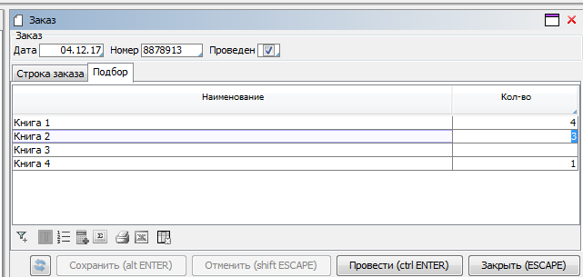

## Проведение документов

### Условие

Есть логика работы с заказами.

```lsf
CLASS Book 'Книга';
name 'Наименование' = DATA ISTRING[100] (Book) IN id;

CLASS Order 'Заказ';
date 'Дата' = DATA DATE (Order);
number 'Номер' = DATA STRING[10] (Order);

CLASS OrderDetail 'Строка заказа';
order 'Заказ' = DATA Order (OrderDetail) NONULL DELETE;

book 'Книга' = DATA Book (OrderDetail) NONULL;
nameBook 'Книга' (OrderDetail d) = name(book(d));

quantity 'Количество' = DATA INTEGER (OrderDetail);
price 'Цена' = DATA NUMERIC[14,2] (OrderDetail);
```

Для заказов создана форма редактирования.

```lsf
FORM order 'Заказ'
    OBJECTS o = Order PANEL
    PROPERTIES(o) date, number

    OBJECTS d = OrderDetail
    PROPERTIES(d) nameBook, quantity, price, NEW, DELETE
    FILTERS order(d) == o

    EDIT Order OBJECT o
;


FORM orders 'Заказы'
    OBJECTS o = Order
    PROPERTIES(o) READONLY date, number
    PROPERTIES(o) NEWSESSION NEW, EDIT, DELETE
;

NAVIGATOR {
    NEW orders;
}
```

Кроме того, для заказа добавлен признак `Проведен`. В дальнейшем, заказы только с этим признаком будут участвовать в последующих расчетах (например, при расчете зарезервированного количества).

```lsf
posted 'Проведен' = DATA BOOLEAN (Order);
reserved 'Зарезервировано' (Book b) = GROUP SUM quantity(OrderDetail d) IF posted(order(d)) BY book(d);

EXTEND FORM order
    PROPERTIES(o) posted
;
```

Необходимо сделать, чтобы на форме заказов вместо кнопки `ОК` была кнопка `Провести`, которая одновременно проставляет признак `Проведен` для заказа, сохраняет изменения и закрывает форму.

### Решение

```lsf
post 'Провести' (Order o)  { posted(o) <- TRUE; }

EXTEND FORM order
    EVENTS ON OK post(o)
;
DESIGN order {
    PROPERTY(formOk()) {
        caption = 'Провести';
    }
}
```

При нажатии переименованной кнопки `OK` будет в единой транзакции выполнено действие `post`. При такой схеме, если пользователь захочет "распровести" документ, то он должен зайти в форму редактирования, снять галочку `Проведен` в шапке документа, и нажать последовательно `Сохранить` и `Закрыть`.

## Подбор строк

### Условие

Есть заказ с формой редактирования, аналогичной примеру [**Проведение документов**](#проведение-документов).

Нужно добавить возможность вводить строки заказа путем ввода количества в таблице со списком товаров. При этом любые изменения в строках заказах и этой таблице должны автоматически синхронизироваться друг с другом.

### Решение

```lsf
quantity 'Кол-во' (Order o, Book b) = GROUP SUM quantity(OrderDetail d) BY order(d), book(d);
lastOrderDetail 'Последняя строка' (Order o, Book b) = GROUP LAST OrderDetail d ORDER d BY order(d), book(d);

changeQuantity 'Изменить кол-во' (Order o, Book b)  {
    INPUT q = INTEGER DO { // запрашиваем число
        IF lastOrderDetail(o, b) THEN { // проверяем, есть ли хоть одна строка
            IF q THEN // ввели число
                // записываем количество в последнюю строку с такой книгой
                quantity(OrderDetail d) <- q IF d == lastOrderDetail(o, b) WHERE order(d) == o AND book(d) == b; 
            ELSE // сбросили число - удаляем строку
                DELETE OrderDetail d WHERE order(d) == o AND book(d) == b;
        } ELSE
            IF q THEN
                NEW d = OrderDetail { // создаем новую строку
                    order(d) <- o;
                    book(d) <- b;
                    quantity(d) <- q;
                }
    }
}

EXTEND FORM order
    OBJECTS b = Book
    PROPERTIES name(b) READONLY, quantity(o, b) ON CHANGE changeQuantity(o, b)
;

DESIGN order {
    OBJECTS {
        NEW pane { // создаем контейнер после заголовка заказа
            fill = 1;
            tabbed = TRUE;
            MOVE BOX(d);
            MOVE BOX(b) {
                caption = 'Подбор';
            }
        }
    }
}
```

Форма будет выглядеть следующим образом :



При изменении количества на вкладке `Подбор` система будет автоматически изменять строки заказов. При изменении строк заказов также будет меняться количество на вкладке `Подбор`.

В случае, если в заказе будет две или более строк с одной книгой, то система сбросит количество в первых строках и проставит введенное количество в последней строке. Чтобы изменение касалось только последней строки, то нужно при записи количество использовать следующее действие:

```lsf
quantity(OrderDetail d) <- q WHERE d == lastOrderDetail(o, b);
```

Однако, такое поведение будет не понятно пользователю, так как после ввода определенного количества на вкладке `Подбор`, в этой же колонке будет показываться суммарное количество по всем строкам, которое отличается от введенного.

Более детальное описание этого механизма можно почитать в этой [статье](https://habr.com/ru/company/lsfusion/blog/464487/).

## Агрегированные документы

### Условие

Есть логика заказов.

Необходимо добавить логику счетов таким образом, чтобы заказ мог автоматически создавать тождественный ему счет.

### Решение

Для реализации такой логики необходимо создать абстрактный [класс](Classes.md) `Invoice` с нужным набором [абстрактных свойств](Property_extension.md).

```lsf
CLASS ABSTRACT Invoice 'Счет';
date 'Дата' = ABSTRACT DATE (Invoice);
number 'Номер' = ABSTRACT STRING[10] (Invoice);

CLASS ABSTRACT InvoiceDetail 'Строка счета';
invoice 'Счет' = ABSTRACT Invoice (InvoiceDetail);
book 'Книга' = ABSTRACT Book (InvoiceDetail);

quantity 'Количество' = ABSTRACT INTEGER (InvoiceDetail);
price 'Цена' = ABSTRACT NUMERIC[14,2] (InvoiceDetail);
```

Также создается форма со списком объектов этого абстрактного класса. В ней будут видны объекты всех классов, наследуемых от класса `Invoice`.

```lsf
FORM invoices 'Счета'
    OBJECTS i = Invoice
    PROPERTIES(i) READONLY date, number
    PROPERTIES(i) NEWSESSION edit, DELETE
;

NAVIGATOR {
    NEW invoices;
}
```

Свойство `edit` будет вызывать форму редактирования текущего объекта, заданную для его класса. Если для класса текущего объекта она не определена, то никаких действий проведено не будет. Свойство `DELETE` удалит текущий объект, если не нарушится никакого ограничения.

В системе не может существовать объект абстрактного класса. Для того, чтобы можно было ввести счет пользователем вручную, создается отдельный класс `UserInvoice`. Для него создаются симметричные абстрактным свойства, которые затем добавляются как их реализация.

```lsf
CLASS UserInvoice 'Пользовательский счет' : Invoice;
date 'Дата' = DATA DATE (UserInvoice);
number 'Номер' = DATA STRING[10] (UserInvoice);

CLASS UserInvoiceDetail 'Строка пользовательского счета' : InvoiceDetail;
userInvoice 'Пользовательский счет' = DATA UserInvoice (UserInvoiceDetail);
book 'Книга' = DATA Book (UserInvoiceDetail);
nameBook 'Книга' (UserInvoiceDetail d) = name(book(d));

quantity 'Количество' = DATA INTEGER (UserInvoiceDetail);
price 'Цена' = DATA NUMERIC[14,2] (UserInvoiceDetail);

// имплементим свойства счета
date(UserInvoice i) += date(i);
number(UserInvoice i) += number(i);

// имплементим свойства строк счета
invoice (UserInvoiceDetail d) += userInvoice(d);
book (UserInvoiceDetail d) += book(d);

quantity (UserInvoiceDetail d) += quantity(d);
price (UserInvoiceDetail d) += price(d);
```

Создаем форму для редактирования пользовательского счета. Добавляем на форму со списком абстрактных счетов кнопку по добавлению пользовательского.

```lsf
FORM userInvoice 'Счет (пользовательский)'
    OBJECTS i = UserInvoice PANEL
    PROPERTIES(i) date, number

    OBJECTS d = UserInvoiceDetail
    PROPERTIES(d) nameBook, quantity, price, NEW, DELETE
    FILTERS userInvoice(d) == i

    EDIT UserInvoice OBJECT i
;

EXTEND FORM invoices
    PROPERTIES(i) NEWSESSION NEW[UserInvoice]
;
```

Для заказа создаем опцию `createInvoice`, по которой будет создаваться счет. Затем создаем конкретный класс `OrderInvoice`, который будет наследоваться от `Invoice`. Объект этого класса будет автоматически создаваться и удаляться системой для каждого заказа, у которого проставлена опция `createInvoice`. Таким образом, этот счет является [агрегированным объектом](Aggregations.md) для соответствующего заказа. Аналогичным образом создается агрегация для строки счета относительно строки заказа.

```lsf
createInvoice 'Создать счет' = DATA BOOLEAN (Order);
EXTEND FORM order PROPERTIES(o) createInvoice;

// агрегированный счет
CLASS OrderInvoice 'Счет на основе заказа' : Invoice;
orderInvoice = AGGR OrderInvoice WHERE createInvoice(Order order) MATERIALIZED INDEXED;
date(OrderInvoice i) += date(order(i));
number(OrderInvoice i) += number(order(i));

// агрегированные строки счета
createInvoiceDetail 'Создать строку счета' (OrderDetail d) = createInvoice(order(d));

CLASS OrderInvoiceDetail 'Строка счета на основе заказа' : InvoiceDetail;
orderInvoiceDetail = AGGR OrderInvoiceDetail WHERE createInvoiceDetail(OrderDetail orderDetail) MATERIALIZED INDEXED;

invoice (OrderInvoiceDetail d) += orderInvoice(order(orderDetail(d)));
book (OrderInvoiceDetail d) += book(orderDetail(d));

quantity (OrderInvoiceDetail d) += quantity(orderDetail(d));
price (OrderInvoiceDetail d) += price(orderDetail(d));
```

Указываем, что при попытке редактирования такого агрегированного счета должна открываться форма редактирования связанного заказа.

```lsf
edit(OrderInvoice i) + {  edit(order(i)); }
```

При попытке удаления счета, созданного на основе заказа, будет выдано сообщение с ошибкой.

Принципиальное отличие такой схемы через агрегацию от простого создания счета на основе заказа заключается в том, что система сама следит за синхронизацией счета и заказа. При создании на основе, в случае изменения заказа, пользователь должен сам позаботиться о таких же изменениях в счете. Или нужно писать отдельную обработку событий, которая будет этим заниматься.
