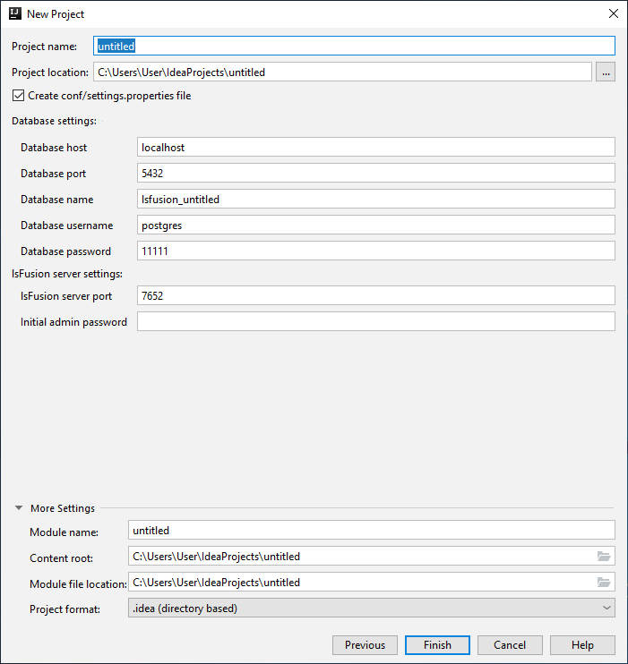
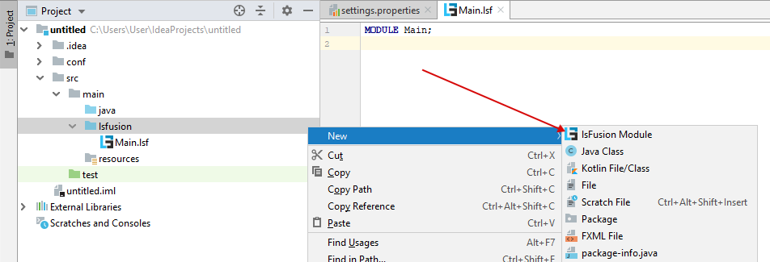
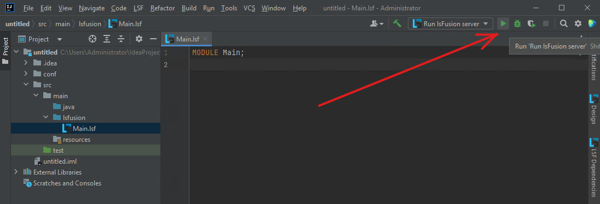
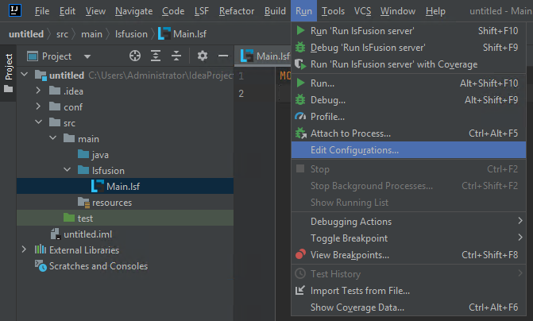
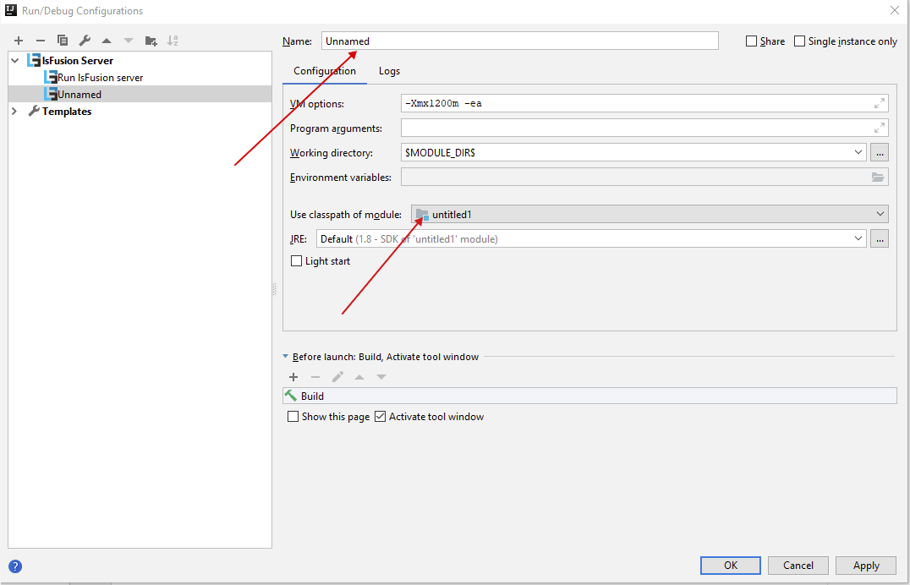

### Создание нового lsFusion проекта {#newproject}

Выбираем пункт `Create New Project` при старте **IDEA**. Или, если **IDEA** уже запущена, выбираем в меню пункт `File > New > Project`.

Выбираем тип проекта `lsFusion`. Проверяем, что задан JDK и выбрана ссылка на библиотеку с сервером `lsFusion` (при [автоматической установке](Development_auto.md) эта ссылка устанавливается автоматически, если ее все же нет - скачиваем `Download` или выбираем уже скачанную библиотеку `Create`), нажимаем `Next`.

Заполняем имя проекта и каталог, в котором будут находиться исходные файлы. При необходимости изменяем параметры подключения и пароли к базе данных и серверу приложений. Нажимаем `Create`.

### Разработка приложения {#dev}

Весь исходный код на языке **lsFusion**, по умолчанию, находится в папке `src/main/lsfusion`.

Добавить новый [модуль](Modules.md) можно нажав правой кнопкой мыши на соответствующей папкой и выбрав пункт меню `New > lsFusion Module`:

  

Аналогичным образом, при необходимости, можно создавать вложенные папки (пункт `Package`), группируя тем самым логически связанные модули в директории.

Более подробную информацию о процессе разработки можно найти в этой [статье](https://habr.com/ru/company/lsfusion/blog/465573/).

### Запуск сервера {#run}

По умолчанию, при создании нового проекта создается конфигурация запуска сервера. Соответственно запустить ее, можно выбрав пункт меню `Run -> Run 'Run lsFusion server'`, или нажав на значок  рядом с надписью `Run lsFusion server` в правом верхнем углу. При удачном старте самой последней строкой в логе должна быть `Server has successfully started`.

После того, как сервер успешно запущен, к нему можно подключаться при помощи веб или десктоп клиента через ярлык на рабочем столе.

### Создание конфигурации запуска сервера {#configuration}

Если платформа подключается к уже существующему проекту (например [через Maven](Development_manual.md#maven) к maven проекту), может потребоваться создать конфигурацию запуска сервера приложений вручную. Делается это следующим образом:

Выбираем пункт меню `Edit configurations`:

В открывшемся окне, жмем `+` в левом верхнем углу и в выпавшем списке выбираем `lsFusion Server`

Задаем имя конфигурации и модуль (если их несколько), для которого необходимо стартовать сервер приложений lsFusion. Также в этом окне, при необходимости, можно задать процессы сборки, которые надо выполнить перед запуском конфигурации, дополнительные параметры виртуальной машины Java, и т.п.

### Сборка приложения (со встроенным сервером) {#build}

Для того, чтобы собрать единый jar-файл, который содержит как разработанный код, так и сам сервер приложений, можно воспользоваться следующей [инструкцией](https://blog.jetbrains.com/idea/2010/08/quickly-create-jar-artifact/). Полученный jar-файл (*artifact*) можно использовать для установки приложения на рабочий сервер в соответствии с пунктом [установка сервера приложений в качестве сервиса](Execution_manual.md#appservice). При этом так как все модули и сам сервер будут внутри одного jar-файла, процесс установки немного отличается:

-   в первом пункте вместо jar-файла сервера необходимо скачать именно этот файл
-   третий пункт (копирование файлов приложений на сервер) можно пропустить
