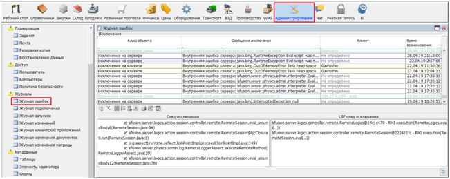
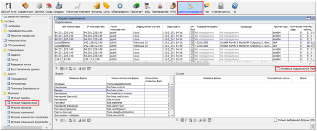
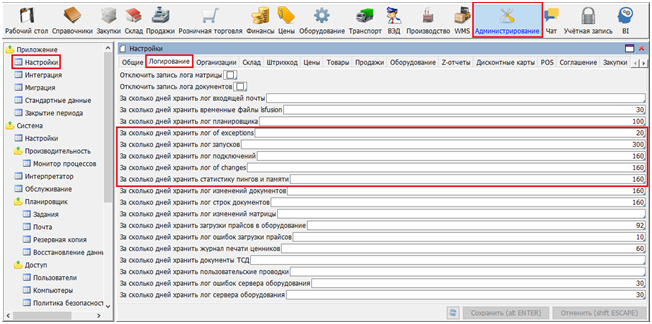
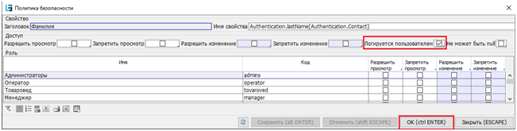

### Журналы

-   Журнал ошибок (рис.1).

Данный журнал содержит все ошибки, возникшие в ходе работы. Ошибки делятся на следующие классы (колонка `Класс объекта`):

-   ошибки, возникшие на сервере –– ошибки отображены на белом фоне и входят в единственный класс `Исключение на сервере`;
-   ошибки, возникшие на сервере и полученные клиентским приложением –– ошибки отображены на розовом фоне и входят в единственный класс `Исключение на сервере (от клиента)`;
-   ошибки, возникшие на клиентском приложении – ошибки отображены на желтом фоне и входят в два класс: `Исключение на клиенте` и `Исключение на web-клиенте`;
-   ошибки связи – ошибки отображены на голубом фоне и входят в два класса:
    -   `Временное исключение связи` - связь с сервером прерывалась, но была восстановлена;
    -   `Постоянное исключение связи` - связь с сервером прерывалась и не восстановилась;

 Рис. 1 Журнал ошибок.

В секции `След исключения` отображается java-стек ошибки, в секции `LSF след исключения` - lsfusion-стек. 

-   Журнал подключений (рис. 2).

** **

Рис. 2 Журнал подключений.

В журнале храниться информация о пользователях, которые подключались к системе, с какого компьютера, каковы характеристика этого ПК, а также информация о дате и времени подключения/отключения. На форме можно отобразить пользователей, работающих в данный момент с БД – отметка `Активные подключения`.

В секции `Форма` видно сколько раз и в какие формы входил пользователь. В секции `Сессия`, для некоторых форм, можно проследить, когда применялись изменения.

-   Журнал запусков хранит информацию о дате и времен запуска (перезапуска) сервера приложений. Также видно имя компьютера, на котором установлен сервер и версия приложения (если заполняется при сборке).

-   Журнал изменений содержит более подробную информацию о примененных изменениях, которые были отражены в Журнале подключений в секции `Сессия` (рис. 3.).

Рис. 3 Журнал изменений.

В колонке `Изменения` отображается список Свойств (колонок), в которых менялись значения, а также количество изменений (строк). Логируются только изменения на текущей форме – зависимые Свойства, которые меняются одновременно на других таблицах, в данный список не попадают.

На форме можно отфильтровать изменения, сделанные пользователями (без системных изменений) – отметка `Только изменения пользователя`.

-   Журнал клиентских приложений содержит информацию о качестве соединения во время работы с сервером приложений за определенный период времени (рис. 4.).

Рис. 4 Журнал клиентских приложений.

В верхней части формы для клиентских компьютеров, помимо системных показателей памяти, можно проанализировать средние значения времени отклика (ping) в миллисекундах, доступной и используемой java-приложением памяти. Анализируемый период задается вводом `Дата с` и `Дата по` в секции `Дата со временем`. Кроме дат, здесь можно задать пороговый значения для этих же показателей (ping и память)– это позволит получить суммарно время (в секундах), когда клиентский ПК превысил пороговые значения.

В нижней части, на вкладке `Данные` представлена хронология изменений времени отклика, доступной и используемой памяти. Эта информация отображается только для Desktop-клиента.

Сколько должна храниться информация в перечисленных журналах указывается на форме `Администрирование > Настройки > вкладка Логирование` (рис. 5.).

Рис. 5 Установка количества дней логирования.

Если необходимо отслеживать изменения отдельных значений в каких-либо  Свойствах (колонках), на определенных Формах, для таких случаем разработан механизм пользовательского логирования. Например, в справочнике Сотрудники нужно протоколировать изменения фамилии сотрудника. Для этого:

-  находясь на любой записи колонки `Фамилия`, по правой клавише мыши вызываем меню `Настройка политики свойств` (рис. 6.);

Рис. 6 Выбор свойства для протоколирования изменений.

-   в форме `Политика безопасности` устанавливаем отметку `Логируется пользователем` и нажимаем кнопку `ОК` (рис. 7.);

Рис. 7 Установка пользовательского логирования.

-   после перезапуска сервера приложений, при нажатии правой клавиши мыши на Свойстве `Фамилия`, появится дополнительный пункт меню `Показать историю изменений`. Если, для текущей записи, фамилия была кем-то изменена, то это найдет отражение в истории изменения свойств (рис. 8).

### 

Рис. 8. История изменения свойства.

Время хранения для подобных протоколов устанавливается одинаковым времени хранения для Журнала изменений.

### Логи {#logs}

Для каждого компонента платформы в платформе поддерживается следующий набор логов:

|Компонент|Папка|Логи|
|---|---|---|
|Сервер приложений (Server)|`$FUSION_DIR$/logs`, где `$FUSION_DIR$` - папка запуска сервера приложений|<ul><li>`stdout` - лог стандартного вывода (выводится в стандартный поток вывода, то есть в консоль ОС, IDE и т.п.). Включает в себя логи `start` и `explain`.</li><li>`stderr` - общий лог ошибок</li><li>`start` - лог процесса остановки и запуска</li><li>`remote`, `invocation` - логи процессов связанных с обращением к серверу приложений</li><li>`sql`, `sqlhand`, `sqlconnection`, `sqlconflict`, `sqladjust` - логи процессов связанных с обращением к серверу бд</li><li>`explain`, `explaincompile` - логи, в которые выводятся планы запросов (сервера БД и сервера приложений соответственно)</li><li>`lru` - лог процессов управления памятью (в основном LRU кэшами)</li><li>`allocatedbytes` - лог процессов выделения памяти</li><li>`assert` - лог различных проверок на выполнение заданных условий (а точнее их невыполнение)</li><li>`mail` - лог почты</li><li>`jasperReports` - лог JasperReports</li><li>`jdbc` - лог jdbc-драйвера</li><li>`exinfo` - лог дополнительной информации (не входящей в вышеописанные)</li></ul>|
|Веб-сервер (Client)|`$CATALINA_BASE$/logs`,  где `$CATALINA_BASE$` - папка, в которую установлен Tomcat|<ul><li>`catalina.out` - общий лог вывода</li><li>`gwtlog`, `gwtlog-err` - логи GWT</li><li>`invocation` - логи процессов связанных с обращением к веб-серверу</li></ul>|
|Десктоп-клиент|`$USER_DIR$/.fusion/logs`, где `$USER_DIR$` - папка пользователя|<ul><li>`stdout` - лог стандартного вывода (выводится в стандартный поток вывода, то есть в консоль ОС, IDE и т.п.).</li><li>`stderr` - общий лог ошибок</li><li>`remote`, `invocation` - логи процессов связанных с обращением к серверу приложений</li><li>`jasperReports` - лог JasperReports</li></ul>|

  

:::info
При [автоматической установке](Execution_auto.md) под Linux для этих папок (как и для файлов [lsFusion параметров запуска](Launch_parameters.md#applsfusion)) автоматически создаются symlink'и на [другие папки](Execution_auto.md#logs), расположение которых лучше соответствует идеологии Linux.
:::
