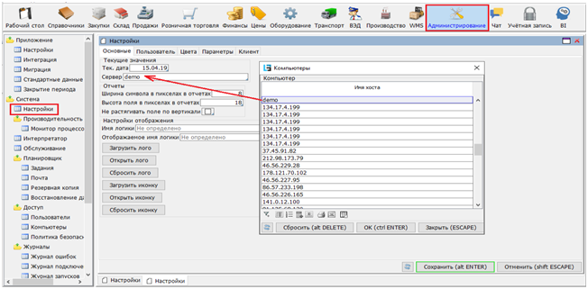
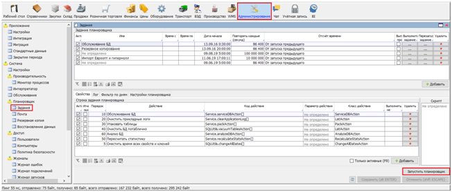
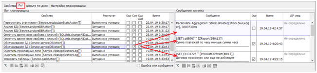
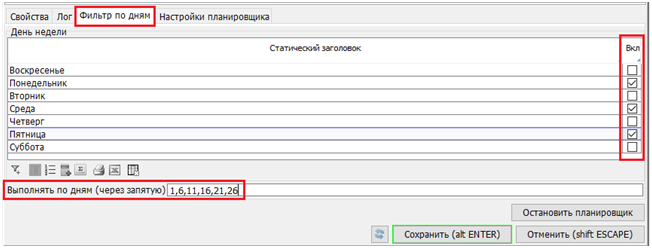

Планировщик предназначен для автоматического выполнения определенных заданий с заданной периодичностью.

Настройка планировщика осуществляется в меню `Администрирование > Планировщик > Задания`.  Из данной формы можно осуществлять запуск планировщика по кнопке `Запустить планировщик`, либо остановку – `Остановить планировщик` (рис.7.11.). Если в настройка системы указан Сервер, то планировщика можно будет запустить только с данного сервера (рис.1.).

Рис. 1. Указание сервера для запуска планировщика

Рис. 2. Запуск/остановка планировщика

В данной форме определяется состав Заданий – кнопки `Добавить`, `Удалить`.  Планировщик будет выполнять только активные Задания – отметка `Активно`. Для каждого Задания задаются обязательные параметры:

-   `Дата начала` – задание будет выполняться только после наступления указанной даты. Время в данном поле не привязано к Дате начала – она привязана к текущей дате и указывает на время первого (в рамках суток) запуска задания. От этого времени идет отсчет для повторного выполнения задания – периодичность задается в поле `Повторять каждые (секунд)`. Если периодичность больше суток (86400 секунд), то датой начала отсчета является дата запуск (перезапуска) сервера.
-   `Повторять каждые (секунд)` – периодичность выполнения задания.
-   `Отсчет времени` – указывается момент, с которого осуществлять отсчет времени для повторного выполнения задания: либо `От окончания предыдущего`, либо `От запуска предыдущего`.

Также могут быть заданы и необязательны параметры:

-   `Время с`/`Время по` – временное ограничение на выполнение задания в рамках суток.
-   `Выполнять при старте` – задание выполняется только при запуске (перезапуске) сервера.

Для каждого задания доступны кнопки:

-   `Выполнить задание` - ручной способ выполнить задание. Задание запускается сразу по нажатию кнопки. Если при нажатии кнопки задание еще не было завершено, то оно будет запущено дважды.
-   `Перезапустить задание` - ручной способ выполнить задание. Задание заускается сразу по нажатию кнопки, Если, при нажатии кнопки, задание еще не было завершено, то оно будет остановлено и запущено вновь.
-   `Удалить` - удалить задание.

Вкладки на форме `Задания`:

-   На вкладке `Свойства` перечислены Действия, входящие в выбранное задание. Последовательность выполнения Действий определяется значениями в поле `Порядок` - от меньшего к большему. Выполняются Действия только с отметкой `Активно`. Отметка `Игнорировать ошибки` позволяет начать Действие, не смотря на ошибку, возникшую в предыдущем Действии, в противном случае – текущее Действие не запустится. В качестве Действия могут быть либо встроенные команды – список команд появляется по клику в поле `Действие`, либо созданные пользователем скрипты – в поле `Скрипт`. Для некоторых встроенных Действий необходимы входные параметры (как правило числовые), они вносятся в поле `Параметр действия`. В поле `Выполнять не дольше (секунд)` указывается максимально допустимая продолжительность для выполнения данного Действия. Если действие не закончено в указанный срок, система расценивает это как ошибку.
-   На вкладке `Лог` можно проследить результаты выполнения Действий: когда оно начато и когда закончено. Если при выполнении Действия возникла ошибка, не позволяющая его завершить, то в логе это отмечено в поле `Ошибка`. Некоторые Действия сопровождаются информационными сообщениями – отметка в поле `Сообщения`. Если в логе, в поле `Ошибка в сообщениях` есть отметка, это означает, что при выполнении были обнаружены несоответствия некоторым ограничения, используемым в программе. Все ошибки и сообщения сопровождаются пояснениями в секции `Сообщения клиента` (рис. 3.).

Рис. 3. Лог планировщика.

-   Если задание выполняется раз в несколько дней, то на вкладке `Фильтр по дням` можно указать либо дни недели, либо числа месяца, в которые будет запущено задание. Если указаны и дни недели, и числа месяца, то задание будет выполняться только в те числа месяца, которые выпадают на указанные дни недели (рис.4.).

Рис. 4. Установка фильтра по дням.

-   На вкладке `Настройки планировщика` указывается максимальное количество потоков (заданий), которое может выполняться одновременно. Если количество потоков не указано, то, по умолчанию, одновременно может выполняться до 5 заданий.
