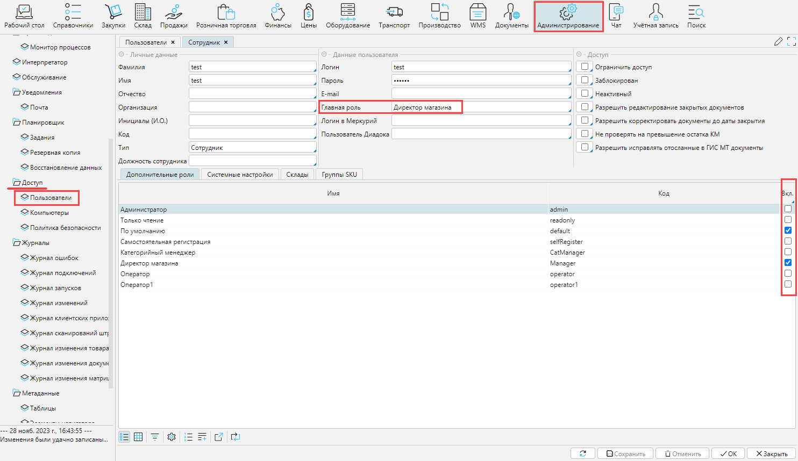
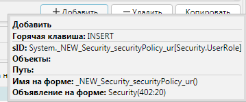
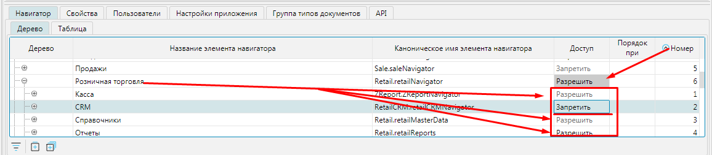
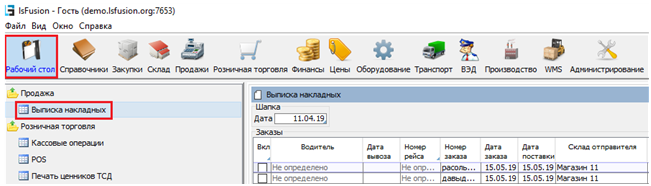
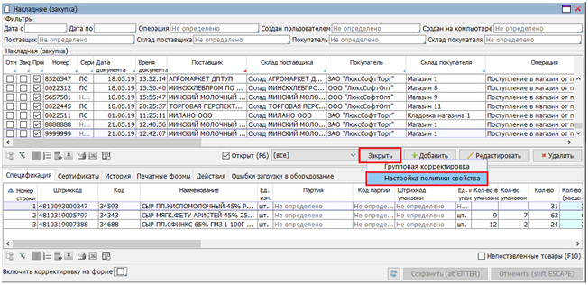
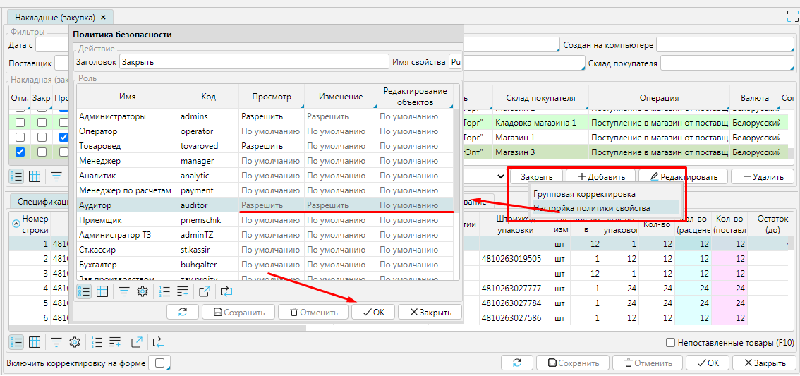
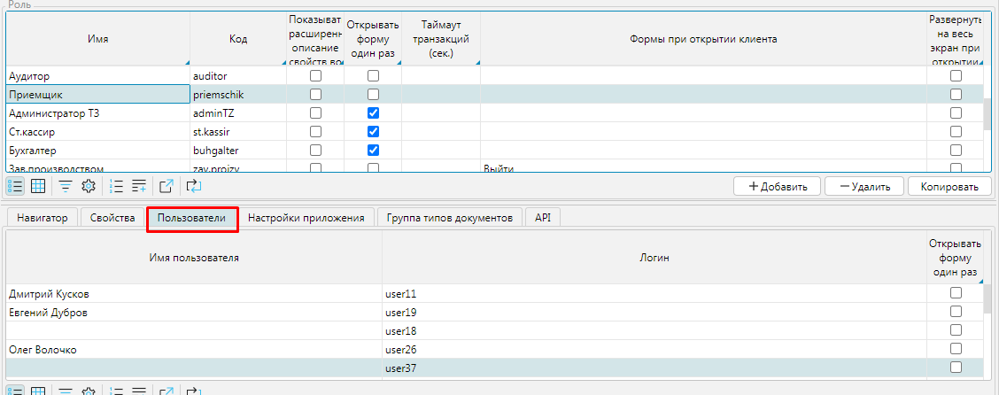

### Настройка ролей пользователя

В системе используется понятие Пользователь. Пользователь - это объект, который содержит информацию об одном человеке, работающим в системе. 

Функциональные возможности Пользователя определяются его Ролью или списком  Ролей. Роль устанавливает какие формы, поля и кнопки будут доступны.

В карточке Пользователя (`Администрирование > Доступ > Пользователи`) указывается Главная роль, при необходимости назначаются Дополнительные роли (рис. 1.).

Рис. 1. Назначение сотруднику ролей

### Настройка доступа к элементам системы

Настройка политики безопасности для каждой Роли осуществляется в меню `Администрирование > Доступ > Политика безопасности`.  На данной форме определяется состав Ролей – кнопки `Добавить`, `Удалить`, `Копировать`. При копировании Роли,  копируются и все права.

Рис. 2. Настройка политики безопасности по ролям

Для каждой Роли нужно указать наименование (`Имя`) и код (`Код`), а также можно задать следующие параметры:
- `Показывать расширенное описание свойств во всплывающих подсказках` – при наведении на на свойство, кнопку, поле и т.д. во всплывающем окне будет отображаться описание.

Рис. 3. Расширенное описание сво-ва

- `Открывать форму один раз` – при выборе в навигаторе уже открытой на рабочем столе формы пользователь перейдет на нее,  дополнительное окно открыто не будет.  Если есть потребность открыть несколько окон с данной формой,необходимо удерживать клавишу `Ctrl` при вызове формы . Данное ограничение можно установить и для конкретного пользователя на вкладке `Пользователи`.
- `Таймаут транзакции (сек.)` – период времени, указанный в секундах, при превышении которого транзакция будет прервана.
- `Формы при открытии клиента ` – для роли можно определить формы, которые будут открыты сразу после входа пользователя в программу. Для этого  на вкладке `Навигатор`, в поле `Порядок` при открытии клиента для нужных форм указывается номер по порядку (см. рис. 2).
- `Развернуть на весь экран при открытии клиента` – при входе в систему у пользователя будет отображено только  рабочее окно на весь экран без меню навигации.
- `Отключить роль` – доступы, настроенные для роли не будут применяться.

#### Вкладка Навигатор

На вкладке `Навигатор` отображаются все существующие в системе Формы. Они отображаются либо в виде дерева, либо в виде таблицы. В древовидном представлении список форм отражает структуру имеющихся модулей и наиболее удобен для управления доступом к ним.

Для каждой формы в колонке `Доступ` можно установить один из трех статусов:

`Разрешить` - форма будет доступна пользователю

`Запретить` - форма будет недоступна пользователю

`По умолчанию` - форма по умолчанию будет доступна пользователю с данной ролью. Если у пользователя несколько ролей, форма будет доступна если среди этих ролей есть `Разрешить` или нет `Запретить`.

Рис. 4. Пример настройки доступа к формам

Статус, установленный для ветви дерева, автоматически действует на дочерние ветви. При необходимости, дочерней ветви можно установить другой статус доступа, в таком случае статус родительского элемента будет подсвечен серым фоном, чтобы пользователь мог визуально определить, что в структуре данной ветви есть элементы с отличным статусом допуска.   В соответствии с настройками, приведенными на рис. 4 пользователь в модуле Розничная торговля не будет видеть и не сможет работать с  блоком  форм CRM.

Рис. 5. Результат настройки доступа к формам

#### Вкладка Свойства

На вкладке `Свойства` отображены все существующие в системе свойства всех форм - это поля, кнопки, чекбоксы и т.д. Они также как и формы имеют иерархическое  (Дерево) и табличное (Таблица) представление.

Для роли может быть установлен один из трех статусов доступа на действия в отношении свойств:

`Просмотр` - для пользователя свойство отображается или нет;

`Изменение` - пользователь может или нет изменить значение свойства;

`Редактирование объекта` - если значением свойства выступает объект, пользователь может или нет перейти к редактированию данного объекта.

Устанавливается статус доступа к свойствам аналогично доступу к формам.  Однако, учитывая большое количество разнообразных свойств в приложении, на вкладке `Свойства` удобно определить  уровень доступа к группе свойств, соответствующей верхним ветвям дерева, либо просмотреть статус допусков роли в разрезе свойств.

Рис. 6. Управление правами доступа к свойствам

Чтобы определить уровень доступа к конкретному свойству на форме удобно воспользоваться контекстным меню. Для этого необходимо нажать правой клавишей мыши на кнопку или поле, доступ к которому нужно настроить и в контекстном меню выбрать `Настройка политики свойств`. Откроется окно `Политики безопасности`, в котором можно установить уровень доступа к свойству для каждой роли или  для нескольких, затем нажать `ОК`. Все изменения, внесенные и сохраненные через контекстное меню, также отображаются на вкладке `Свойства` формы `Политика безопасности`.

Рис. 7. Вариант настройки доступа к отдельному свойству

#### Вкладка Пользователи

На этой вкладке отображены все пользователи системы, которым назначена выделенная роль в качестве главной либо дополнительной.

Рис. 8. Вкладка "Пользователи" 

Все изменения сделанные на форме `Политика безопасности` активизируются после очередного входа пользователя в систему.

По умолчанию в платформе предустановлены 4 роли:

- Администратор (admin)
- Только чтение (readonly)
- По умолчанию (default)
- Самостоятельная регистрация (selfRegister)

:::info
Следует помнить, что при установке для формы или свойства доступа `По умолчанию` применяется разрешение или запрет, в зависимости от установленных дополнительных ролей. Установленный доступ `По умолчанию` не применяет значение, указанное в настройках роли По умолчанию. Чтобы для пользователя действовали доступы, настроенные в роли По умолчанию, ему необходимо назначить эту роль.
:::
