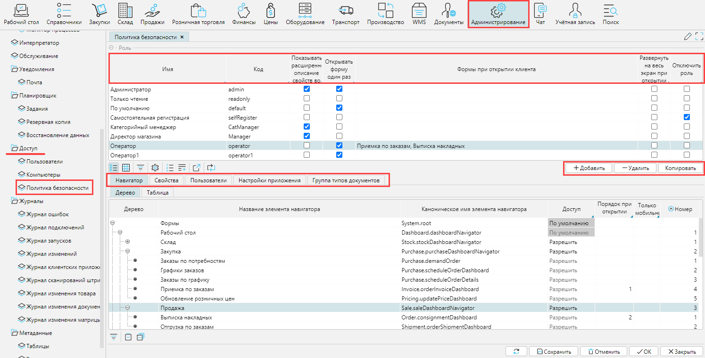
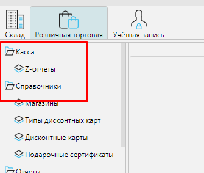
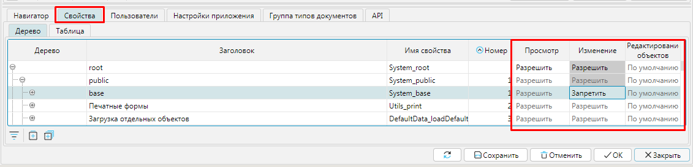

### Настройка ролей пользователя

В системе используется понятие Пользователь. Пользователь - это объект, который содержит информацию об одном человеке, работающим в системе. В системе могут храниться информация как о своих собственных сотрудниках, так и о сотрудниках иных организаций.

Функциональные возможности Пользователя определяются его Ролью или списком  Ролей. Роль устанавливает какие формы, поля и кнопки будут доступны.

В карточке Пользователя (`Администрирование > Доступ > Пользователи`) указывается Главная роль, при необходимости назначаются Дополнительные роли (рис. 1.).

Рис. 1. Назначение сотруднику ролей

### Настройка доступа к элементам системы

Настройка политики безопасности для каждой Роли осуществляется в меню `Администрирование > Доступ > Политика безопасности > вкладка Роли`.  В данной форме определяется состав Ролей – кнопки `Добавить`, `Удалить`, `Копировать`. При копировании Роли,  копируются и все права. Если указана `Главная роль по умолчанию`, то при сохранении нового Сотрудника без Главной роли, ему будет назначена Роль из данного поля.

Рис. 2. Настройка политики безопасности по ролям

Для каждой Роли можно определить некоторые исходные права:

-   `Разрешить/запретить все элементы навигатора` – служит для начальной установки прав доступ ко всем формам. Для Ролей с ограниченным функциональным доступом рекомендуется устанавливать `Запретить все элементы навигации`. Это облегчает дальнейшую настройку доступа к конкретным формам – достаточно будет перечислить доступные формы.
-   `Разрешить/запретить просмотр всех свойств` – служит для начальной установки прав на просмотр всех элементов форм: кнопки, поля, "птички" и др.
-   `Разрешить/запретить изменение всех свойств` – служит для начальной установки прав на использование всех элементов форм.
-   `Запрет просмотра/редактирования политики безопасности` – ограничивает доступ к настройкам политики безопасности, т.е. сотрудник с такой ролью не сможет самостоятельно менять доступ к элементам формы.
-   `Запретить изменения пароля` – сотрудникам с данной ролью запрещено менять свои пароли. Данное ограничение можно установить и на конкретного пользователя на вкладке `Пользователи`.
-   `Запретить редактирование профиля` – сотрудникам с данной ролью запрещено менять Логин, Имя, Фамилия, E-mail, размер шрифта. Данное ограничение можно установить и на конкретного пользователя на вкладке `Пользователи`.
-   `Открывать форму один раз` – если пользователь повторно отрывает уже открытую форму (как правило, случайно), то дополнительное окно с данной формой не создается. Если есть потребность иногда открыть одну и ту же форму повторно, то нужно при вызове этой форму удерживать клавишу `Ctrl`. Данное ограничение можно установить и на конкретного пользователя на вкладке `Пользователи`.
-   `Формы при открытии` – для роли можно определить Формы, которые будут открыты сразу после входа сотрудника в программу. Для этого в поле указывается `Отображать формы по умолчанию`, а на вкладке `Навигатор`, в поле `Номер по умолчанию` для нужных форм указывается номер по порядку. Как правило используется для АРМа кассира.

Вкладки на форме `Политика безопасности > вкладка Роли`:

-   На вкладке `Навигатор` отображаются все существующие в системе Формы. Они отображаются либо в виде дерева, либо в виде таблицы. В древовидном представлении список форм отражает структуру имеющихся модулей и наиболее удобен для управления доступом к ним. Кроме этого, чем глубже ветвь дерева, тем приоритетнее будут установки `Разрешить` / `Запретить`. Например, на `Рабочем столе`, для всего раздела `Продажи` установим признак `Запретить`, а для формы `Выписка накладных` – `Разрешить`. (рис. 3.)

Рис. 3. Пример настройки доступа к формам

В результате, при входе в систему пользователя с данной ролью, ему будет доступна форма `Выписка накладных`, а форма `Обработка внутренних заказов` не видна. (рис. 4.)

Рис. 4. Результат настройки доступа к формам

-   На вкладке `Свойства` отображаются все элементы имеющихся в системе форм: поля, кнопки, "птички" и др. Как и сами Формы, Свойства представлены в древовидной и табличной форме. Путем выставления разрешений/запретов на просмотр и изменение свойств, для роли устанавливается функциональная наполненность используемых форм. Как показывает практика, использование данной вкладки оправдано для установки доступа верхних ветвях дерева свойств, т.е. для целых групп свойств. Для настройки доступа по конкретным свойствам (на конкретной форме) лучше воспользоваться контекстным меню (по правой клавише мыши) на интересующем элементе формы. Например, на форме `Накладные (закупка)` нам необходимо установить ограничения на закрытие документов для некоторых ролей. Для этого, наведя курсор мыши на кнопку `Закрыть`, по правой клавише мыши вызываем `Настройки политики безопасности` (рис. 5).

Рис. 5. Способ настройки доступа к отдельному свойству

В открывшемся окне, в секции `Доступ` ставим отметку `Запретить просмотр`. Это означает, что для всех ролей, по умолчанию, данная кнопка в данной форме не будет видна. И далее, поставив разрешающую отметку напротив определенных ролей, мы даем возможность сотрудникам только этих ролей использовать данную кнопку (рис.7.7.).

Рис. 6. Вариант настройки доступа к отдельному свойству

Таким же способом можно организовывать доступ к полям и колонкам на любой форме. Все изменения, сделанные при настройке доступа к отдельному элементу Формы, транслируются на вкладке `Свойства` формы `Политика безопасности`.

-   На вкладке `Дополнительная политика безопасности` можно установить самые приоритетные права (в обход ранее описанных) по некоторым возможностям в программе. Это делается путем ввода числа 1 в поле `Порядок` (рис. 7.).

Рис. 7. Установка дополнительной политики безопасности

Для Форм и Свойств, которым не были установлены права доступа (не указаны отметки разрешить/запретить) на уровне ролей, будут применяться права, указанные на вкладке `По умолчанию` (рис.8.).

Рис. 8. Установка политики безопасности по умолчанию

Все изменения сделанные на форме `Политика безопасности` активизируются после очередного входа пользователя в систему.
